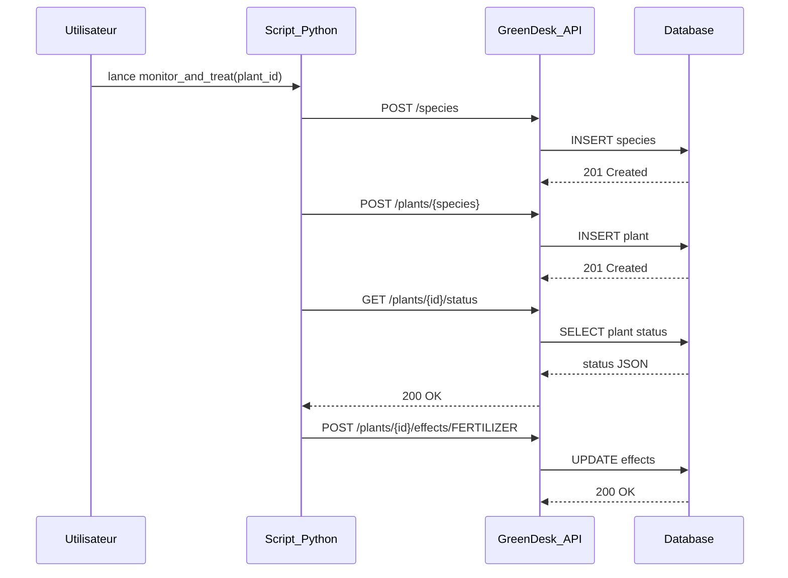

# Exemples d'utilisation de l'API

Des exemples pratiques pour différents scénarios d'utilisation.

## Scénario 1 : Configuration initiale simple

Créer une espèce et une plante pour tester l'application.

### Étape 1 : Créer une espèce

```bash
curl -X POST http://localhost:8080/api/species \
  -H "Content-Type: application/json" \
  -d '{
    "name": "Basilic",
    "waterNeeds": 400.0,
    "optimalTemperature": 22.0,
    "optimalHumidity": 65.0,
    "luxNeeds": 2500.0,
    "baseGrowthRate": 3.0,
    "seedProductionRate": 40.0
  }'
```

**Réponse** :
```json
{
  "id": "507f1f77bcf86cd799439011",
  "name": "Basilic",
  "waterNeeds": 400.0,
  "optimalTemperature": 22.0,
  "optimalHumidity": 65.0,
  "luxNeeds": 2500.0,
  "baseGrowthRate": 3.0,
  "seedProductionRate": 40.0
}
```

### Étape 2 : Créer une plante

```bash
curl -X POST http://localhost:8080/api/plants/Basilic \
  -H "Content-Type: application/json" \
  -d '{
    "name": "Basilic du Jardin",
    "water": 400.0,
    "temperature": 22.0,
    "humidity": 65.0,
    "luxIntensity": 2500.0
  }'
```

### Étape 3 : Consulter l'état

```bash
curl http://localhost:8080/api/plants/507f1f77bcf86cd799439012
```

**Réponse** : Plante HEALTHY ✅

---

## Scénario 2 : Système complet avec forêt

Créer une forêt et y placer plusieurs plantes avec gestion des saisons.

### Étape 1 : Créer des espèces variées

```bash
# Rosier (moyen)
curl -X POST http://localhost:8080/api/species \
  -H "Content-Type: application/json" \
  -d '{
    "name": "Rosier",
    "waterNeeds": 500.0,
    "optimalTemperature": 20.0,
    "optimalHumidity": 60.0,
    "luxNeeds": 3000.0,
    "baseGrowthRate": 2.5,
    "seedProductionRate": 50.0
  }'

# Fougère (humide, ombre)
curl -X POST http://localhost:8080/api/species \
  -H "Content-Type: application/json" \
  -d '{
    "name": "Fougère",
    "waterNeeds": 800.0,
    "optimalTemperature": 18.0,
    "optimalHumidity": 80.0,
    "luxNeeds": 1000.0,
    "baseGrowthRate": 1.8,
    "seedProductionRate": 100.0
  }'

# Cactus (sec, lumière)
curl -X POST http://localhost:8080/api/species \
  -H "Content-Type: application/json" \
  -d '{
    "name": "Cactus",
    "waterNeeds": 100.0,
    "optimalTemperature": 25.0,
    "optimalHumidity": 20.0,
    "luxNeeds": 4000.0,
    "baseGrowthRate": 0.5,
    "seedProductionRate": 30.0
  }'
```

### Étape 2 : Créer les plantes

```bash
# Créer une rose
ROSE_ID=$(curl -s -X POST http://localhost:8080/api/plants/Rosier \
  -H "Content-Type: application/json" \
  -d '{
    "name": "Rose Rouge",
    "water": 500.0,
    "temperature": 20.0,
    "humidity": 60.0,
    "luxIntensity": 3000.0
  }' | jq -r '.id')

# Créer une fougère
FOUGERE_ID=$(curl -s -X POST http://localhost:8080/api/plants/Fougère \
  -H "Content-Type: application/json" \
  -d '{
    "name": "Fougère de Boston",
    "water": 800.0,
    "temperature": 18.0,
    "humidity": 80.0,
    "luxIntensity": 1000.0
  }' | jq -r '.id')

# Créer un cactus
CACTUS_ID=$(curl -s -X POST http://localhost:8080/api/plants/Cactus \
  -H "Content-Type: application/json" \
  -d '{
    "name": "Cactus Doré",
    "water": 100.0,
    "temperature": 25.0,
    "humidity": 20.0,
    "luxIntensity": 4000.0
  }' | jq -r '.id')
```

### Étape 3 : Créer une forêt

```bash
FOREST_ID=$(curl -s -X POST http://localhost:8080/api/forests \
  -H "Content-Type: application/json" \
  -d '{
    "name": "Jardin Botanique",
    "width": 10,
    "height": 10
  }' | jq -r '.id')

echo "Forest ID: $FOREST_ID"
```

### Étape 4 : Placer les plantes

```bash
# Rose au centre
curl -X POST "http://localhost:8080/api/forests/$FOREST_ID/plants/$ROSE_ID?posX=5&posY=5"

# Fougère à gauche (ombrage naturel)
curl -X POST "http://localhost:8080/api/forests/$FOREST_ID/plants/$FOUGERE_ID?posX=2&posY=5"

# Cactus à droite (soleil)
curl -X POST "http://localhost:8080/api/forests/$FOREST_ID/plants/$CACTUS_ID?posX=8&posY=5"
```

### Étape 5 : Vérifier la forêt

```bash
curl http://localhost:8080/api/forests/$FOREST_ID/plants
```

---

## Scénario 3 : Gestion du stress et des effets

Traiter une plante stressée avec des interventions.

### Situation initiale : Plante stressée

```bash
# Créer une plante avec conditions suboptimales
PLANT_ID=$(curl -s -X POST http://localhost:8080/api/plants/Rosier \
  -H "Content-Type: application/json" \
  -d '{
    "name": "Rose en Stress",
    "water": 300.0,
    "temperature": 28.0,
    "humidity": 40.0,
    "luxIntensity": 4500.0
  }' | jq -r '.id')

# Consultez l'état
curl http://localhost:8080/api/plants/$PLANT_ID
```

**Observation** : Status = STRESSED 🟡

### Diagnostic des problèmes

- Eau : 300ml (optimal 500ml) → **Besoin eau**
- Température : 28°C (optimal 20°C) → **Trop chaud**
- Humidité : 40% (optimal 60%) → **Trop sec**
- Lumière : 4500lux (optimal 3000lux) → **Trop lumineux**

### Application des solutions

```bash
# 1. Ajouter ombrage (réduire lumière)
curl -X POST http://localhost:8080/api/plants/$PLANT_ID/effects/SHADE

# 2. Ajouter arrosage supplémentaire
curl -X POST http://localhost:8080/api/plants/$PLANT_ID/effects/EXTRA_WATERING

# 3. Augmenter humidité (via EXTRA_WATERING)
# Pas d'effet directe, mais effectif + spray simulé

# 4. Ajouter fertiliseur pour récupération
curl -X POST http://localhost:8080/api/plants/$PLANT_ID/effects/FERTILIZER

# Vérifier effets
curl http://localhost:8080/api/plants/$PLANT_ID/effects
```

### Suivi

```bash
# Vérifier amélioration après 1-2 jours
curl http://localhost:8080/api/plants/$PLANT_ID

# Si health > 80%, retirer les effets progressivement
curl -X DELETE http://localhost:8080/api/plants/$PLANT_ID/effects/SHADE
```

---

## Scénario 4 : Simulation saisonnière

Simuler les changements saisonniers dans une forêt.

### Initialisation (SPRING)

```bash
# Créer forêt
FOREST_ID=$(curl -s -X POST http://localhost:8080/api/forests \
  -H "Content-Type: application/json" \
  -d '{
    "name": "Forêt Saisonnière",
    "width": 5,
    "height": 5
  }' | jq -r '.id')

# Vérifier saison (doit être SPRING)
curl http://localhost:8080/api/forests/$FOREST_ID/season
```

**Réponse** :
```json
{
  "currentSeason": "SPRING",
  "waterMultiplier": 1.0,
  "temperatureModifier": 0.0,
  "humidityModifier": 5.0,
  "luxMultiplier": 1.0
}
```

### Transition vers l'été

```bash
# Avancer à SUMMER
curl -X POST http://localhost:8080/api/forests/$FOREST_ID/season/next

# Vérifier nouvelle saison
curl http://localhost:8080/api/forests/$FOREST_ID/season
```

**Réponse** :
```json
{
  "currentSeason": "SUMMER",
  "waterMultiplier": 1.2,
  "temperatureModifier": 5.0,
  "humidityModifier": -10.0,
  "luxMultiplier": 1.3
}
```

### Observer les impacts

```bash
# Créer une rose sensible au soleil estival
ROSE_ID=$(curl -s -X POST http://localhost:8080/api/plants/Rosier \
  -H "Content-Type: application/json" \
  -d '{
    "name": "Rose d'\''Été",
    "water": 500.0,
    "temperature": 20.0,
    "humidity": 60.0,
    "luxIntensity": 3000.0
  }' | jq -r '.id')

# Placer en forêt
curl -X POST "http://localhost:8080/api/forests/$FOREST_ID/plants/$ROSE_ID?posX=2&posY=2"

# Vérifier état : Sera STRESSED à cause chaleur + lumière
curl http://localhost:8080/api/forests/$FOREST_ID/plants
```

### Intervention estivale

```bash
# Ajouter SHADE pour protéger
curl -X POST http://localhost:8080/api/plants/$ROSE_ID/effects/SHADE

# Augmenter arrosage
curl -X POST http://localhost:8080/api/plants/$ROSE_ID/effects/EXTRA_WATERING

# Vérifier amélioration
curl http://localhost:8080/api/plants/$ROSE_ID
```

---

## Scénario 5 : Automation en Python

Script Python pour gérer l'application automatiquement.

```python
import requests
import json

BASE_URL = "http://localhost:8080/api"

class GreenDeskAPI:
    def __init__(self, base_url):
        self.base_url = base_url
    
    def create_species(self, name, water, temp, humidity, lux, growth, seeds):
        """Créer une espèce"""
        data = {
            "name": name,
            "waterNeeds": water,
            "optimalTemperature": temp,
            "optimalHumidity": humidity,
            "luxNeeds": lux,
            "baseGrowthRate": growth,
            "seedProductionRate": seeds
        }
        response = requests.post(f"{self.base_url}/species", json=data)
        return response.json()
    
    def create_plant(self, species_name, plant_name, water, temp, humidity, lux):
        """Créer une plante"""
        data = {
            "name": plant_name,
            "water": water,
            "temperature": temp,
            "humidity": humidity,
            "luxIntensity": lux
        }
        response = requests.post(f"{self.base_url}/plants/{species_name}", json=data)
        return response.json()
    
    def get_plant_status(self, plant_id):
        """Vérifier l'état d'une plante"""
        response = requests.get(f"{self.base_url}/plants/{plant_id}/status")
        return response.json()
    
    def add_effect(self, plant_id, effect_name):
        """Ajouter un effet"""
        response = requests.post(f"{self.base_url}/plants/{plant_id}/effects/{effect_name}")
        return response.status_code == 200
    
    def monitor_and_treat(self, plant_id):
        """Monitorer et traiter une plante"""
        status = self.get_plant_status(plant_id)
        health = status.get("health", 100)
        
        if health < 50:
            print(f"🚨 Plante malade ! Health: {health}%")
            self.add_effect(plant_id, "FERTILIZER")
            self.add_effect(plant_id, "EXTRA_WATERING")
            self.add_effect(plant_id, "HEATING")
        elif health < 80:
            print(f"⚠️  Plante stressée. Health: {health}%")
            self.add_effect(plant_id, "FERTILIZER")
        else:
            print(f"✅ Plante en bonne santé. Health: {health}%")

# Utilisation
api = GreenDeskAPI(BASE_URL)

# Créer espèce
species = api.create_species("Rose", 500, 20, 60, 3000, 2.5, 50)
print(f"Espèce créée: {species['name']}")

# Créer plante
plant = api.create_plant("Rose", "Ma Rose", 450, 22, 55, 2900)
plant_id = plant['id']
print(f"Plante créée: {plant['name']} (ID: {plant_id})")

# Monitorer
api.monitor_and_treat(plant_id)
```



---

## Scénario 6 : Batch creation avec curl

Créer plusieurs espèces et plantes en boucle.

```bash
#!/bin/bash

BASE_URL="http://localhost:8080/api"

# Liste d'espèces à créer
declare -a species=(
  "Rose:500:20:60:3000:2.5:50"
  "Cactus:100:25:20:4000:0.5:30"
  "Fougère:800:18:80:1000:1.8:100"
  "Tomate:600:22:70:3500:3.0:200"
)

# Créer les espèces
for spec in "${species[@]}"
do
  IFS=':' read -r name water temp hum lux growth seeds <<< "$spec"
  
  curl -X POST ${BASE_URL}/species \
    -H "Content-Type: application/json" \
    -d "{
      \"name\": \"$name\",
      \"waterNeeds\": $water,
      \"optimalTemperature\": $temp,
      \"optimalHumidity\": $hum,
      \"luxNeeds\": $lux,
      \"baseGrowthRate\": $growth,
      \"seedProductionRate\": $seeds
    }"
  
  echo "Espèce $name créée"
done

# Créer une forêt
curl -X POST ${BASE_URL}/forests \
  -H "Content-Type: application/json" \
  -d '{
    "name": "Jardin Batch",
    "width": 10,
    "height": 10
  }'
```

---

Explorez ces scénarios et adaptez-les à vos besoins ! Pour plus d'aide, consultez la [documentation des endpoints](endpoints.md).
