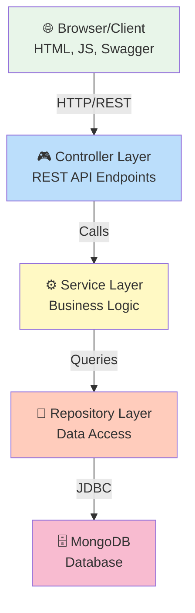
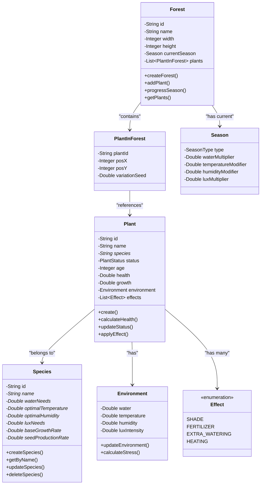
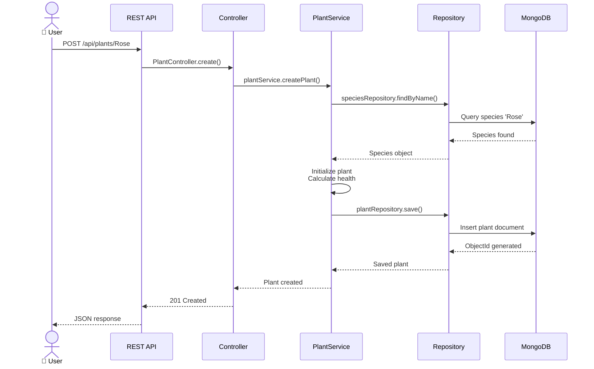
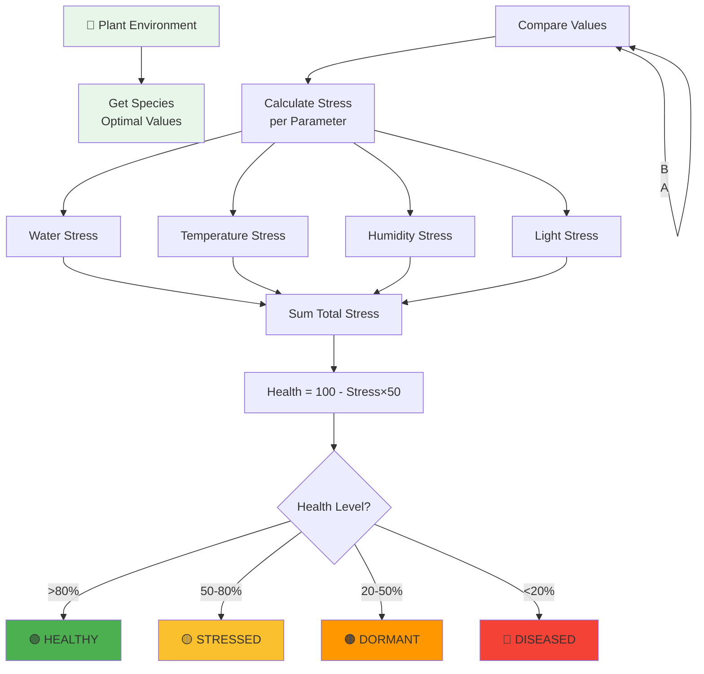
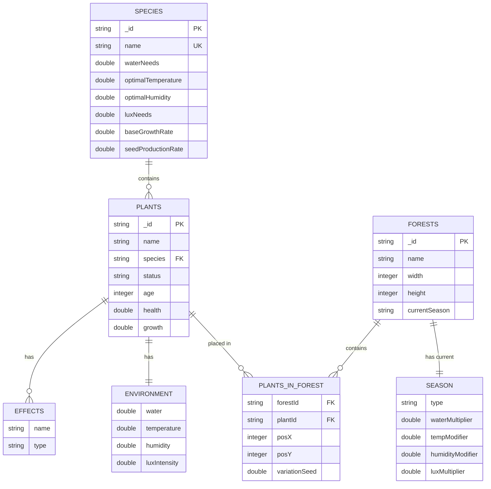

# Architecture du projet

Documentation de l'architecture interne et du design de GreenDesk.

## Diagramme Architecture Générale



## Diagramme entités UML



## Diagramme flux création plante



## Diagramme calcul santé



## Diagramme relations base données



## Architecture en couches

### 1. Controller Layer (REST API)

**Responsabilités** :
- Recevoir requêtes HTTP
- Valider entrées (via @Validated)
- Mapper requêtes vers services
- Retourner réponses JSON

**Fichiers** :
- `controllers/HomeController.java` - Redirection racine
- `controllers/SpeciesController.java` - Endpoints espèces
- `controllers/PlantController.java` - Endpoints plantes
- `controllers/ForestController.java` - Endpoints forêts

**Exemple** :
```java
@RestController
@RequestMapping("/api/species")
public class SpeciesController {
    
    @PostMapping
    public ResponseEntity<Species> createSpecies(@RequestBody Species species) {
        Species created = speciesService.createSpecies(species);
        return ResponseEntity.status(201).body(created);
    }
    
    @GetMapping("/{name}")
    public ResponseEntity<Species> getSpecies(@PathVariable String name) {
        return speciesService.getByName(name)
            .map(ResponseEntity::ok)
            .orElse(ResponseEntity.notFound().build());
    }
}
```

### 2. Service Layer (Business Logic)

**Responsabilités** :
- Implémentation logique métier
- Orchestration des opérations
- Calcul de l'état des plantes
- Gestion des effets et saisons

**Fichiers** :
- `services/SpeciesService.java` - Gestion espèces
- `services/PlantService.java` - Gestion plantes
- `services/ForestService.java` - Gestion forêts
- `services/EffectService.java` - Calcul des effets
- `services/SeasonService.java` - Gestion saisons

**Exemple** :
```java
@Service
public class PlantService {
    
    public Plant updatePlantStatus(Plant plant) {
        // Calcul du stress
        double stress = calculateStress(plant);
        
        // Calcul de la santé
        double health = 100 - (stress * 50);
        
        // Déterminer l'état
        if (health > 80) plant.setStatus(PlantStatus.HEALTHY);
        else if (health > 50) plant.setStatus(PlantStatus.STRESSED);
        else if (health > 20) plant.setStatus(PlantStatus.DORMANT);
        else plant.setStatus(PlantStatus.DISEASED);
        
        return plant;
    }
    
    private double calculateStress(Plant plant) {
        // Calcul complexe du stress basé sur environnement
        Species species = plant.getSpecies();
        Environment env = plant.getEnvironment();
        
        double stressWater = Math.abs(env.getWater() - species.getWaterNeeds()) 
                           / species.getWaterNeeds();
        double stressTemp = Math.abs(env.getTemperature() - species.getOptimalTemperature()) 
                          / species.getOptimalTemperature();
        // ... etc
        
        return stressWater + stressTemp + ... ;
    }
}
```

### 3. Repository Layer (Data Access)

**Responsabilités** :
- Accès à MongoDB via Spring Data MongoDB
- Requêtes de recherche custom si nécessaire
- Abstraction des opérations CRUD

**Fichiers** :
```java
@Repository
public interface SpeciesRepository extends MongoRepository<Species, String> {
    Optional<Species> findByName(String name);
}

@Repository
public interface PlantRepository extends MongoRepository<Plant, String> {
    List<Plant> findBySpeciesName(String speciesName);
}

@Repository
public interface ForestRepository extends MongoRepository<Forest, String> {
}
```

### 4. Entity/Model Layer

**Responsabilités** :
- Définir structure des données
- Mapping vers MongoDB
- Annotations de validation

**Fichiers** :
- `entities/Species.java` - Modèle espèce
- `entities/Plant.java` - Modèle plante
- `entities/Forest.java` - Modèle forêt
- `entities/Environment.java` - Conditions environnementales
- `entities/PlantInForest.java` - Plante positionnée

**Exemple** :
```java
@Document(collection = "species")
@Data
@NoArgsConstructor
@AllArgsConstructor
public class Species {
    
    @Id
    private String id;
    
    @Indexed(unique = true)
    @NotBlank(message = "Species name is required")
    private String name;
    
    @Min(value = 0)
    private Double waterNeeds;
    
    @Min(value = -50)
    @Max(value = 50)
    private Double optimalTemperature;
    
    // ... autres champs
}
```

## Flux de donnees

### Exemple : Créer une plante

```
1. POST /api/plants/Rose
   │
   ├─> PlantController.createPlant()
   │   │
   │   ├─> Validation @RequestBody
   │   │
   │   ├─> PlantService.createPlant()
   │   │   │
   │   │   ├─> Récupérer espèce via SpeciesRepository
   │   │   │
   │   │   ├─> Initialiser plante avec défauts
   │   │   │
   │   │   ├─> Calculer état initial
   │   │   │
   │   │   └─> Sauvegarder via PlantRepository
   │   │
   │   └─> Retourner JSON réponse
   │
└─> Response 201 Created

2. Données sauvegardées dans MongoDB
   └─> Collection "plants"
       └─> Document avec ID généré
```

### Exemple : Mettre à jour l'état d'une plante

```
1. GET /api/plants/{plantId}
   │
   ├─> PlantRepository.findById()
   │
   ├─> Récupérer plante depuis MongoDB
   │
   ├─> PlantService.calculateHealth()
   │   │
   │   ├─> Lire espèce associée
   │   │
   │   ├─> Comparer environnement vs optimal
   │   │
   │   ├─> Calculer stress
   │   │
   │   ├─> Déterminer santé et état
   │   │
   │   └─> Appliquer effets si présents
   │
   └─> Retourner plante enrichie
```

## Structures de données

### Species

```json
{
  "_id": ObjectId,
  "name": "Rose",
  "waterNeeds": 500.0,
  "optimalTemperature": 20.0,
  "optimalHumidity": 60.0,
  "luxNeeds": 3000.0,
  "baseGrowthRate": 2.5,
  "seedProductionRate": 50.0
}
```

### Plant

```json
{
  "_id": ObjectId,
  "name": "Ma Rose",
  "species": "Rose",
  "status": "HEALTHY",
  "age": 5,
  "health": 95.0,
  "growth": 12.5,
  "environment": {
    "water": 500.0,
    "temperature": 20.0,
    "humidity": 60.0,
    "luxIntensity": 3000.0
  },
  "effects": ["FERTILIZER"],
  "createdAt": ISODate,
  "updatedAt": ISODate
}
```

### Forest

```json
{
  "_id": ObjectId,
  "name": "Forêt Enchantée",
  "width": 10,
  "height": 10,
  "currentSeason": "SPRING",
  "plants": [
    {
      "plantId": ObjectId,
      "posX": 5,
      "posY": 5,
      "variationSeed": 0.95
    }
  ],
  "createdAt": ISODate
}
```

## Patterns et principes

### MVC (Model-View-Controller)

Appliqué avec Vue = API JSON

```
Model  ← Entities
View   ← JSON Responses
Controller ← REST Controllers
```

### Dependency Injection

Spring Boot gère automatiquement :

```java
@Service
public class PlantService {
    @Autowired
    private PlantRepository plantRepository;
    
    @Autowired
    private SpeciesService speciesService;
    // Injection automatique
}
```

### Exception Handling

Centralisé avec `@ControllerAdvice` :

```java
@ControllerAdvice
public class GlobalExceptionHandler {
    
    @ExceptionHandler(EntityNotFoundException.class)
    public ResponseEntity<ErrorResponse> handleNotFound(EntityNotFoundException e) {
        return ResponseEntity.status(404).body(new ErrorResponse(e.getMessage()));
    }
}
```

## Technologies utilisées

| Technologie | Version | Usage |
|-------------|---------|-------|
| Java | 21 | Langage |
| Spring Boot | 3.3.3 | Framework |
| Spring Data MongoDB | Latest | ORM |
| Lombok | Latest | Boilerplate |
| Validation | Latest | @Valid |
| OpenAPI | 2.5.0 | Documentation |
| JUnit 5 | 5.10.0 | Tests |
| MongoDB | 6.0+ | Database |

## Configuration

### application.properties

```properties
# Server
server.port=8080
server.servlet.context-path=/

# MongoDB
spring.data.mongodb.uri=mongodb://localhost:27017/greendesk
spring.data.mongodb.auto-index-creation=true

# Logging
logging.level.root=INFO
logging.level.org.springframework.web=DEBUG
logging.level.org.example=DEBUG

# Swagger
springdoc.swagger-ui.path=/swagger-ui.html
springdoc.api-docs.path=/v3/api-docs
```

## Bonnes pratiques appliquées

- ✅ Séparation des préoccupations (SoC)
- ✅ DRY (Don't Repeat Yourself)
- ✅ SOLID principles partially
- ✅ Validation des données
- ✅ Gestion des erreurs
- ✅ Documentation API
- ✅ Tests unitaires

## Points d'extension futur

- 🔄 Authentification JWT
- 🔄 Rate limiting
- 🔄 Cache (Redis)
- 🔄 WebSockets (Real-time)
- 🔄 Pagination
- 🔄 Micro-services

---

Consultez [Tests](testing.md) pour comprendre stratégie de test !
