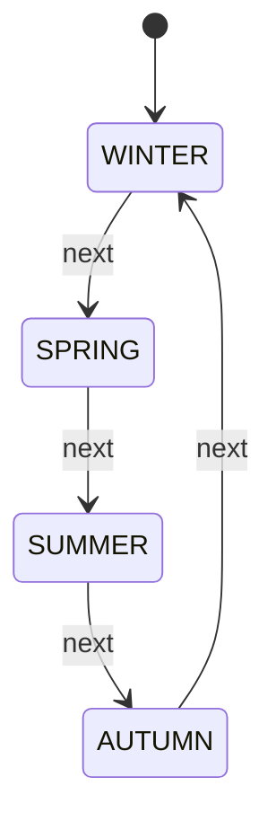
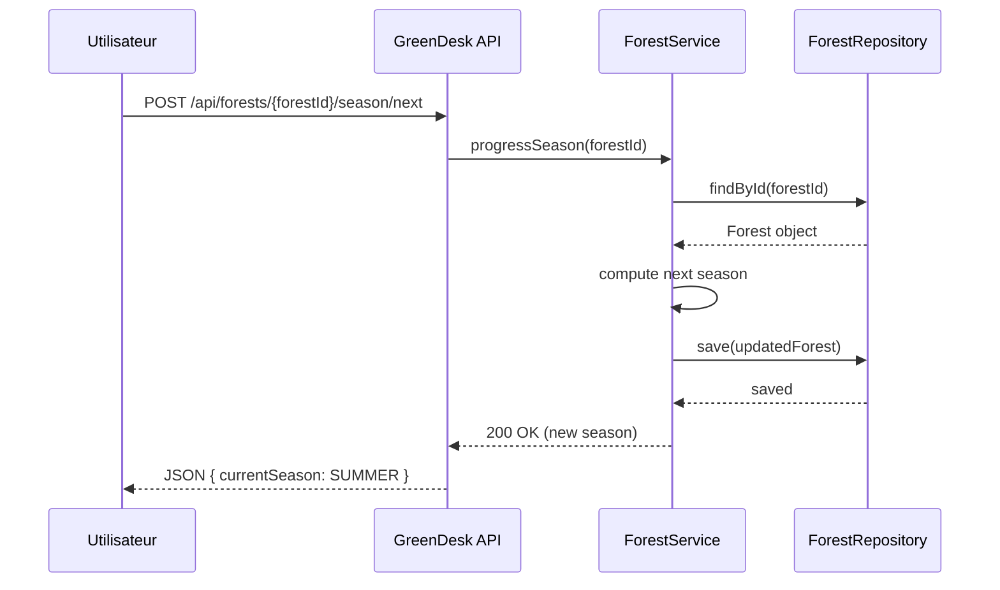

# Gestion des forêts

Les forêts sont des écosystèmes 2D où vous pouvez placer plusieurs plantes dans une grille spatiale.

## Créer une forêt

### Structure de base
```bash
POST /api/forests
```

**Corpus** :
```json
{
  "name": "Forêt Enchantée",
  "width": 10,
  "height": 10
}
```

**Exemple** :
```bash
curl -X POST http://localhost:8080/api/forests \
  -H "Content-Type: application/json" \
  -d '{
    "name": "Forêt Enchantée",
    "width": 10,
    "height": 10
  }'
```

**Réponse** :
```json
{
  "id": "507f1f77bcf86cd799439014",
  "name": "Forêt Enchantée",
  "width": 10,
  "height": 10,
  "currentSeason": "SPRING",
  "plants": [],
  "createdAt": "2024-02-23T14:30:00Z"
}
```

## Placer une plante dans une forêt

### Ajouter une plante à une position
```bash
POST /api/forests/{forestId}/plants/{plantId}?posX={x}&posY={y}
```

**Paramètres** :
- `posX` : Position X (0 à width-1)
- `posY` : Position Y (0 à height-1)
- Une position ne peut contenir qu'une plante

**Exemple** :
```bash
curl -X POST "http://localhost:8080/api/forests/507f1f77bcf86cd799439014/plants/507f1f77bcf86cd799439012?posX=5&posY=5"
```

**Réponse** :
```json
{
  "plantId": "507f1f77bcf86cd799439012",
  "posX": 5,
  "posY": 5,
  "variationSeed": 0.95
}
```

## Voir les plantes d'une forêt

### Lister toutes les plantes
```bash
GET /api/forests/{forestId}/plants
```

**Exemple** :
```bash
curl http://localhost:8080/api/forests/507f1f77bcf86cd799439014/plants
```

**Réponse** :
```json
[
  {
    "plantId": "507f1f77bcf86cd799439012",
    "name": "Rose du Jardin",
    "posX": 5,
    "posY": 5,
    "variationSeed": 0.95,
    "status": "HEALTHY"
  },
  {
    "plantId": "507f1f77bcf86cd799439013",
    "name": "Cactus",
    "posX": 2,
    "posY": 8,
    "variationSeed": 1.02,
    "status": "STRESSED"
  }
]
```

## Gestion des saisons

### Récupérer la saison actuelle
```bash
GET /api/forests/{forestId}/season
```

**Exemple** :
```bash
curl http://localhost:8080/api/forests/507f1f77bcf86cd799439014/season
```

**Réponse** :
```json
{
  "currentSeason": "SPRING",
  "order": 1,
  "waterMultiplier": 1.0,
  "temperatureModifier": 0.0,
  "humidityModifier": 5.0,
  "luxMultiplier": 1.0
}
```

### Saisons disponibles

#### Cycle des saisons
```
1. WINTER    (Hiver)    → Froid, sec
2. SPRING    (Printemps) → Moyen, humide
3. SUMMER    (Été)      → Chaud, sec
4. AUTUMN    (Automne)  → Moyen, sec
→ Cycle recommence


```

#### Effets par saison

| Saison | Eau | Température | Humidité | Lumière |
|--------|-----|-------------|----------|---------|
| WINTER | ×0.5 | -5°C | +10% | ×0.7 |
| SPRING | ×1.0 | 0°C | +5% | ×1.0 |
| SUMMER | ×1.2 | +5°C | -10% | ×1.3 |
| AUTUMN | ×0.8 | -2°C | 0% | ×0.9 |

**Exemple** : Hiver
- Rose avec water: 500ml → 250ml
- Température baisse de 5°C
- Lumière réduite de 30%
- Plante va stresser !

### Progresser dans les saisons
```bash
POST /api/forests/{forestId}/season/next
```

**Exemple** :
```bash
curl -X POST http://localhost:8080/api/forests/507f1f77bcf86cd799439014/season/next
```

**Effet** : La forêt passe à la saison suivante (SPRING → SUMMER)



## Récupérer une forêt

### Par ID
```bash
GET /api/forests/{forestId}
```

**Exemple** :
```bash
curl http://localhost:8080/api/forests/507f1f77bcf86cd799439014
```

### Lister toutes les forêts
```bash
GET /api/forests
```

**Exemple** :
```bash
curl http://localhost:8080/api/forests
```

## Supprimer une forêt

**⚠️ Attention** : Cela supprime aussi les plantes de la forêt
```bash
DELETE /api/forests/{forestId}
```

**Exemple** :
```bash
curl -X DELETE http://localhost:8080/api/forests/507f1f77bcf86cd799439014
```

## Variation génétique

### Concept

Chaque plante dans une forêt reçoit une `variationSeed` unique (0.8 - 1.2) qui modifie légèrement ses paramètres.

### Impact

```json
{
  "plantId": "507f1f77bcf86cd799439012",
  "posX": 5,
  "posY": 5,
  "variationSeed": 0.95
}
```

La variation est appliquée à :
- **Croissance** : ×0.95 → Croissance 5% plus lente
- **Résistance** : ×0.95 → Moins résistante au stress

Variation 1.05 :
- **Croissance** : ×1.05 → 5% plus rapide
- **Résistance** : ×1.05 → Plus résistante

### Diversité écologique

La variation génétique permet :
- ✅ Même espèce, différents phénotypes
- ✅ Simulation réaliste de la diversité
- ✅ Comportements variés

## Scenarios écologiques

### Scénario 1 : Forêt printanière diverse

**Création** :
```bash
# Créer forêt 10x10
curl -X POST http://localhost:8080/api/forests \
  -H "Content-Type: application/json" \
  -d '{"name": "Forêt Printanière", "width": 10, "height": 10}'

# Créer espèces
curl -X POST http://localhost:8080/api/species \
  -H "Content-Type: application/json" \
  -d '{
    "name": "Muguet",
    "waterNeeds": 400.0,
    "optimalTemperature": 15.0,
    "optimalHumidity": 70.0,
    "luxNeeds": 2000.0,
    "baseGrowthRate": 2.0,
    "seedProductionRate": 40.0
  }'

# Créer plantes
curl -X POST http://localhost:8080/api/plants/Muguet \
  -H "Content-Type: application/json" \
  -d '{"name": "Muguet 1", "water": 400, "temperature": 15, "humidity": 70, "luxIntensity": 2000}'

# Placer dans forêt
curl -X POST "http://localhost:8080/api/forests/{forestId}/plants/{plantId}?posX=5&posY=5"
```

**Observation** : Les muguets s'épanouissent au printemps (SPRING saison)

### Scénario 2 : Transition saisonnière

**Été** :
- Chaleur (+5°C affecte toutes les plantes)
- Moins d'eau (eau ×1.2)
- Moins humide (-10%)
- Plus de lumière (×1.3)

→ Plantes tropicales prospèrent, autres stressent

**Action** :
```bash
# Avancer à l'été
curl -X POST http://localhost:8080/api/forests/{forestId}/season/next

# Vérifier plantes stressées
curl http://localhost:8080/api/forests/{forestId}/plants

# Appliquer SHADE si besoin
curl -X POST http://localhost:8080/api/plants/{plantId}/effects/SHADE
```

### Scénario 3 : Forêt équilibrée

Placer une variété d'espèces avec besoins opposés :

```
Position | Espèce | Type | Effet
---------|--------|------|-------
(2,2)    | Fougère | Humide | SHADE
(5,5)    | Rose | Moyen | -
(8,8)    | Cactus | Sec | HEATING
(1,1)    | Trèfle | Moyen | -
(9,9)    | Orchidée | Tropical | HEATING
```

Chaque espèce peut prospérer dans ses conditions optimales.

## Gestion avancée

### Diversifier une forêt

```bash
# Ajouter plusieurs espèces

# Créer 5-10 espèces différentes
# Planter plusieurs zones

# Résultat : Écosystème diversifié
```

### Monitorer une forêt

```bash
# Vérifier tous les états
curl http://localhost:8080/api/forests/{forestId}/plants

# Filtrer les plantes stressées
curl http://localhost:8080/api/forests/{forestId}/plants \
  | jq '.[] | select(.status != "HEALTHY")'

# Appliquer interventions
```

### Simuler des cycles complets

```bash
# 1. Observer SPRING
# 2. Season/next → SUMMER
# 3. Observer changements
# 4. Season/next → AUTUMN
# 5. Etc.

# Chaque saison affecte les plantes différemment
```

## Bonnes pratiques

### ✅ À faire

- Créer des forêts thématiques (tropicale, tempérée, désert)
- Monitorer les saisons et adapter
- Diversifier les espèces pour résilience
- Utiliser variations génétiques pour réalisme

### ❌ À ne pas faire

- Placer 2 plantes au même endroit
- Ignorer les changements saisonniers
- Laisser des plantes malades sans interventions
- Surcharger la forêt (optimum : 30-50% positions remplies)

## Questions fréquentes

**Q: Combien de plantes puis-je placer dans une forêt ?**

A: Maximum = width × height. Exemple : 10×10 = 100 positions

**Q: Puis-je changer les dimensions après création ?**

A: Non, créez une nouvelle forêt.

**Q: Comment la variation génétique affecte la santé ?**

A: Indirectement via croissance et stress. Plus robuste = variation > 1.0

**Q: Les saisons affectent-elles les effets appliqués ?**

A: Oui ! Les effets + saison = impact total sur plante.

---

**Exploré les forêts ?** Consultez [Système d'effets](effects.md) pour plus de contrôle !
