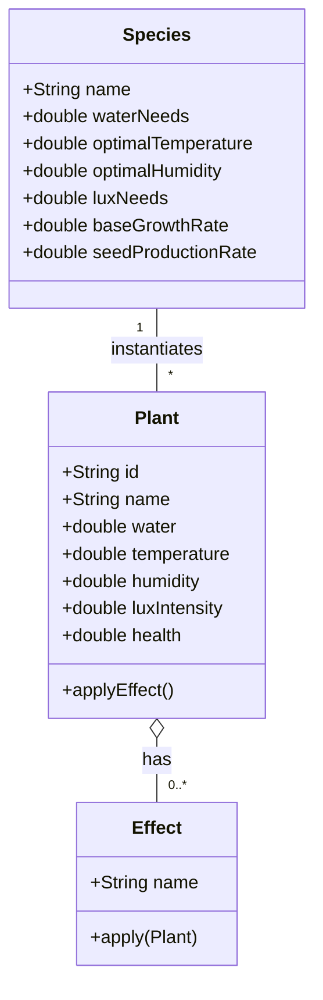

# Gestion des plantes

Les plantes sont des instances d'espèces créées avec des conditions environnementales spécifiques.



## Créer une plante

### Étapes préalables

1. Une espèce doit exister
2. Définir les conditions initiales

### Créer une plante simple

```bash
POST /api/plants/{speciesName}
```

**Corpus** :
```json
{
  "name": "Ma Rose",             // Nom de cette instance
  "water": 450.0,                // Eau initiale (ml)
  "temperature": 22.0,           // Température initiale (°C)
  "humidity": 55.0,              // Humidité initiale (%)
  "luxIntensity": 2900.0         // Lumière initiale (lux)
}
```

**Exemple complet** :
```bash
curl -X POST http://localhost:8080/api/plants/Rose \
  -H "Content-Type: application/json" \
  -d '{
    "name": "Rose du Jardin",
    "water": 500.0,
    "temperature": 20.0,
    "humidity": 60.0,
    "luxIntensity": 3000.0
  }'
```

**Réponse** :
```json
{
  "id": "507f1f77bcf86cd799439012",
  "name": "Rose du Jardin",
  "species": "Rose",
  "status": "HEALTHY",
  "age": 0,
  "health": 100.0,
  "growth": 0.0,
  "environment": {
    "water": 500.0,
    "temperature": 20.0,
    "humidity": 60.0,
    "luxIntensity": 3000.0
  },
  "effects": []
}
```

## Récupérer une plante

### Par ID
```bash
GET /api/plants/{plantId}
```

**Exemple** :
```bash
curl http://localhost:8080/api/plants/507f1f77bcf86cd799439012
```

### Lister toutes les plantes
```bash
GET /api/plants
```

**Exemple** :
```bash
curl http://localhost:8080/api/plants
```

**Réponse** :
```json
[
  {
    "id": "507f1f77bcf86cd799439012",
    "name": "Rose du Jardin",
    "species": "Rose",
    "status": "HEALTHY",
    ...
  },
  {
    "id": "507f1f77bcf86cd799439013",
    "name": "Cactus du Bureau",
    "species": "Cactus",
    "status": "STRESSED",
    ...
  }
]
```

## Mettre à jour une plante

### Modifier l'environnement
```bash
PUT /api/plants/{plantId}
```

**Exemple** : Arroser la plante (augmenter water)
```bash
curl -X PUT http://localhost:8080/api/plants/507f1f77bcf86cd799439012 \
  -H "Content-Type: application/json" \
  -d '{
    "water": 550.0,
    "temperature": 21.0,
    "humidity": 62.0,
    "luxIntensity": 3100.0
  }'
```

## Consulter l'état d'une plante

### Récupérer l'état complet
```bash
GET /api/plants/{plantId}/status
```

**Exemple** :
```bash
curl http://localhost:8080/api/plants/507f1f77bcf86cd799439012/status
```

**Réponse** :
```json
{
  "id": "507f1f77bcf86cd799439012",
  "name": "Rose du Jardin",
  "species": "Rose",
  "status": "HEALTHY",    // État calculé
  "health": 95.5,         // Pourcentage santé
  "age": 5,               // Jours
  "growth": 12.5,         // Croissance (mm)
  "lastUpdated": "2024-02-23T14:30:00Z"
}
```

### Interprétation de la santé

| Status | Plage santé | Signification |
|--------|-------------|---------------|
| 🟢 **HEALTHY** | > 80% | Conditions optimales |
| 🟡 **STRESSED** | 50-80% | Conditions suboptimales |
| 🟠 **DORMANT** | 20-50% | Croissance arrêtée |
| 🔴 **DISEASED** | < 20% | État critique |

## Appliquer des interventions

### Arroser
```bash
PUT /api/plants/{plantId}
```

Augmenter `water` progressivement :
```json
{
  "water": 550.0
}
```

### Tailler
```bash
PUT /api/plants/{plantId}
```

Réduire `growth` :
```json
{
  "growth": 0.0
}
```

### Modifier la lumière
```bash
PUT /api/plants/{plantId}
```

Diminuer `luxIntensity` :
```json
{
  "luxIntensity": 2000.0
}
```

### Augmenter température
```bash
PUT /api/plants/{plantId}
```

Modifier `temperature` :
```json
{
  "temperature": 25.0
}
```

## Gestion des effets

### Ajouter un effet
```bash
POST /api/plants/{plantId}/effects/{effectName}
```

**Effets disponibles** :
- `SHADE` : Réduit lumière -30%
- `FERTILIZER` : Augmente croissance +20%
- `EXTRA_WATERING` : Augmente eau +15%
- `HEATING` : Augmente température +3°C

**Exemple** :
```bash
curl -X POST http://localhost:8080/api/plants/507f1f77bcf86cd799439012/effects/FERTILIZER
```

### Consulter les effets
```bash
GET /api/plants/{plantId}/effects
```

**Exemple** :
```bash
curl http://localhost:8080/api/plants/507f1f77bcf86cd799439012/effects
```

**Réponse** :
```json
["FERTILIZER", "EXTRA_WATERING"]
```

### Retirer un effet
```bash
DELETE /api/plants/{plantId}/effects/{effectName}
```

**Exemple** :
```bash
curl -X DELETE http://localhost:8080/api/plants/507f1f77bcf86cd799439012/effects/FERTILIZER
```

## Supprimer une plante

```bash
DELETE /api/plants/{plantId}
```

**Exemple** :
```bash
curl -X DELETE http://localhost:8080/api/plants/507f1f77bcf86cd799439012
```

## Scénarios d'utilisation

### Scénario 1 : Plante en bonne santé
```json
{
  "name": "Rose heureuse",
  "water": 500.0,
  "temperature": 20.0,
  "humidity": 60.0,
  "luxIntensity": 3000.0
}
```
→ Santé : 100% ✅

### Scénario 2 : Plante stressée (trop chaud)
```json
{
  "name": "Rose en stress",
  "water": 500.0,
  "temperature": 30.0,              // 10°C trop chaud
  "humidity": 60.0,
  "luxIntensity": 3000.0
}
```
→ Santé : ~60% 🟡 Stressée

**Solution** : 
- Ajouter effet `SHADE` (-30% lumière)
- Baisser température
- Augmenter humidité

### Scénario 3 : Plante très stressée (conditions extrêmes)
```json
{
  "name": "Rose mourante",
  "water": 200.0,                   // 60% trop bas
  "temperature": 35.0,              // 15°C trop chaud
  "humidity": 20.0,                 // 40% trop bas
  "luxIntensity": 100.0             // 96% trop bas
}
```
→ Santé : ~15% 🔴 Malade

**Solutions** :
1. Augmenter eau immédiatement (+300ml)
2. Baisser température significantly
3. Augmenter humidité
4. Augmenter lumière progressivement
5. Ajouter effet `EXTRA_WATERING`

## Impact des effets

### Effet FERTILIZER
**Impact** : Croissance +20%

```bash
# Ajouter fertiliseur
curl -X POST http://localhost:8080/api/plants/{plantId}/effects/FERTILIZER

# Résultat : La plante grandit 20% plus vite
# growth: 2.5 mm/jour → 3.0 mm/jour
```

### Effet SHADE
**Impact** : Lumière -30%

```bash
# Ombrer la plante
curl -X POST http://localhost:8080/api/plants/{plantId}/effects/SHADE

# Résultat :
# luxIntensity: 3000 → 2100 lux
# Moins de stress si plante reçoit trop de lumière
```

### Effet EXTRA_WATERING
**Impact** : Eau +15%

```bash
# Arroser plus
curl -X POST http://localhost:8080/api/plants/{plantId}/effects/EXTRA_WATERING

# Résultat :
# water: 500 → 575 ml/jour
# Moins de stress hydrique
```

### Effet HEATING
**Impact** : Température +3°C

```bash
# Chauffer
curl -X POST http://localhost:8080/api/plants/{plantId}/effects/HEATING

# Résultat :
# temperature: 20 → 23°C
# Utile en hiver pour plantes tropicales
```

## Stratégies de soin

### Plante en bon état
- Maintenir conditions : aucune action requise
- Monitorer tous les 2-3 jours

### Plante stressée
1. Identifier le stress (eau, température, lumière)
2. Ajuster les paramètres
3. Ajouter effet approprié
4. Remonter à état HEALTHY

### Plante malade
1. **Urgence eau** : Augmenter drastiquement
2. **Action rapide** : Ajouter EXTRA_WATERING
3. **Isolation** : Retirer les effets négatifs
4. **Lent rétablissement** : Ajuster graduellement

## Questions fréquentes

**Q: Comment savoir si ma plante a besoin d'eau ?**

A: Vérifiez que `water` = `waterNeeds` de l'espèce. Si inférieur, arrosez.

**Q: Quels effets combinent bien ?**

A: `FERTILIZER` + `EXTRA_WATERING` pour croissance rapide  
`SHADE` + `HEATING` pour plantes tropicales

**Q: Quel est le meilleur age pour reproduire une plante ?**

A: Utilisez `seedProductionRate` de l'espèce.

---

**Prêt ?** Consultez [Gestion des forêts](forests.md) pour aller plus loin !
