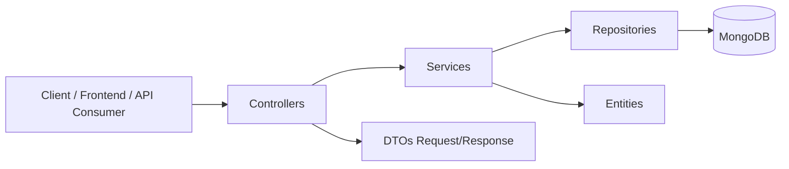
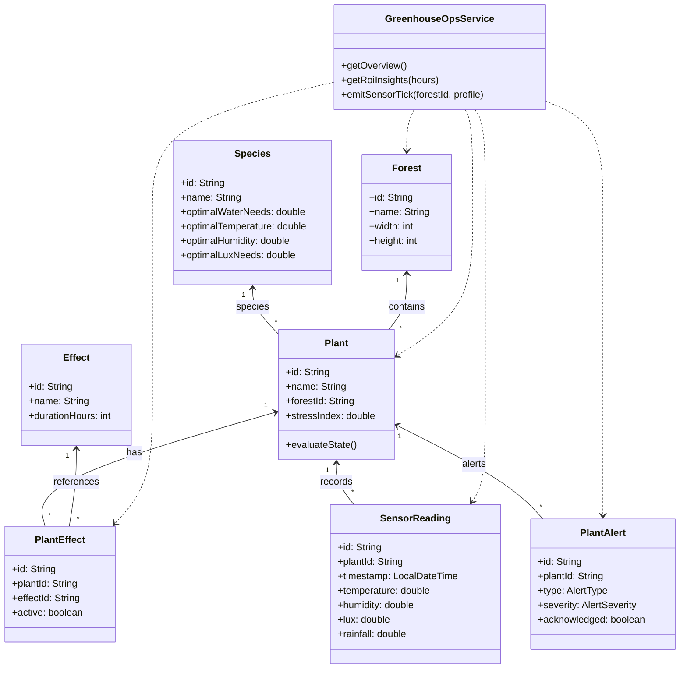

# Architecture

## Vue d'ensemble

GreenDesk suit une architecture Spring Boot classique:

- `controllers`: exposition API REST
- `services`: logique métier
- `repositories`: accès MongoDB
- `entities`: modèles métier

## Diagramme d'architecture (Mermaid)

## Diagramme de classes (Mermaid)

## Modules métier principaux

### Domaine plantes

- `Plant`, `PlantState`, `PlantEffect`
- `PlantService`, `SensorReadingService`, `PlantAlertService`

### Domaine espèces

- `Species`
- `SpeciesService`

### Domaine forêts et saisons

- `Forest`, `ForestCell`
- `Season`, `SeasonCycle`
- `ForestService`, `SeasonService`

### Domaine effets et stimulus

- `Effect`, `Stimulus`
- `EffectService`, `StimulusService`

### Domaine simulation

- `Ecosystem`, `EcosystemCell`, maladies
- `EcosystemService`

### Domaine opérations greenhouse

- `GreenhouseOpsService`
- endpoints KPI/ROI/alertes/sensor-stream

## Couche API (controllers)

Contrôleurs principaux:

- `PlantController`
- `SpeciesController`
- `ForestController`
- `ForestSeasonController`
- `EffectController`
- `StimulusController`
- `SensorReadingController`
- `PlantAlertController`
- `EcosystemController`
- `GreenhouseOpsController`

## Données et persistance

- MongoDB via Spring Data MongoDB
- Repositories typés (`PlantRepository`, `ForestRepository`, etc.)
- Initialisation de données de référence via `DataInitializer`

## Qualité et CI

- Tests JUnit/Spring
- JaCoCo avec seuils de validation dans `build.gradle`
- CI GitHub Actions pour build/tests/coverage

## Principes de conception

- Endpoints REST explicites
- Validation métier dans les services
- Réponses d'erreur HTTP cohérentes (`400`, `404`, `409` selon le cas)
- Endpoints analytics séparés (`/api/greenhouse/*`)
