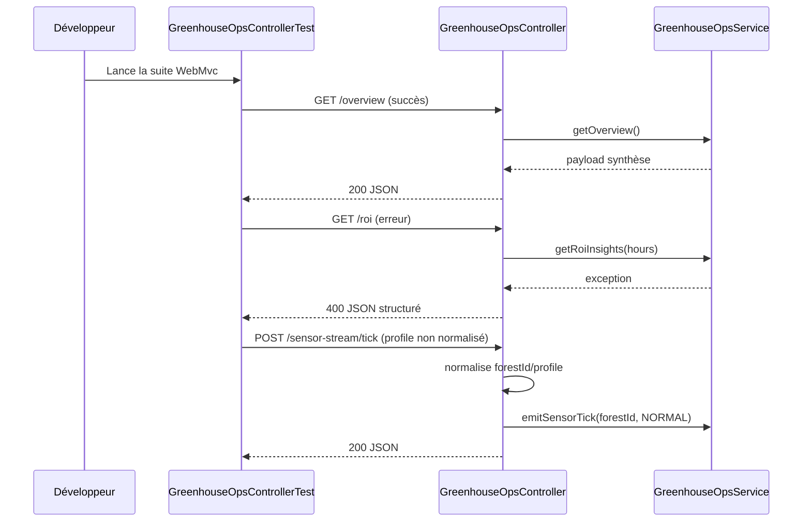
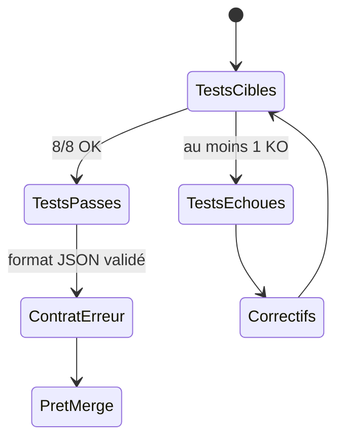

# Rapport d'amélioration — Greenhouse Ops

Date: 2026-02-25

## Contexte

La couche API `GreenhouseOpsController` a été renforcée pour améliorer la robustesse des entrées, l'homogénéité des erreurs et la stabilité des comportements côté client.

## Changements implémentés

### 1) Normalisation des paramètres de requête

- `limit` est borné (`1..500`) sur les endpoints listés.
- `hours` est borné (`1..720`) sur les endpoints listés.

Endpoints concernés:

- `GET /api/greenhouse/live-effects`
- `GET /api/greenhouse/alerts`
- `GET /api/greenhouse/roi`
- `GET /api/greenhouse/roi/forests`

Effet attendu:

- Empêcher les valeurs extrêmes (négatives, nulles, trop grandes).
- Réduire les risques de surcharge et de réponses imprévisibles.

### 2) Validation et normalisation du tick capteurs

Sur `POST /api/greenhouse/sensor-stream/tick`:

- `forestId` est `trim()` puis validé (obligatoire, non vide).
- `profile` est normalisé (`trim().toUpperCase()`), valeur par défaut `NORMAL`.

Effet attendu:

- Réduire les erreurs de saisie utilisateur.
- Garantir un format stable pour les profils (`NORMAL`, `HOT_DRY`, `HUMID_RAIN`, etc.).

### 3) Uniformisation des réponses d'erreur

Les erreurs `400` du contrôleur Greenhouse Ops retournent désormais un JSON structuré:

```json
{
  "error": "message lisible",
  "endpoint": "/roi",
  "timestamp": "2026-02-25T..."
}
```

Effet attendu:

- Contrats d'erreur homogènes pour les clients frontend.
- Débogage simplifié grâce au champ `endpoint`.

## Validation

Tests WebMvc ciblés sur `GreenhouseOpsControllerTest`:

- Résultat: **8 tests passés / 0 échec**
- Couverture vérifiée sur chemins succès + erreurs + normalisation

Cas couverts:

- `overview` succès/erreur
- `roi` et `alerts` en erreur structurée
- validation `forestId` manquant
- succès/erreur `sensor-stream/tick`
- normalisation `forestId/profile` sur tick

## Diagramme de validation (Mermaid)



## Diagramme des portes qualité



## Impact API

### Compatibilité

- Les endpoints et routes restent inchangés.
- Le format des erreurs `400` Greenhouse Ops a évolué de string brute vers JSON structuré.

### Recommandation client

- Adapter les parseurs d'erreur frontend pour lire `error` (et optionnellement `endpoint`, `timestamp`).

## Prochaines étapes recommandées

- Étendre le même format d'erreur JSON aux autres contrôleurs (`plants`, `forests`, `effects`, etc.).
- Ajouter tests de contrat API pour verrouiller le format d'erreur global.
- Documenter les bornes (`limit`, `hours`) dans chaque endpoint détaillé.
