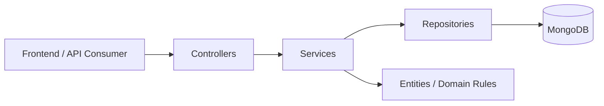
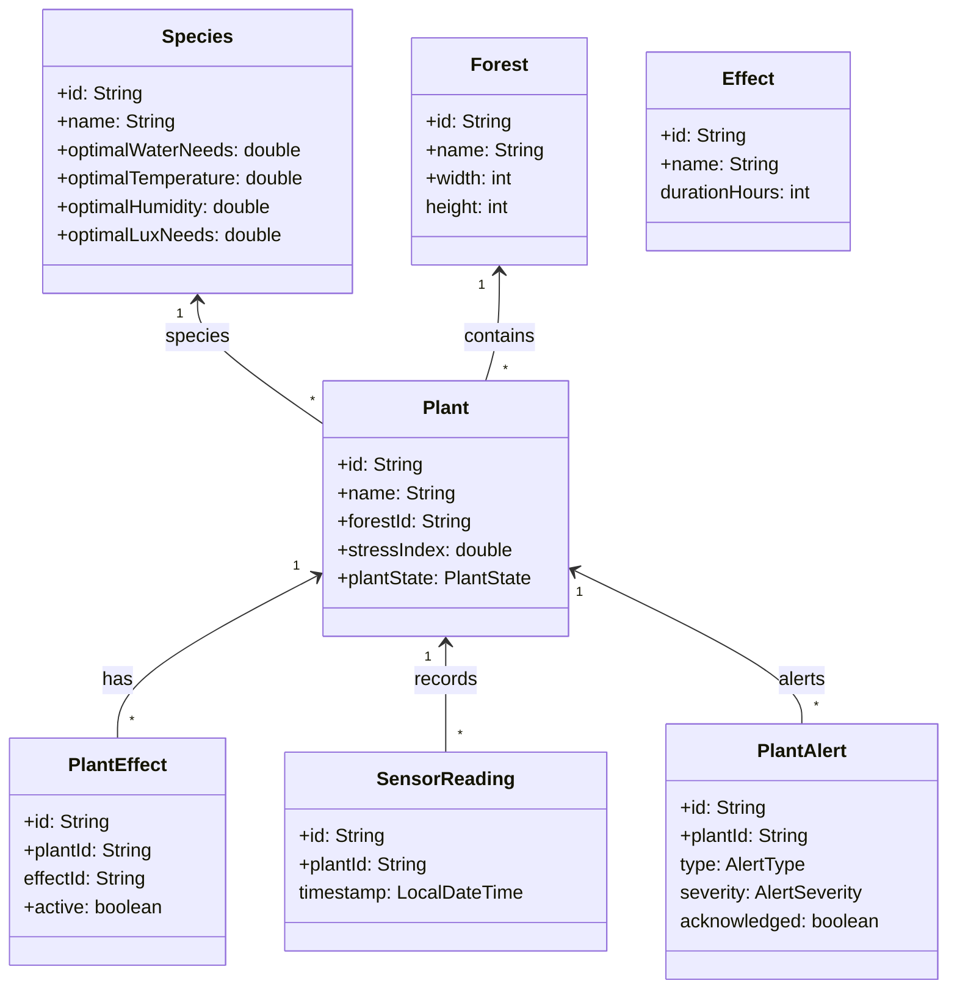
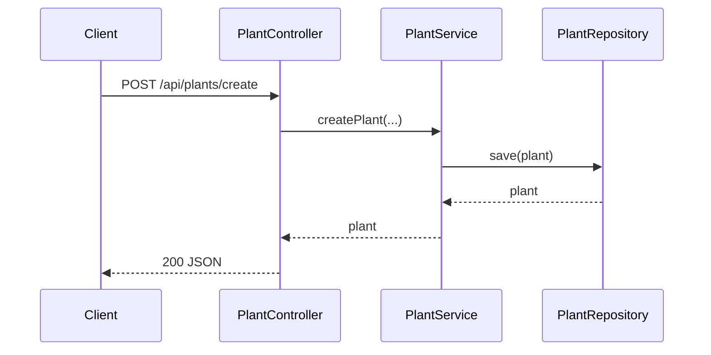
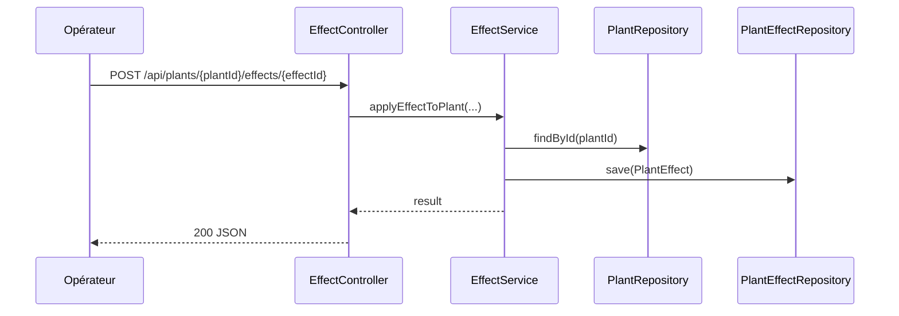
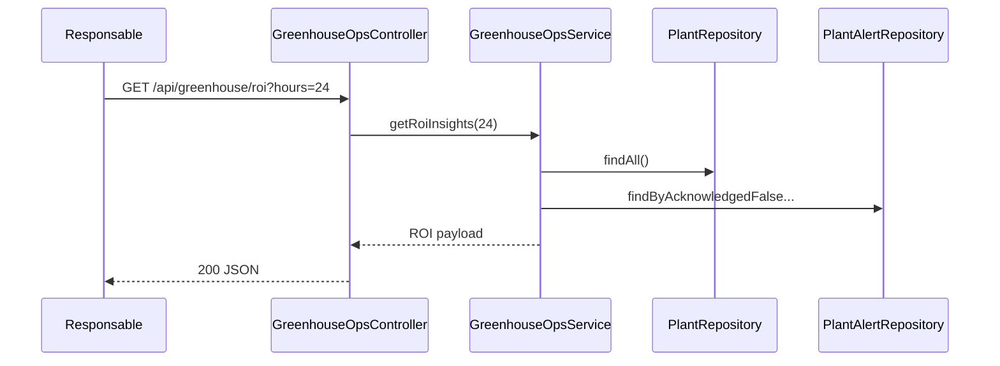
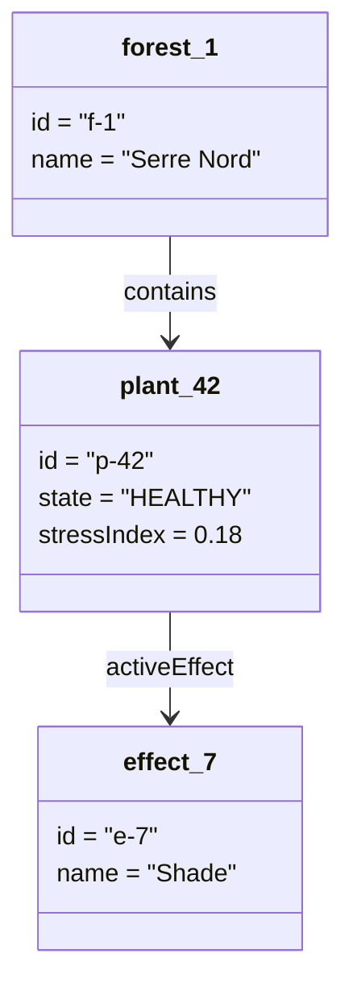
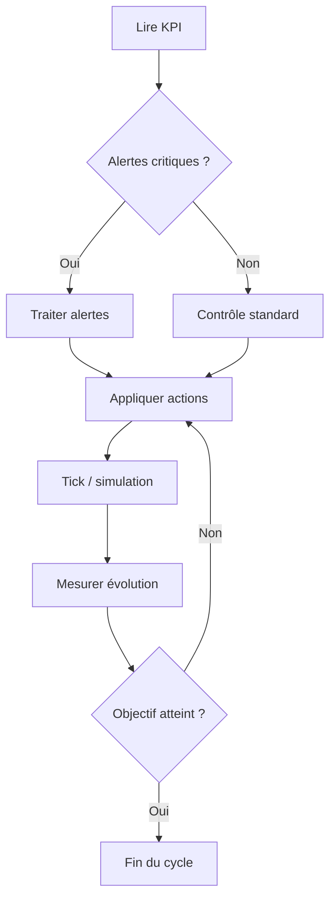
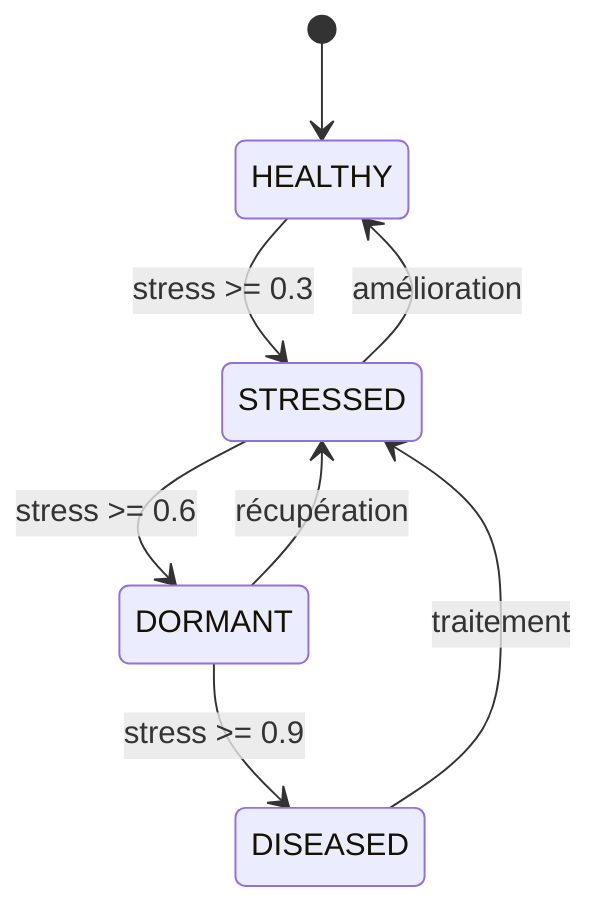
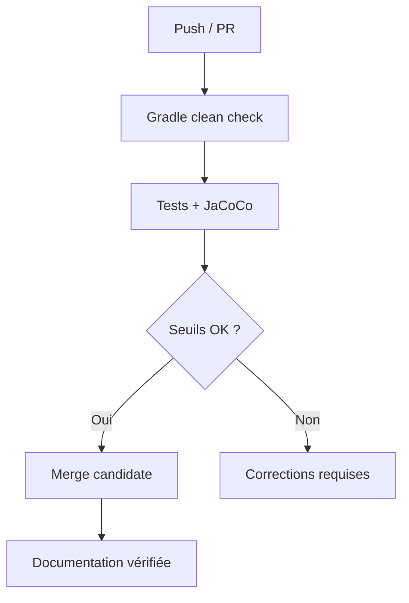

# Dossier Technique & Manuel Utilisateur
## Projet DevOps — Application GreenDesk

<div class="doc-hero">
  <h2 style="margin:0;">GreenDesk — Documentation officielle</h2>
  <p style="margin:8px 0 0;">Version strictement alignée sur le plan du document de référence, adaptée au contexte GreenDesk.</p>
  <div class="doc-meta">
    <span class="doc-chip">Version : v1.1.0</span>
    <span class="doc-chip">Date : 26 février 2026</span>
    <span class="doc-chip">Type : Dossier technique + manuel utilisateur</span>
  </div>
</div>

**Auteurs / Équipe**

| Membre | Rôle | Scope principal |
|---|---|---|
| Équipe GreenDesk | Développement Fullstack / DevOps | Architecture, API, QA, Documentation |

<div class="doc-callout">
<strong>Export PDF :</strong> le bouton <em>Exporter en PDF</em> en haut de page déclenche l’impression PDF (style A4 optimisé).
</div>

## 📑 Sommaire

- **1. [Présentation Générale](#1-présentation-générale)**
	- 1.1 [Objectif du Projet](#11-objectif-du-projet)
	- 1.2 [Équipe & Contributeurs](#12-équipe--contributeurs)
	- 1.3 [Gestion de Projet & DevOps](#13-gestion-de-projet--devops)

- **2. [Analyse Concurrentielle & UX](#2-analyse-concurrentielle--ux)**
	- 2.1 [Étude de la concurrence](#21-étude-de-la-concurrence)
	- 2.2 [Utilisabilité & Design](#22-utilisabilité--design)

- **3. [Architecture Technique](#3-architecture-technique)**
	- 3.1 [Stack Technologique](#31-stack-technologique)
	- 3.2 [Modélisation (UML) & Structure des Données](#32-modélisation-uml--structure-des-données)

- **4. [Fonctionnalités Détaillées (User Guide)](#4-fonctionnalités-détaillées-user-guide)**
	- 4.1 [Feature 1 — Gestion des espèces](#41-feature-1--gestion-des-espèces)
	- 4.2 [Feature 2 — Gestion des plantes](#42-feature-2--gestion-des-plantes)
	- 4.3 [Feature 3 — Forêts & saisons](#43-feature-3--forêts--saisons)
	- 4.4 [Feature 4 — Effets & stimuli](#44-feature-4--effets--stimuli)
	- 4.5 [Feature 5 — Simulation & alertes](#45-feature-5--simulation--alertes)
	- 4.6 [Feature 6 — Greenhouse Ops (KPI / ROI)](#46-feature-6--greenhouse-ops-kpi--roi)
	- 4.7 [Scénarios d’usage (end-to-end)](#47-scénarios-dusage-end-to-end)

- **5. [Matrice de Responsabilités & Réalisations](#5-matrice-de-responsabilités--réalisations)**

- **6. [Tests effectués](#6-tests-effectués)**
	- 6.1 [Couverture](#61-couverture)
	- 6.2 [Couverture — Qui ?](#62-couverture--qui-)
	- 6.3 [Couverture — Quoi ? / Pourquoi ?](#63-couverture--quoi--pourquoi-)
	- 6.4 [Seuils qualité imposés](#64-seuils-qualité-imposés)
	- 6.5 [CI/CD (Documentation complète + CI)](#65-cicd-documentation-complète--ci)
	- 6.6 [Captures qualité](#66-captures-qualité)

- **7. [Guide d’Installation & Déploiement](#7-guide-dinstallation--déploiement)**
	- 7.1 [Prérequis](#71-prérequis)
	- 7.2 [Exécution locale](#72-exécution-locale)
	- 7.3 [Exécution Docker](#73-exécution-docker)
	- 7.4 [Vérifications rapides](#74-vérifications-rapides)
	- 7.5 [Dépannage](#75-dépannage)

- **8. [Annexe API REST](#8-annexe-api-rest)**
	- 8.1 [Base URL](#81-base-url)
	- 8.2 [Endpoints principaux](#82-endpoints-principaux)
	- 8.3 [Exemples payload](#83-exemples-payload)
	- 8.4 [Format d’erreur structuré](#84-format-derreur-structuré)

---

## 1. Présentation Générale

### 1.1 Objectif du Projet

Le projet GreenDesk vise à centraliser les opérations clés de gestion agronomique dans une application unique. Le système permet :

- la gestion des espèces et des plantes,
- la simulation d’environnements (forêts, saisons, effets, stimuli),
- la supervision des alertes,
- l’analyse de KPI et d’indicateurs ROI.

L’objectif est de fournir une base décisionnelle fiable, testée et documentée, utilisable autant par les opérateurs métiers que par l’équipe technique.

### 1.2 Équipe & Contributeurs

| Domaine | Responsables | Livrables |
|---|---|---|
| Produit & cadrage | Équipe projet | Vision, backlog, priorités métier |
| Backend & API | Équipe dev | Contrôleurs, services, persistance |
| Qualité & CI | Référent QA/CI | Tests, couverture, validation pipeline |
| Documentation | Référent documentation | Dossier unique, annexes, export PDF |

### 1.3 Gestion de Projet & DevOps

L’organisation suit une approche itérative inspirée Agile/Scrum :

- cycles courts orientés valeur,
- revues PR systématiques,
- intégration continue orientée qualité,
- documentation maintenue dans le même cycle que le code.

**Mécanismes opérationnels**

- Versioning Git avec branches feature.
- Contrôle qualité local : `./gradlew clean check`.
- Validation CI : tests + JaCoCo + cohérence doc.
- Traçabilité : PR explicites avec impact API/métier.

---

## 2. Analyse Concurrentielle & UX

### 2.1 Étude de la concurrence

| Type d’outil | Forces | Limites |
|---|---|---|
| Tableurs/scripts | Mise en place rapide | Faible robustesse, faible traçabilité |
| Plateformes IoT capteurs | Excellente télémétrie | Modèle métier agronomique limité |
| Simulateurs spécialisés | Simulation poussée | Coût élevé, intégration plus complexe |

**Positionnement GreenDesk** : compromis API-first entre simplicité opérationnelle, modélisation métier et fiabilité logicielle.

### 2.2 Utilisabilité & Design

Principes UX retenus :

- navigation claire orientée tâches,
- accès rapide aux modules critiques,
- lisibilité des états/alertes,
- documentation mono-page pour lecture continue.

Éléments design :

- interface responsive,
- cohérence visuelle entre modules,
- diagrammes et captures intégrés pour compréhension rapide.

---

## 3. Architecture Technique

### 3.1 Stack Technologique

**Backend**

- Langage : Java 21
- Framework : Spring Boot 3.3.3
- Architecture : MVC/REST (`Controller` → `Service` → `Repository`)
- Persistance : MongoDB (Spring Data)

**Frontend / Documentation**

- UI app : HTML5/CSS3/JavaScript
- Documentation : Docsify + Mermaid

**Build & Qualité**

- Build : Gradle Wrapper
- Tests : JUnit + MockMvc
- Couverture : JaCoCo
- API interactive : Swagger/OpenAPI

### 3.2 Modélisation (UML) & Structure des Données

#### 3.2.1 Diagramme d’architecture



#### 3.2.2 Diagramme de classes (back)



#### 3.2.3 Diagrammes de séquence (back)

**Création d’une plante**



**Application d’un effet**



**Consultation ROI**



#### 3.2.4 Diagramme d’objet (back)



#### 3.2.5 Diagramme de cas d’utilisation


#### 3.2.6 Diagramme d’activité



#### 3.2.7 Diagramme d’état



---

## 4. Fonctionnalités Détaillées (User Guide)

> Exigence stricte : 6 fonctionnalités, chacune avec **But feature**, **Scénarios/Personas**, **Wireframes/Screenshots**, **Résumé NVF**.

### 4.1 Feature 1 — Gestion des espèces

**But feature** : centraliser le référentiel agronomique.

**Scénarios / Personas**

- Persona : Opérateur serre
- Scénario : création d’une espèce puis réutilisation lors de la création de plantes.

**Wireframe / screenshot**


**Résumé NVF**

- N : nécessaire pour définir les seuils de référence.
- V : valeur forte sur la cohérence des diagnostics.
- F : faisable via endpoints CRUD déjà exposés.

### 4.2 Feature 2 — Gestion des plantes

**But feature** : suivre les plantes à granularité individuelle.

**Scénarios / Personas**

- Persona : Opérateur serre
- Scénario : création, lecture état/statut, comparaison de deux plantes.

**Wireframe / screenshot**


**Résumé NVF**

- N : indispensable pour le pilotage opérationnel.
- V : visibilité sur stress/état par individu.
- F : endpoints disponibles + logique métier stable.

### 4.3 Feature 3 — Forêts & saisons

**But feature** : organiser la plantation dans l’espace et le temps.

**Scénarios / Personas**

- Persona : Responsable agronomique
- Scénario : créer forêt, placer plantes sans conflit, avancer cycle saisonnier.

**Wireframe / screenshot**


**Résumé NVF**

- N : nécessaire à la simulation réaliste.
- V : améliore la planification des interventions.
- F : mécanismes de grille et season cycle implémentés.

### 4.4 Feature 4 — Effets & stimuli

**But feature** : agir sur l’environnement simulé et observer les impacts.

**Scénarios / Personas**

- Persona : Opérateur serre
- Scénario : appliquer un effet, déclencher un stimulus, vérifier évolution.

**Wireframe / screenshot**


**Résumé NVF**

- N : nécessaire pour passer de l’observation à l’action.
- V : accélère l’optimisation des conditions culturales.
- F : services et endpoints dédiés déjà présents.

### 4.5 Feature 5 — Simulation & alertes

**But feature** : anticiper les dérives et gérer les incidents.

**Scénarios / Personas**

- Persona : Responsable agronomique
- Scénario : simuler plusieurs ticks, analyser alertes, acquitter les alertes traitées.

**Wireframe / screenshot**


**Résumé NVF**

- N : indispensable pour réduction du risque.
- V : priorisation par sévérité.
- F : module simulation + module alertes testés.

### 4.6 Feature 6 — Greenhouse Ops (KPI / ROI)

**But feature** : fournir des indicateurs décisionnels consolidés.

**Scénarios / Personas**

- Persona : Responsable exploitation / Tech lead
- Scénario : lire `overview`, `roi`, `roi/forests`, déclencher `sensor-stream/tick`.

**Wireframe / screenshot**


**Résumé NVF**

- N : nécessaire pour pilotage par la donnée.
- V : améliore arbitrage coût/risque/performance.
- F : GreenhouseOpsService et tests ciblés disponibles.

### 4.7 Scénarios d’usage (end-to-end)

#### Scénario A — Mise en service d’une nouvelle zone

**Objectif** : créer un cycle opérationnel complet de zéro (espèce → plante → forêt).

1. Créer une espèce de référence (ex : Basilic).
2. Créer une plante rattachée à cette espèce.
3. Créer une forêt (grille).
4. Positionner la plante dans la forêt.
5. Vérifier l’état initial de la plante et l’occupation de la forêt.

**Résultat attendu** : la plante est traçable, positionnée sans conflit et prête pour simulation.

#### Scénario B — Diagnostic et correction d’une dérive

**Objectif** : détecter un stress, appliquer une action, puis mesurer l’effet.

1. Lire le statut d’une plante (`/status`) et ses alertes actives.
2. Appliquer un effet (`Shade`, `Extra Watering` ou autre).
3. Déclencher un stimulus si nécessaire (ex : `RAIN`, `HEATWAVE`).
4. Lancer un tick de simulation.
5. Relire stress, état et alertes pour comparer avant/après.

**Résultat attendu** : diminution du stress ou stabilisation de l’état, avec alertes mieux maîtrisées.

#### Scénario C — Pilotage décisionnel journalier (manager)

**Objectif** : prioriser les actions quotidiennes via KPI/ROI.

1. Consulter `GET /api/greenhouse/overview`.
2. Analyser `GET /api/greenhouse/alerts?hours=24&limit=20`.
3. Comparer `GET /api/greenhouse/roi` et `GET /api/greenhouse/roi/forests`.
4. Identifier les forêts à risque / à faible rendement.
5. Définir un plan d’action (effets, fréquence capteurs, ajustements de cycle).

**Résultat attendu** : plan priorisé avec justification chiffrée et suivi continu.

#### Scénario D — Validation technique avant livraison

**Objectif** : garantir la qualité d’une release.

1. Exécuter `./gradlew clean check`.
2. Vérifier les seuils JaCoCo (LINE/BRANCH/CLASS).
3. Contrôler Swagger et les endpoints critiques (espèces, plantes, ROI).
4. Exporter la documentation en PDF.

**Résultat attendu** : build valide, couverture conforme, API vérifiée et documentation prête à diffusion.

---

## 5. Matrice de Responsabilités & Réalisations

| Axe | Responsable principal | Réalisation |
|---|---|---|
| Modèle métier | Dev backend | Entités espèces/plantes/forêts/effets/alertes |
| API REST | Dev backend | Endpoints CRUD + KPI Greenhouse |
| Qualité logicielle | QA/CI | Tests unitaires + WebMvc + couverture |
| Documentation | Référent doc | Dossier unique + diagrammes + annexe API |
| Exploitation locale | DevOps/tech | Runbook local + Docker + diagnostic rapide |

---

## 6. Tests effectués

### 6.1 Couverture

- LINE: `81.04%`
- BRANCH: `52.47%`
- CLASS: `98.18%`

### 6.2 Couverture — Qui ?

- Développeur backend : implémente et maintient les tests.
- Référent QA/CI : valide les seuils et la stabilité.
- Reviewer PR : vérifie la non-régression avant merge.

### 6.3 Couverture — Quoi ? / Pourquoi ?

**Quoi ?**

- Mesurer objectivement la part de code exécutée en tests.
- Couvrir cas nominal + cas d’erreur + branches critiques.

**Pourquoi ?**

- Réduire les bugs de régression.
- Sécuriser les évolutions de logique métier.
- Garantir un niveau de confiance minimal avant intégration.

### 6.4 Seuils qualité imposés

- LINE `>= 70%`
- BRANCH `>= 45%`
- CLASS `>= 90%`

### 6.5 CI/CD (Documentation complète + CI)



Commandes standard :

```bash
./gradlew test
./gradlew clean check
./gradlew test jacocoTestReport
```

### 6.6 Captures qualité


---

## 7. Guide d’Installation & Déploiement

### 7.1 Prérequis

- Java 21
- Docker (optionnel mais recommandé)
- Port 8080 disponible

### 7.2 Exécution locale

```bash
./gradlew clean bootRun
```

- App : `http://localhost:8080/`
- Swagger : `http://localhost:8080/swagger-ui/index.html`

### 7.3 Exécution Docker

```bash
docker compose up -d --build
```

- App : `http://localhost:8080`
- Mongo Express : `http://localhost:8081`

### 7.4 Vérifications rapides

```bash
curl -s http://localhost:8080/api/species
curl -s http://localhost:8080/api/forests
curl -s http://localhost:8080/api/greenhouse/overview
```

### 7.5 Dépannage

- API inaccessible : vérifier port 8080 et logs applicatifs.
- Mongo indisponible : vérifier URI, credentials, service DB.
- Tests en échec : ouvrir le rapport tests et corriger par lot.

---

## 8. Annexe API REST

### 8.1 Base URL

`http://localhost:8080`

### 8.2 Endpoints principaux

| Domaine | Méthode | Endpoint |
|---|---|---|
| Espèces | GET | `/api/species` |
| Espèces | POST | `/api/species` |
| Plantes | POST | `/api/plants/create` |
| Plantes | GET | `/api/plants/{id}/status` |
| Forêts | POST | `/api/forests` |
| Forêts | POST | `/api/forests/{forestId}/plants` |
| Saisons | POST | `/api/forests/{id}/season-cycle/advance` |
| Effets | POST | `/api/plants/{plantId}/effects/{effectId}` |
| Stimulus | POST | `/api/stimuli` |
| Alertes | GET | `/plants/{plantId}/alerts` |
| Alertes | POST | `/alerts/{alertId}/ack` |
| Écosystème | POST | `/api/ecosystem/simulate/{n}` |
| Greenhouse | GET | `/api/greenhouse/overview` |
| Greenhouse | GET | `/api/greenhouse/roi` |
| Greenhouse | POST | `/api/greenhouse/sensor-stream/tick` |

### 8.3 Exemples payload

**Créer espèce**

```json
{
  "name": "Basilic",
  "optimalWaterNeeds": 45,
  "optimalTemperature": 24,
  "optimalHumidity": 55,
  "optimalLuxNeeds": 280,
  "baseGrowthRate": 1.1,
  "seedProductionRate": 0.9
}
```

**Créer forêt**

```json
{
  "name": "Zone-Nord",
  "width": 8,
  "height": 8
}
```

**Tick Greenhouse**

```json
{
  "forestId": "<FOREST_ID>",
  "profile": "NORMAL"
}
```

### 8.4 Format d’erreur structuré

```json
{
  "error": "message lisible",
  "endpoint": "/api/greenhouse/...",
  "timestamp": "2026-02-26T12:34:56"
}
```

---

## Vérification finale de conformité (exigences demandées)

| Exigence | Statut |
|---|---|
| Documentation complète + CI | ✅ |
| Couverture + Qui + Quoi/Pourquoi | ✅ |
| Concurrence | ✅ |
| Architecture & technos | ✅ |
| Éléments de gestion de projet | ✅ |
| Diagrammes classes + séquence + objet (back) | ✅ |
| 6 fonctionnalités complètes (objectif/personas/screenshots/NVF) | ✅ |
| Annexe API REST | ✅ |
