# Dossier Technique & Manuel Utilisateur

## Projet DevOps - Application GreenDesk

<div class="doc-hero">
  <h2 style="margin:0;">GreenDesk - Documentation officielle</h2>
  <p style="margin:8px 0 0;">Version strictement alignée sur le plan du document de référence, adaptée au contexte GreenDesk.</p>
  <div class="doc-meta">
    <span class="doc-chip">Version : v1.1.0</span>
    <span class="doc-chip">Date : 26 février 2026</span>
    <span class="doc-chip">Type : Dossier technique + manuel utilisateur</span>
  </div>
</div>

**Auteurs / Équipe**

- **Hadi ISSA**
- **Fatima SAIDI**
- **Lydia AMROUCHE**
- **Misasoa ROBISON**
- **Mamadou DIALLO**

<div style="display: flex; justify-content: center; gap: 60px; margin: 40px 0; flex-wrap: wrap;">
  <div style="text-align: center;">
    
    <p style="margin-top: 15px; font-weight: bold; font-size: 16px;">📦 Repository GitHub</p>
    <p style="font-size: 13px; color: #666;">github.com/MisasoaRobison/GreenDesk</p>
  </div>
  <div style="text-align: center;">
    
    <p style="margin-top: 15px; font-weight: bold; font-size: 16px;">📚 Documentation en ligne</p>
    <p style="font-size: 13px; color: #666;">misasoarobison.github.io/GreenDesk</p>
  </div>
</div>
<div class="doc-callout">
<strong>Export PDF :</strong> le bouton <em>Exporter en PDF</em> en haut de page déclenche l'impression PDF (style A4 optimisé).
</div>

## Sommaire

- **1. [Présentation Générale](#1-présentation-générale)**
	- 1.1 [Objectif du Projet](#11-objectif-du-projet)
	- 1.2 [Équipe & Contributeurs](#12-équipe--contributeurs)
	- 1.3 [Gestion de Projet & DevOps](#13-gestion-de-projet--devops)

- **2. [Concurrence](#2-concurrence)**
	- 2.1 [Étude de la concurrence](#21-étude-de-la-concurrence)
	- 2.2 [Utilisabilité & Design](#22-utilisabilité--design)

- **3. [Architecture Technique](#3-architecture-technique)**
	- 3.1 [Stack Technologique](#31-stack-technologique)
	- 3.2 [Modélisation (UML) & Structure des Données](#32-modélisation-uml--structure-des-données)

- **4. [Fonctionnalités Détaillées (User Guide)](#4-fonctionnalités-détaillées-user-guide)**
	- 4.1 [Feature 1 - Gestion des espèces et plantes CRUD](#41-feature-1--gestion-des-espèces-et-plantes-crud)
	- 4.2 [Feature 2 - Simulation évolutive d'une plante](#42-feature-2--simulation-évolutive-dune-plante)
	- 4.3 [Feature 3 - Forêts & saisons](#43-feature-3--forêts--saisons)
	- 4.4 [Feature 4 - Effets & stimuli](#44-feature-4--effets--stimuli)
	- 4.5 [Feature 5 - Simulation & alertes](#45-feature-5--simulation--alertes)
	- 4.5.1 [Feature V2.1 - Alertes météo](#451-feature-v21---alertes-météo)
	- 4.6 [Feature 6 - Simulation écosystème](#46-feature-6--simulation-écosystème)
	- 4.7 [Feature 7 - Greenhouse Ops (KPI / ROI)](#47-feature-7--greenhouse-ops-kpi--roi)
	- 4.8 [Feature 8 - Capteurs (Sensor Readings)](#48-feature-8--capteurs-sensor-readings)

- **5. [Matrice de Responsabilités & Réalisations](#5-matrice-de-responsabilités--réalisations)**

- **6. [Tests effectués](#6-tests-effectués)**
	- 6.1 [Couverture](#61-couverture)
	- 6.2 [CI/CD (Documentation complète + CI)](#62-cicd-documentation-complète--ci)
	- 6.3 [Captures qualité](#63-captures-qualité)

- **7. [Guide d'Installation & Déploiement](#7-guide-dinstallation--déploiement)**
	- 7.1 [Prérequis](#71-prérequis)
	- 7.2 [Exécution locale](#72-exécution-locale)
	- 7.3 [Exécution Docker](#73-exécution-docker)
	- 7.4 [Vérifications rapides](#74-vérifications-rapides)
	- 7.5 [Dépannage](#75-dépannage)

- **8. [Annexe API REST](#8-annexe-api-rest)**
	- 8.1 [Base URL](#81-base-url)
	- 8.2 [Endpoints principaux](#82-endpoints-principaux)
	- 8.3 [Exemples payload](#83-exemples-payload)
	- 8.4 [Captures API (CLI)](#84-captures-api-cli)
	- 8.5 [Format d'erreur structuré](#85-format-derreur-structuré)

---

## 4.5.1 Feature V2.1 - Alertes météo

Cette section décrit la **Partie 2 de la feature V2.1**, réalisée pour l'ajout du traitement et de l'affichage des alertes météo.

- Intégration de l'endpoint `POST /api/weather/webhook` pour la réception des alertes météo.
- Vérification et validation des payloads reçus avant persistance.
- Correction du traitement des coordonnées de forêts pour permettre le calcul du rayon d'impact des alertes.
- Mise à jour de la documentation et du README pour refléter l'avancement de la fonctionnalité.
- Ajout de scripts de test locaux : `test-weather.sh` et `test-weather.bat`.

## 1. Présentation Générale

### 1.1 Objectif du Projet

**Le projet GreenDesk vise à centraliser les opérations clés de gestion agronomique dans une application unique. Le système permet** :

- la gestion des espèces et des plantes,
- la simulation d'environnements **(forêts, saisons, effets, stimuli)**,
- la supervision des alertes,
- l'analyse de **KPI** et d'indicateurs **ROI**.

L'objectif est de fournir une base décisionnelle fiable, testée et documentée, utilisable autant par les opérateurs métiers que par l'équipe technique.

**Qui ?**

- **Opérateurs serre** : utilisent les fonctions terrain (espèces, plantes, forêts, interventions).
- **Responsables agronomiques** : pilotent les alertes, la simulation et les décisions **KPI/ROI**.
- **Équipe technique** : maintient l'**API**, la qualité logicielle et l'exploitation.

**Quoi ?**

- Une plateforme unique pour gérer les données agronomiques, simuler les évolutions et suivre la performance.
- Un socle **API** documenté et testable pour intégrer des interfaces et automatisations.

**Pourquoi ?**

- Réduire la dispersion des informations et améliorer la traçabilité opérationnelle.
- Accélérer la prise de décision grâce à des indicateurs consolidés.
- Limiter les régressions via une approche qualité/CI continue.

**Scénario d'usage (application actuelle)**

**Objectif**

Décrire le flux opérationnel réel de l'application GreenDesk, de la création de plante jusqu'au pilotage par indicateurs.

**Quoi ?**

Un scénario métier concret qui combine création, simulation, alertes, corrections et suivi KPI dans le fonctionnement actuel.

**Contexte** : un agriculteur exploite plusieurs forêts dont les performances diffèrent selon les conditions climatiques, les maladies et les interventions réalisées. Avec des ressources limitées (temps, budget, traitements), il ne peut pas agir partout de la même manière et doit prioriser les zones les plus rentables.

**Acteurs**

- Agriculteur / exploitant
- Responsable agronomique
- Manager exploitation

**Déroulé du scénario**

1. L'agriculteur structure ses données de base : espèces, plantes et affectation dans plusieurs forêts (`/api/species`, `/api/plants/create`, `/api/forests`, `/api/forests/{forestId}/plants`).
2. Il lance des simulations d'évolution par forêt pour observer l'impact des conditions locales (`/api/ecosystem/tick`, `/api/ecosystem/simulate/{n}`, `/api/ecosystem/simulate/{forestId}/{n}`).
3. L'équipe analyse l'état sanitaire, les alertes et les mesures capteurs pour identifier les zones critiques (`/plants/{plantId}/alerts`, `/api/sensor-readings/...`).
4. Des actions correctives ciblées sont appliquées (effets, stimuli, traitements), puis les alertes sont acquittées (`/api/plants/{plantId}/effects/{effectId}`, `/api/stimuli`, `/alerts/{alertId}/ack`).
5. Le manager compare les indicateurs consolidés et le ROI par forêt afin d'identifier les forêts à forte valeur potentielle (`/api/greenhouse/overview`, `/api/greenhouse/roi`, `/api/greenhouse/roi/forests`).
6. Les investissements (traitements, interventions, réallocation des ressources) sont priorisés sur les forêts au meilleur retour attendu, puis un nouveau cycle de simulation est relancé.

**Résultat attendu**

- Vision claire des forêts les plus performantes et des forêts à risque.
- Priorisation des actions selon le retour sur investissement potentiel.
- Maximisation progressive de la rentabilité globale de l'exploitation via des décisions pilotées par données.

### 1.2 Équipe & Contributeurs

Membres du groupe :

- **Hadi ISSA**
- **Fatima SAIDI**
- **Lydia AMROUCHE**
- **Misasoa ROBISON**
- **Mamadou DIALLO**

**Répartition des contributions** :

- **Produit & cadrage** : vision, backlog, priorités métier.
- **Backend & API** : contrôleurs, services, persistance.
- **Qualité & CI** : tests, couverture, validation pipeline.
- **Documentation** : dossier unique, annexes, export PDF.

### 1.3 Gestion de Projet & DevOps

L'organisation suit une approche itérative inspirée Agile/Scrum :

- cycles courts orientés valeur,
- revues PR systématiques,
- intégration continue orientée qualité,
- documentation maintenue dans le même cycle que le code.

**Mécanismes opérationnels**

- Versioning **Git** avec branches feature.
- **Contrôle qualité local** : `./gradlew clean check`.
- **Validation CI** : tests + JaCoCo + cohérence doc.
- **Traçabilité** : PR explicites avec impact API/métier.

---

## 2. Concurrence

### 2.1 Étude de la concurrence

L'analyse concurrentielle est réalisée sur trois familles de solutions utilisées dans des contextes proches de GreenDesk.

| Type d'outil | Forces | Limites | Écart couvert par GreenDesk |
|---|---|---|---|
| Tableurs / scripts | Démarrage très rapide, peu de friction | Données dispersées, faible traçabilité, logique difficile à maintenir | Référentiel centralisé + API versionnable + règles métier explicites |
| Plateformes IoT orientées capteurs | Excellente télémétrie temps réel | Faible profondeur métier agronomique, faible simulation native | Intègre capteurs + états plante + alertes + simulation dans un même modèle |
| Simulateurs spécialisés | Moteurs avancés de simulation | Coûts/licences élevés, intégration SI plus lourde | Approche pragmatique API-first, plus légère à intégrer et exploiter |

**Lecture stratégique**

- Les outils simples sont rapides, mais deviennent coûteux en maintenance quand le périmètre grandit.
- Les outils très spécialisés sont puissants, mais peuvent être surdimensionnés pour un usage opérationnel quotidien.
- **GreenDesk** cible une zone d'équilibre : suffisamment structuré pour durer, suffisamment simple pour rester exploitable.

**Positionnement GreenDesk**

- Architecture API-first pour faciliter intégration et automatisation.
- Couplage métier + qualité (tests, couverture, CI) pour fiabilité continue.
- Vision opérationnelle complète : espèces → plantes → forêts → alertes/simulation → KPI/ROI.

### 2.2 Utilisabilité & Design

L'utilisabilité est pensée pour réduire le temps entre observation et action.

**Principes UX retenus**

- Navigation orientée tâches métier (créer, diagnostiquer, corriger, vérifier).
- Accès rapide aux points critiques (état plante, alertes, KPI, ROI).
- Lisibilité forte des signaux (stress, sévérité, tendances).
- Documentation mono-page pour lecture continue et export PDF instantané.

**Décisions de design**

- Interface responsive pour usage sur postes variés.
- Hiérarchie visuelle stable (titres, blocs, tableaux, callouts).
- Cohérence de vocabulaire entre UI, API et documentation.
- Diagrammes Mermaid + captures réelles pour accélérer la compréhension.

**Critères d'utilisabilité visés**

- Comprendre les informations clés en moins de 30 secondes sur un écran de synthèse.
- Retrouver une action principale en moins de 3 clics.
- Identifier un état anormal sans ambiguïté grâce aux alertes et statuts.

**Bénéfice attendu**

- Moins d'erreurs d'interprétation.
- Décisions plus rapides côté exploitation.
- Meilleure adoption par les profils non techniques.

---

## 3. Architecture Technique

### 3.1 Stack Technologique

**Backend**

- **Langage** : Java 21
- **Framework** : Spring Boot 3.3.3
- **Architecture** : MVC/REST (`Controller` -> `Service` -> `Repository`)
- **Persistance** : MongoDB (Spring Data)

**Frontend / Documentation**

- **UI app** : HTML5/CSS3/JavaScript
- **Documentation** : Docsify + Mermaid

**Build & Qualité**

- **Build** : Gradle Wrapper
- **Tests** : JUnit + MockMvc
- **Couverture** : JaCoCo
- **API interactive** : Swagger/OpenAPI

### 3.2 Modélisation (UML) & Structure des Données

#### 3.2.1 Diagramme d'architecture

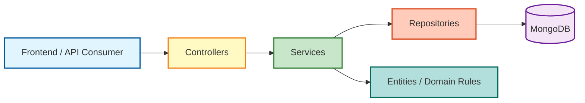
```mermaid
flowchart LR
    client["Frontend / API Consumer"] --> controller["Controllers"]
    controller --> service["Services"]
    service --> repository["Repositories"]
    repository --> database[("MongoDB")]
    service --> domain["Entities / Domain Rules"]

    classDef clientStyle fill:#e1f5ff,stroke:#01579b,stroke-width:2px
    classDef controllerStyle fill:#fff9c4,stroke:#f57f17,stroke-width:2px
    classDef serviceStyle fill:#c8e6c9,stroke:#2e7d32,stroke-width:2px
    classDef repositoryStyle fill:#ffccbc,stroke:#d84315,stroke-width:2px
    classDef databaseStyle fill:#f3e5f5,stroke:#6a1b9a,stroke-width:2px
    classDef domainStyle fill:#b2dfdb,stroke:#00695c,stroke-width:2px

    class client clientStyle
    class controller controllerStyle
    class service serviceStyle
    class repository repositoryStyle
    class database databaseStyle
    class domain domainStyle
```

Ce diagramme montre l'architecture en couches de GreenDesk et la séparation claire des responsabilités.
Les contrôleurs exposent les endpoints REST, les services appliquent les règles métier (stress, états, effets, alertes), et les repositories gèrent la persistance MongoDB.
Cette organisation limite les régressions, facilite les tests ciblés et rend l'évolution des features plus sûre.

#### 3.2.2 Diagramme de classes - Livraison 1

Ce diagramme représente la base du domaine métier au démarrage du projet.
- `Species` centralise les paramètres agronomiques de référence (eau, température, humidité, lumière) qui servent de seuils cibles.
- `Plant` représente chaque instance suivie dans le système avec son état courant (`PlantState`) et son niveau de stress (`stressIndex`).
- `EnvironmentData` décrit le contexte de simulation (température, humidité, luminosité, pluie, horodatage) utilisé pour faire évoluer la plante.
- La relation `Species 1 -> * Plant` garantit qu'une plante est toujours rattachée à une espèce définie, ce qui sécurise les règles de simulation F2.
- La relation `Plant -> EnvironmentData` relie chaque mise à jour d'état de plante aux conditions environnementales observées.
- Cette version répond au besoin de la livraison 1 : créer, structurer et suivre une plante à l'échelle individuelle.

**Périmètre Livraison 1 :**
- F1: Gestion des espèces et plantes
- F2: Simulation évolutive d'une plante

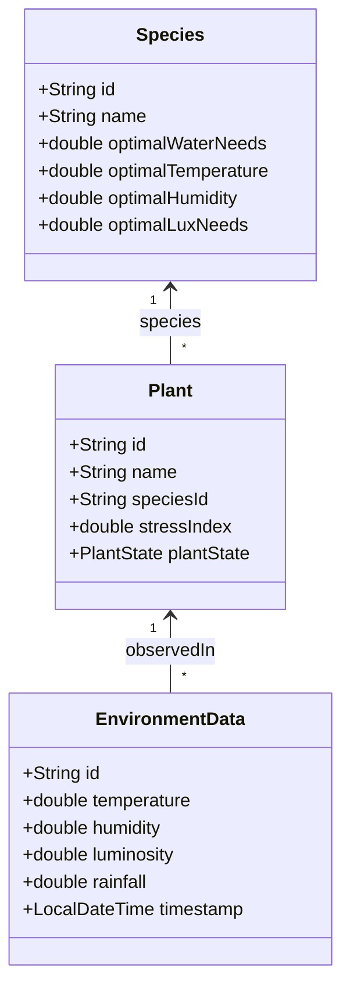
```mermaid
classDiagram
    class Species {
        +String id
        +String name
        +double optimalWaterNeeds
        +double optimalTemperature
        +double optimalHumidity
        +double optimalLuxNeeds
    }

    class Plant {
        +String id
        +String name
        +String speciesId
        +double stressIndex
        +PlantState plantState
    }

    class EnvironmentData {
        +String id
        +double temperature
        +double humidity
        +double luminosity
        +double rainfall
        +LocalDateTime timestamp
    }

    Species "1" <-- "*" Plant : species
    Plant "1" <-- "*" EnvironmentData : observedIn
```

Ce diagramme illustre le noyau initial du projet : un référentiel d'espèces, des plantes rattachées et des observations d'environnement.
Dans GreenDesk, c'est ce triplet qui permet de calculer `stressIndex`, de déduire `PlantState` et de conserver l'historique des conditions.
Il sert de base fonctionnelle aux endpoints CRUD de F1 et à la simulation individuelle de F2.

#### 3.2.3 Diagramme de classes - Livraison 2

Ce diagramme étend le modèle de L1 vers un pilotage opérationnel complet (périmètre cumulatif F1 à F5).
- `Forest` et `Season` ajoutent la dimension environnementale : positionnement des plantes dans une forêt et évolution saisonnière.
- `Effect`, `Stimulus` et `PlantEffect` modélisent les actions appliquées sur les plantes et leur persistance dans le temps.
- `SensorReading` formalise l'observation terrain (mesures horodatées) pour rapprocher simulation et données mesurées.
- `PlantAlert` structure la détection d'anomalies (type, sévérité, acquittement) pour la supervision.
- Les associations montrent clairement le flux métier : une plante est placée, influencée, mesurée et surveillée.

**Périmètre Livraison 2 :**
- F1: Gestion des espèces et plantes
- F2: Simulation évolutive d'une plante
- F3: Forêts et saisons
- F4: Effets et stimulus
- F5: Alertes et capteurs

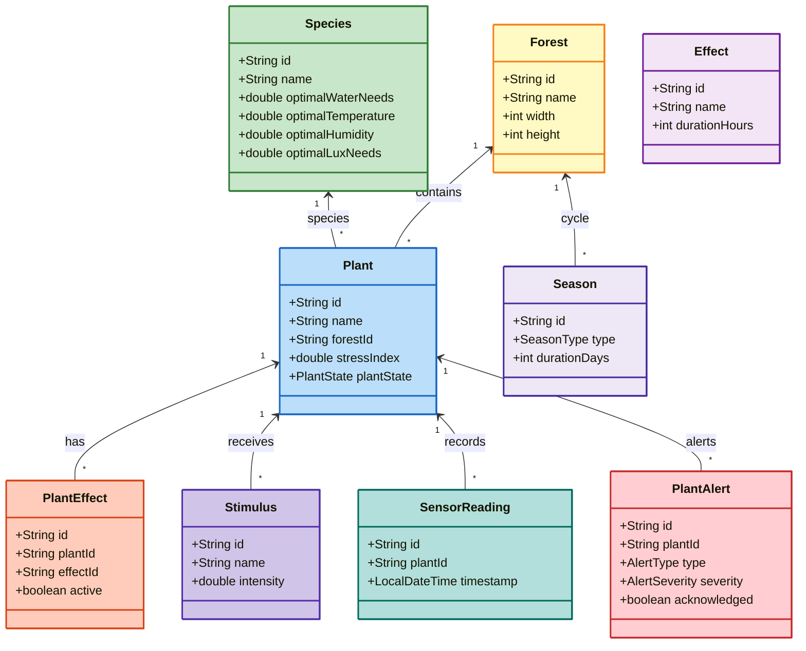
```mermaid
classDiagram
    class Species {
        +String id
        +String name
        +double optimalWaterNeeds
        +double optimalTemperature
        +double optimalHumidity
        +double optimalLuxNeeds
    }

    class Plant {
        +String id
        +String name
        +String forestId
        +double stressIndex
        +PlantState plantState
    }

    class Forest {
        +String id
        +String name
        +int width
        +int height
    }

    class Season {
        +String id
        +SeasonType type
        +int durationDays
    }

    class Effect {
        +String id
        +String name
        +int durationHours
    }

    class Stimulus {
        +String id
        +String name
        +double intensity
    }

    class PlantEffect {
        +String id
        +String plantId
        +String effectId
        +boolean active
    }

    class SensorReading {
        +String id
        +String plantId
        +LocalDateTime timestamp
    }

    class PlantAlert {
        +String id
        +String plantId
        +AlertType type
        +AlertSeverity severity
        +boolean acknowledged
    }

    Species "1" <-- "*" Plant : species
    Forest "1" <-- "*" Plant : contains
    Forest "1" <-- "*" Season : cycle
    Plant "1" <-- "*" PlantEffect : has
    Plant "1" <-- "*" Stimulus : receives
    Plant "1" <-- "*" SensorReading : records
    Plant "1" <-- "*" PlantAlert : alerts
    
    style Species fill:#c8e6c9,stroke:#2e7d32,stroke-width:2px
    style Plant fill:#bbdefb,stroke:#1565c0,stroke-width:2px
    style Forest fill:#fff9c4,stroke:#f57f17,stroke-width:2px
    style Season fill:#ede7f6,stroke:#4527a0,stroke-width:2px
    style Effect fill:#f3e5f5,stroke:#6a1b9a,stroke-width:2px
    style Stimulus fill:#d1c4e9,stroke:#512da8,stroke-width:2px
    style PlantEffect fill:#ffccbc,stroke:#d84315,stroke-width:2px
    style SensorReading fill:#b2dfdb,stroke:#00695c,stroke-width:2px
    style PlantAlert fill:#ffcdd2,stroke:#c62828,stroke-width:2px
```

Ce schéma montre l'extension opérationnelle de GreenDesk autour de la plante : placement en forêt, cycle saisonnier, actions correctives, capteurs et alertes.
Il matérialise le flux métier réel du projet : observer, agir, mesurer, puis superviser.
Cette vue explique pourquoi F3, F4 et F5 doivent être cohérentes entre elles pour produire une simulation exploitable.

#### 3.2.4 Diagramme de classes final - Livraison 3

Ce diagramme final consolide les objets métier des livraisons 1 et 2 et ajoute la couche de simulation globale.
- `Ecosystem` introduit le niveau système (simulation par forêt et suivi du nombre de ticks).
- `EcosystemCell` décrit la granularité spatiale de la simulation (coordonnées `x/y` et plante présente dans la cellule).
- `RoiByForest`, `UsageScenario` et `PlacementSuggestion` couvrent la partie décisionnelle de la livraison 3 (classement ROI, scénarios end-to-end, optimisation de placement).
- Le modèle relie maintenant quatre niveaux cohérents : référentiel agronomique (`Species`), exécution opérationnelle (`Plant`, alertes, capteurs, effets), orchestration globale (`Ecosystem`) et aide à la décision.
- Cette version finale sert de référence cible pour l'architecture fonctionnelle, les services backend et la traçabilité des évolutions F1 à F9.

**Périmètre Livraison 3 (final) :**
- F1: Gestion des espèces et plantes
- F2: Simulation évolutive d'une plante
- F3: Forêts et saisons
- F4: Effets et stimulus
- F5: Alertes et capteurs
- F6: Simulation écosystème
- F7: Classement ROI par forêt
- F8: Scénarios d'usage end-to-end
- F9: Optimiseur de placement de plantes

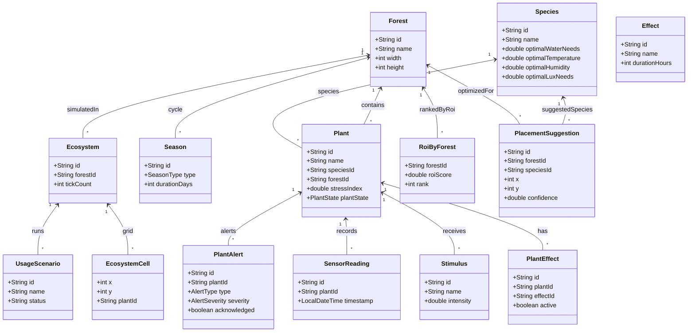
```mermaid
classDiagram
    class Species {
        +String id
        +String name
        +double optimalWaterNeeds
        +double optimalTemperature
        +double optimalHumidity
        +double optimalLuxNeeds
    }

    class Plant {
        +String id
        +String name
        +String speciesId
        +String forestId
        +double stressIndex
        +PlantState plantState
    }

    class Forest {
        +String id
        +String name
        +int width
        +int height
    }

    class Season {
        +String id
        +SeasonType type
        +int durationDays
    }

    class Effect {
        +String id
        +String name
        +int durationHours
    }

    class Stimulus {
        +String id
        +String name
        +double intensity
    }

    class PlantEffect {
        +String id
        +String plantId
        +String effectId
        +boolean active
    }

    class SensorReading {
        +String id
        +String plantId
        +LocalDateTime timestamp
    }

    class PlantAlert {
        +String id
        +String plantId
        +AlertType type
        +AlertSeverity severity
        +boolean acknowledged
    }

    class Ecosystem {
        +String id
        +String forestId
        +int tickCount
    }

    class EcosystemCell {
        +int x
        +int y
        +String plantId
    }

    class RoiByForest {
        +String forestId
        +double roiScore
        +int rank
    }

    class UsageScenario {
        +String id
        +String name
        +String status
    }

    class PlacementSuggestion {
        +String id
        +String forestId
        +String speciesId
        +int x
        +int y
        +double confidence
    }

    Species "1" <-- "*" Plant : species
    Forest "1" <-- "*" Plant : contains
    Forest "1" <-- "*" Season : cycle
    Plant "1" <-- "*" PlantEffect : has
    Plant "1" <-- "*" Stimulus : receives
    Plant "1" <-- "*" SensorReading : records
    Plant "1" <-- "*" PlantAlert : alerts
    Forest "1" <-- "*" Ecosystem : simulatedIn
    Ecosystem "1" <-- "*" EcosystemCell : grid
    Forest "1" <-- "*" RoiByForest : rankedByRoi
    Ecosystem "1" <-- "*" UsageScenario : runs
    Forest "1" <-- "*" PlacementSuggestion : optimizedFor
    Species "1" <-- "*" PlacementSuggestion : suggestedSpecies
```

Ce diagramme final présente la vision complète du produit, de la donnée agronomique jusqu'au pilotage global.
Il relie l'opérationnel (plantes, effets, alertes, capteurs) à la décision (simulation écosystème, ROI, suggestions de placement).
C'est la référence structurelle utilisée pour aligner le backend, les APIs et les scénarios métier des livraisons finales.

#### 3.2.5 Diagrammes de séquence (back)

**Création d'une plante**

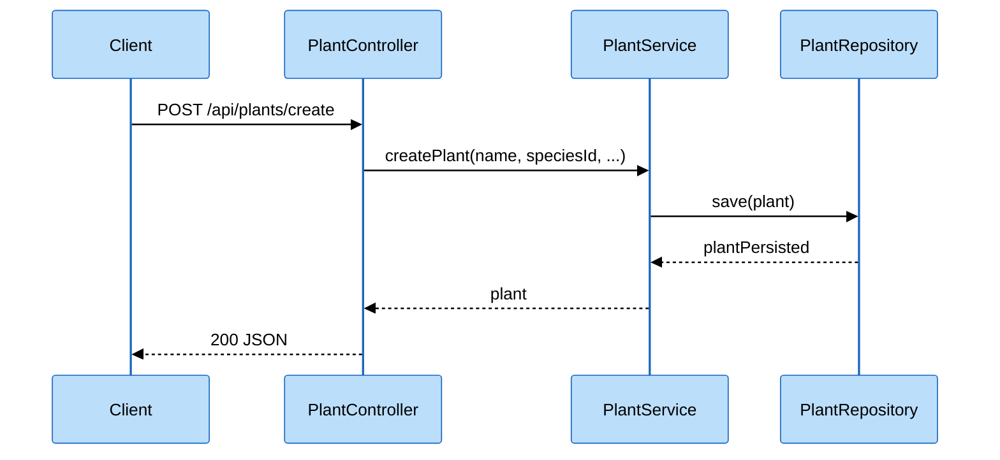
```mermaid
%%{init: {'theme':'base', 'themeVariables': { 'primaryColor':'#bbdefb','primaryTextColor':'#000','primaryBorderColor':'#1565c0','lineColor':'#1565c0','secondaryColor':'#c8e6c9','tertiaryColor':'#fff9c4','noteBkgColor':'#fff3cd','noteTextColor':'#000'}}}%%
sequenceDiagram
    participant client as Client
    participant controller as PlantController
    participant service as PlantService
    participant repository as PlantRepository

    client->>controller: POST /api/plants/create
    controller->>service: createPlant(name, speciesId, ...)
    service->>repository: save(plant)
    repository-->>service: plantPersisted
    service-->>controller: plant
    controller-->>client: 200 JSON
```

Cette séquence décrit le flux standard de création d'une plante côté backend.
Elle montre le passage `Controller -> Service -> Repository`, avec validation métier avant écriture en base.
Dans le projet, ce flux garantit qu'une plante est créée de manière cohérente avec son espèce et directement exploitable en simulation.

**Application d'un effet**

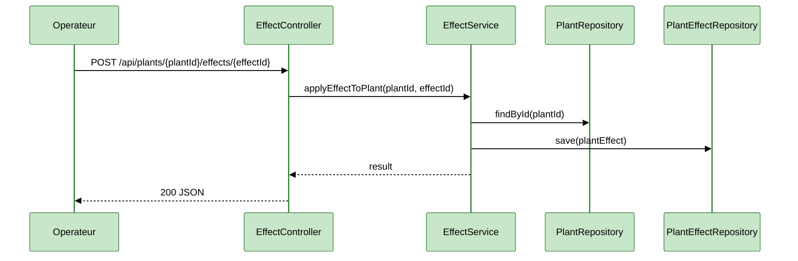
```mermaid
%%{init: {'theme':'base', 'themeVariables': { 'primaryColor':'#c8e6c9','primaryTextColor':'#000','primaryBorderColor':'#2e7d32','lineColor':'#2e7d32','secondaryColor':'#f3e5f5','tertiaryColor':'#ffccbc','noteBkgColor':'#fff3cd','noteTextColor':'#000'}}}%%
sequenceDiagram
    participant user as Operateur
    participant controller as EffectController
    participant service as EffectService
    participant plantRepo as PlantRepository
    participant effectRepo as PlantEffectRepository

    user->>controller: POST /api/plants/{plantId}/effects/{effectId}
    controller->>service: applyEffectToPlant(plantId, effectId)
    service->>plantRepo: findById(plantId)
    service->>effectRepo: save(plantEffect)
    service-->>controller: result
    controller-->>user: 200 JSON
```

Cette séquence montre l'application d'un effet sur une plante depuis l'API.
Le service vérifie la plante cible, persiste l'effet actif, puis renvoie un résultat consommable par l'interface.
C'est le mécanisme clé de F4 pour transformer une action utilisateur en impact réel sur le calcul de stress/croissance.

**Consultation ROI**

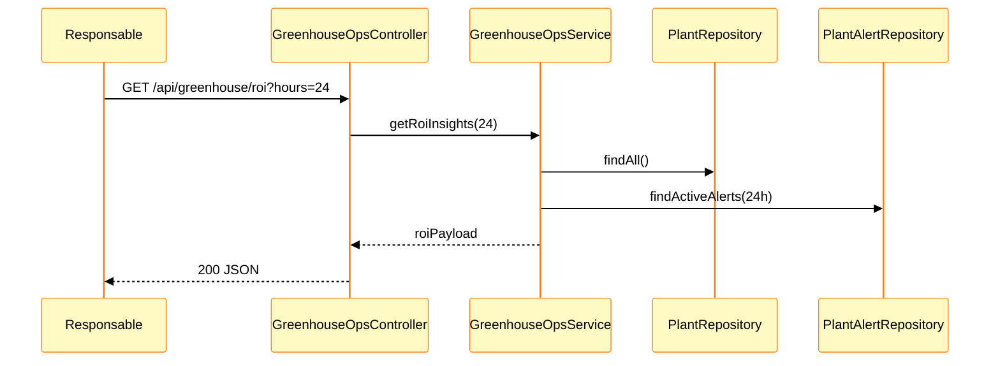
```mermaid
%%{init: {'theme':'base', 'themeVariables': { 'primaryColor':'#fff9c4','primaryTextColor':'#000','primaryBorderColor':'#f57f17','lineColor':'#f57f17','secondaryColor':'#bbdefb','tertiaryColor':'#b2dfdb','noteBkgColor':'#fff3cd','noteTextColor':'#000'}}}%%
sequenceDiagram
    participant manager as Responsable
    participant controller as GreenhouseOpsController
    participant service as GreenhouseOpsService
    participant plantRepo as PlantRepository
    participant alertRepo as PlantAlertRepository

    manager->>controller: GET /api/greenhouse/roi?hours=24
    controller->>service: getRoiInsights(24)
    service->>plantRepo: findAll()
    service->>alertRepo: findActiveAlerts(24h)
    service-->>controller: roiPayload
    controller-->>manager: 200 JSON
```

Cette séquence représente la consultation ROI pour le pilotage des forêts.
Le service agrège les données de plantes et d'alertes sur une fenêtre temporelle afin de calculer un score orienté décision.
Elle traduit le besoin métier de comparer rapidement les zones prioritaires d'intervention.

#### 3.2.6 Diagramme d'objet (back)

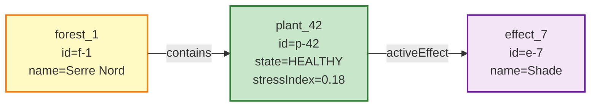
```mermaid
flowchart LR
    forest1["forest_1<br/>id=f-1<br/>name=Serre Nord"]
    plant42["plant_42<br/>id=p-42<br/>state=HEALTHY<br/>stressIndex=0.18"]
    effect7["effect_7<br/>id=e-7<br/>name=Shade"]

    forest1 -->|contains| plant42
    plant42 -->|activeEffect| effect7
    
    style forest1 fill:#fff9c4,stroke:#f57f17,stroke-width:2px
    style plant42 fill:#c8e6c9,stroke:#2e7d32,stroke-width:2px
    style effect7 fill:#f3e5f5,stroke:#6a1b9a,stroke-width:2px
```

Ce diagramme d'objet donne un instantané concret d'un état de simulation : une forêt, une plante et un effet actif.
Il aide à visualiser les identifiants et relations réellement manipulés dans les services.
Cette vue est utile pour relier les concepts UML aux documents MongoDB observés en exécution.

#### 3.2.7 Diagramme de cas d'utilisation

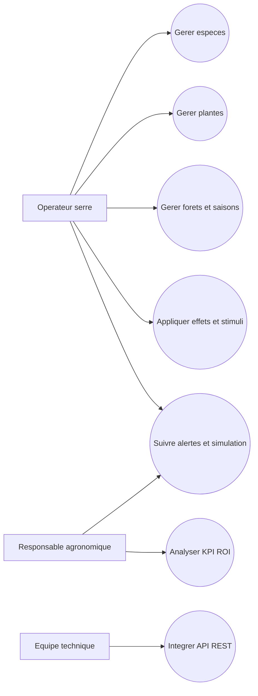
```mermaid
flowchart LR
    operateur[Operateur serre]
    responsable[Responsable agronomique]
    equipe[Equipe technique]

    uc1((Gerer especes))
    uc2((Gerer plantes))
    uc3((Gerer forets et saisons))
    uc4((Appliquer effets et stimuli))
    uc5((Suivre alertes et simulation))
    uc6((Analyser KPI ROI))
    uc7((Integrer API REST))

    operateur --> uc1
    operateur --> uc2
    operateur --> uc3
    operateur --> uc4
    operateur --> uc5
    responsable --> uc5
    responsable --> uc6
    equipe --> uc7
```

Ce cas d'utilisation répartit les responsabilités GreenDesk entre opérateur, responsable agronomique et équipe technique.
Il montre quelles fonctionnalités sont centrées terrain (gestion, actions, suivi) et lesquelles relèvent du pilotage ou de l'intégration.
Cette séparation reflète le fonctionnement réel du projet et facilite la priorisation du backlog par profil utilisateur.

#### 3.2.8 Diagramme d'activité

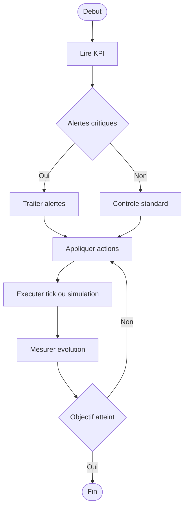
```mermaid
flowchart TD
    a_start([Debut]) --> a_kpi[Lire KPI]
    a_kpi --> a_alert{Alertes critiques}
    a_alert -->|Oui| a_treat[Traiter alertes]
    a_alert -->|Non| a_normal[Controle standard]
    a_treat --> a_action[Appliquer actions]
    a_normal --> a_action
    a_action --> a_tick[Executer tick ou simulation]
    a_tick --> a_measure[Mesurer evolution]
    a_measure --> a_goal{Objectif atteint}
    a_goal -->|Non| a_action
    a_goal -->|Oui| a_finish([Fin])
```

Ce diagramme d'activité montre la boucle de pilotage terrain utilisée dans GreenDesk.
Le cycle commence par la lecture des KPI/alertes, enchaîne avec les actions correctives, puis passe par la simulation et la mesure des résultats.
La boucle est répétée jusqu'à stabilisation, ce qui correspond au mode opératoire attendu en exploitation.

#### 3.2.9 Diagramme d'état

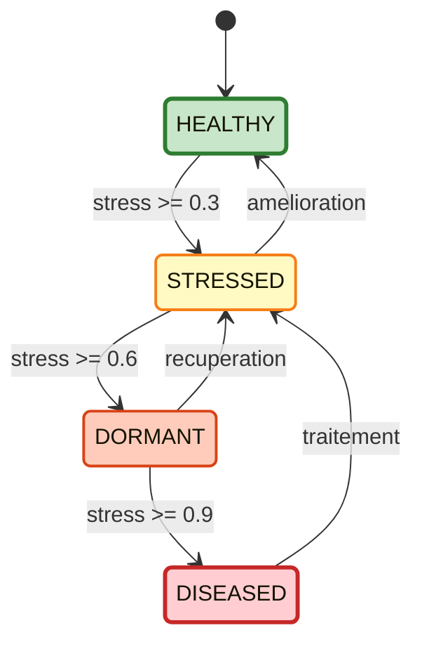
```mermaid
stateDiagram-v2
    [*] --> HEALTHY
    HEALTHY --> STRESSED: stress >= 0.3
    STRESSED --> DORMANT: stress >= 0.6
    DORMANT --> DISEASED: stress >= 0.9
    STRESSED --> HEALTHY: amelioration
    DORMANT --> STRESSED: recuperation
    DISEASED --> STRESSED: traitement
    
    classDef healthyStyle fill:#c8e6c9,stroke:#2e7d32,stroke-width:3px
    classDef stressedStyle fill:#fff9c4,stroke:#f57f17,stroke-width:2px
    classDef dormantStyle fill:#ffccbc,stroke:#d84315,stroke-width:2px
    classDef diseasedStyle fill:#ffcdd2,stroke:#c62828,stroke-width:3px
    
    class HEALTHY healthyStyle
    class STRESSED stressedStyle
    class DORMANT dormantStyle
    class DISEASED diseasedStyle
```

Ce diagramme d'état formalise les transitions de santé d'une plante selon les seuils de `stressIndex`.
Il rend explicite la logique du moteur (`HEALTHY -> STRESSED -> DORMANT -> DISEASED`) ainsi que les retours possibles après amélioration ou traitement.
C'est la règle de lecture principale pour interpréter les changements observés dans les écrans de simulation et d'alertes.

---

## 4. Fonctionnalités Détaillées (User Guide)

> Exigence stricte : 6 fonctionnalités, chacune avec **But feature**, **Scénarios/Personas**, **Wireframes/Screenshots**, **Résumé NVF**.

### 4.1 Feature 1 - Gestion des espèces et plantes CRUD

**1) Objectif (fonctionnel)**

Cette feature fournit les opérations de base (CRUD) pour :

- gérer les espèces (définition des besoins optimaux d'une plante),
- gérer les plantes (instances réelles simulées, liées à une espèce).

Elle constitue le socle du projet : sans espèces/plantes, il n'y a ni simulation, ni forêt, ni effets.

**2) Concepts métiers**

**2.1 Espèce (Species)**

Une espèce représente un modèle "biologique" qui définit les valeurs optimales attendues :

- eau optimale (`optimalWater`),
- température optimale (`optimalTemperature`),
- humidité optimale (`optimalHumidity`),
- lumière optimale (`optimalLux`),
- taux de croissance de base (`baseGrowthRate`),
- éventuellement un identifiant unique / nom d'espèce.

Une espèce est donc une référence utilisée pour calculer le stress et la croissance.

**2.2 Plante (Plant)**

Une plante représente une instance réelle simulée :

- elle est liée à une espèce (`speciesName` ou `speciesId` selon le modèle),
- elle possède des valeurs dynamiques qui évoluent :
- `waterLevel`, `temperature`, `humidity`, `lux`,
- `height` (croissance),
- `stressIndex` (`0..1`),
- `state` : `HEALTHY / STRESSED / DORMANT / DISEASED`,
- elle peut posséder une variabilité (`variationSeed`) utilisée dans certaines règles (ex : anti-clones en forêt).

**3) Règles métier (basées sur le code)**

**3.1 Validation minimale côté API**

Lors de la création/mise à jour :

- les champs essentiels doivent être présents (nom, optimaux, etc.),
- les valeurs doivent être cohérentes (ex : pas de valeurs négatives).

Remarque : les validations peuvent être simples (contrôles dans service/controller). L'objectif est d'éviter des données "impossibles" en base.

**3.2 Cohérence Plante ↔ Espèce**

Lorsqu'on crée une plante :

- l'espèce associée doit exister, sinon erreur (plante orpheline interdite),
- les valeurs initiales de plante peuvent être :
- alignées sur les optimaux (départ "healthy"), ou
- initialisées selon un preset (selon logique du projet).

**4) API exposée (routes CRUD)**

**4.1 CRUD Espèces**

Opérations principales :

- créer une espèce,
- lister toutes les espèces,
- récupérer une espèce (par identifiant ou par nom selon API),
- mettre à jour une espèce,
- supprimer une espèce,
- (optionnel) supprimer toutes les espèces (utile en dev/tests).

Ces endpoints sont exposés par le controller des espèces et persistés via un repository MongoDB.

**4.2 CRUD Plantes**

Opérations principales :

- créer une plante,
- lister toutes les plantes,
- récupérer une plante par ID,
- mettre à jour une plante,
- supprimer une plante,
- (optionnel) supprimer toutes les plantes (reset environnement de test).

En plus du CRUD, le projet expose souvent :

- un endpoint pour lire l'état (`state`) d'une plante,
- un endpoint pour lire le status (ou indicateurs) d'une plante.

**5) Stockage (MongoDB)**

Les espèces et plantes sont stockées dans MongoDB via Spring Data MongoDB :

- `SpeciesRepository` pour les espèces,
- `PlantRepository` pour les plantes.

Chaque entité est persistée sous forme de document MongoDB (avec `_id` généré).

**6) Scénario d'usage (simple et clair)**

1. L'utilisateur crée une espèce : "Tomate" avec `optimalWater=60`, `optimalTemperature=24`, `optimalHumidity=65`, `optimalLux=8000`.
2. Il crée ensuite une plante rattachée à "Tomate".
3. Il consulte la liste des plantes et récupère l'ID.
4. Il met à jour des valeurs si besoin (ex : `waterLevel`).
5. Il supprime la plante / l'espèce à la fin.

**Wireframe / screenshot**


### 4.2 Feature 2 - Simulation évolutive d'une plante

**But feature** : suivre les plantes à granularité individuelle.

**Description fonctionnelle**

Simulation de la croissance et de l'état d'une plante en fonction de son environnement.  
Cette fonctionnalité permet de simuler l'évolution d'une plante en fonction des conditions environnementales.

**Principe**

Un environnement unique contient :
- Température
- Humidité
- Luminosité (cycle jour/nuit)
- Pluie
- Horodatage

À chaque heure simulée :
- L'environnement évolue (variation climatique réaliste).
- Chaque plante s'adapte aux nouvelles conditions.
- Sa croissance et son état sont mis à jour.

**Scénarios / Personas**

- Persona : Opérateur serre
- Scénario : création, lecture état/statut, comparaison de deux plantes.

**Wireframe / screenshot**


**Résumé NVF**

- N : indispensable pour le pilotage opérationnel.
- V : visibilité sur stress/état par individu.
- F : endpoints disponibles + logique métier stable.

### 4.3 Feature 3 - Forêts & saisons

**But feature** : organiser la plantation dans l'espace et le temps.

**Objectif**

La feature **Forêts & Saisons** permet de simuler un environnement structuré et cohérent :
- une forêt est représentée comme une grille 2D (`width x height`) ;
- on peut placer des plantes à des coordonnées (`x`, `y`) ;
- chaque forêt peut avoir un cycle de saisons (`Spring/Summer/Autumn/Winter`) qui évolue dans le temps via un mécanisme d'avancement.

Cette feature sert de base à la simulation globale : on structure l'espace (forêt) et le temps (saisons).

**Modèle & logique métier (basé sur le code)**

**1) Forêt sous forme de grille**

Dans le code, une forêt contient :
- ses dimensions `width` et `height`,
- une structure de placement `position -> plantId`,
- des méthodes de vérification avant insertion.

Règles appliquées lors du placement :

`R1 — Une position ne peut contenir qu'une seule plante`  
Avant d'ajouter une plante, le service vérifie que (`x`, `y`) est libre.

`R2 — Anti-clones / diversité`  
Le code rejette un placement si la nouvelle plante est jugée « clone » ou trop similaire à une plante déjà présente :
- même espèce + même `variationSeed` -> rejet,
- similarité trop forte sur certains paramètres -> rejet.

Ces règles permettent d'éviter une forêt « mono-copie » et donnent une logique métier crédible.

**2) Cycle de saisons par forêt**

Chaque forêt peut posséder un `SeasonCycle` qui contient :
- la saison courante (`currentSeason`),
- le nombre de mois déjà passés dans cette saison (`monthsInCurrentSeason`),
- une règle `monthsPerSeason` (ex : 3 mois = 1 saison).

Algorithme d'avancement (méthode `advanceTime`) :
- ajouter `monthsElapsed` à `monthsInCurrentSeason`,
- tant que `monthsInCurrentSeason >= monthsPerSeason` :
- soustraire `monthsPerSeason`,
- passer à la saison suivante (cycle `Winter -> Spring -> Summer -> Autumn -> Winter`).

Ce mécanisme est robuste : il fonctionne aussi bien avec `+1` mois qu'avec un gros saut (`+12` mois).

**API exposée (routes principales)**

- Gestion des forêts : création, lecture, liste, suppression.
- Gestion des plantes dans une forêt : ajout d'une plante à (`x`, `y`), liste des placements, retrait.
- Gestion du cycle de saisons : créer/attacher un cycle, lire la saison courante, avancer le temps, supprimer le cycle.

**Scénario d'usage**

- Création d'une forêt `10x10`.
- Placement de plantes dans des cellules (`x`, `y`).
- Ajout d'un cycle de saisons avec `monthsPerSeason = 3`.
- Avancement du temps (ex : `+3` mois) -> la saison change automatiquement.

**Wireframe / screenshot**

**Capture - Forêt & saisons**

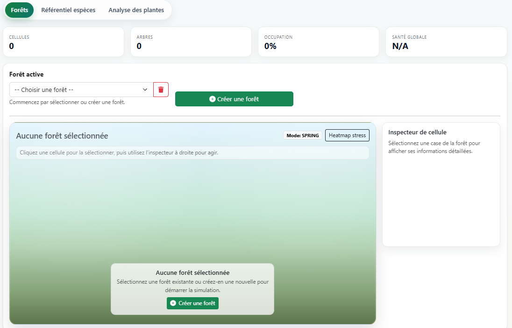

**Capture - Création d'une forêt**

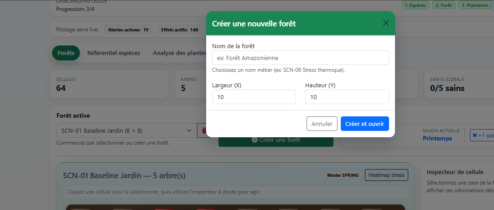

**Capture - Test forêt**


**Résumé NVF**

- N : nécessaire à la simulation réaliste.
- V : améliore la planification des interventions.
- F : mécanismes de grille et season cycle implémentés.

### 4.4 Feature 4 - Effets & stimuli

Effects (interventions) : actions temporaires appliquées à une plante (ombrage, engrais, arrosage, chauffage) qui modifient ses paramètres pendant une durée.

Stimuli (événements) : événements globaux appliqués à une forêt (ex : canicule, pluie intense) qui influencent le contexte environnemental sur une période.

**But feature** : agir sur l'environnement simulé et observer les impacts.

**Objectif**

La feature **Effets & Stimulus** permet d'appliquer des modificateurs temporaires sur une plante (stimulus) afin d'influencer :
- l'environnement « effectif » perçu par la plante (température, humidité, lux, eau),
- la croissance (multiplicateur),
- le stress (réduction du stress).

Exemples d'effets présents dans le projet : `Shade`, `Fertilizer`, `Extra Watering`, `Heating`.

**Modèle & logique métier (basé sur le code)**

**1) Séparation effet / application d'effet**

Le code distingue :
- `Effect` : définition de l'effet (modificateurs + description),
- `PlantEffect` : association plante <-> effet, avec :
- `plantId`, `effectId`,
- `appliedAt` (timestamp),
- `durationHours` (durée),
- statut actif/expiré (calculé à partir du temps).

Cette séparation est propre et extensible : un même effet peut être appliqué à plusieurs plantes.

**2) Gestion de la durée (actif / expiré)**

Un effet est considéré actif si :
- `now < appliedAt + durationHours`.

Lors du calcul de simulation, le service récupère uniquement les effets actifs.

**3) Cumul des effets (stacking)**

Lorsqu'une plante évolue, le service :
- récupère les effets actifs,
- calcule des valeurs effectives :
- `tempEffective = tempBase + somme(modifTemp)`,
- `luxEffective = luxBase + somme(modifLux)`,
- `waterEffective = waterBase + somme(modifWater)`,
- `growthEffective = baseGrowthRate * multiplicateurs`,
- `stressReduction = somme(reductions)`,
- applique ensuite ces valeurs dans le calcul de stress et de croissance.

Résultat : les effets ne sont pas décoratifs, ils changent directement l'état de la plante.

**Intégration dans la simulation (lien direct avec F2)**

Dans le code, le flux est :
- plante + espèce (valeurs optimales),
- environnement courant,
- effets actifs,
- recalcul stress et croissance avec les valeurs effectives,
- mise à jour `stressIndex` + état (`HEALTHY / STRESSED / DORMANT / DISEASED`).

**API exposée (routes principales)**

- lister le catalogue d'effets,
- créer un effet (si autorisé),
- appliquer un effet à une plante,
- lister les effets d'une plante,
- lister uniquement les effets actifs,
- supprimer une application (`PlantEffect`).

**Scénario d'usage**

- Une plante devient stressée (manque d'eau + chaleur).
- On applique `Extra Watering` (`6h`) et `Shade` (`12h`).
- Pendant la durée active :
- `water` augmente,
- `lux` diminue,
- le stress augmente moins vite.
- La plante redevient progressivement stable.

**Wireframe / screenshot**

**Capture - Création d'un effet personnalisé**

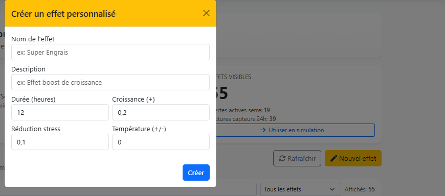

On peut aussi créer des effets personnalisés (durée, croissance, réduction du stress, température), puis les appliquer aux plantes selon le besoin métier.


**Capture - Impact des effets en temps réel**

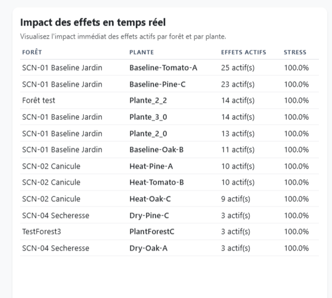

Cette vue représente le suivi en temps réel des effets actifs par plante et par forêt, avec le niveau de stress associé.
Elle permet d'identifier rapidement les plantes qui cumulent beaucoup d'effets et nécessitent un ajustement.

**Capture - Inspecteur avant envoi d'un effet**

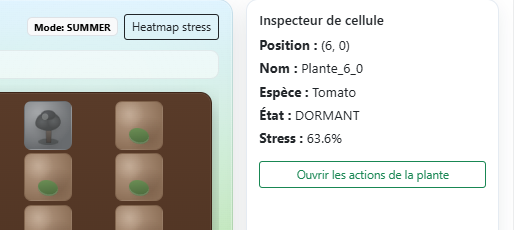

Cette capture montre l'état de la plante avant action : `DORMANT`, avec un score de stress à `63.6%`.
Elle sert de point de référence avant l'envoi d'un effet/stimulus via le bouton **Ouvrir les actions de la plante**.

**Capture - Application de l'effet Extra Watering**

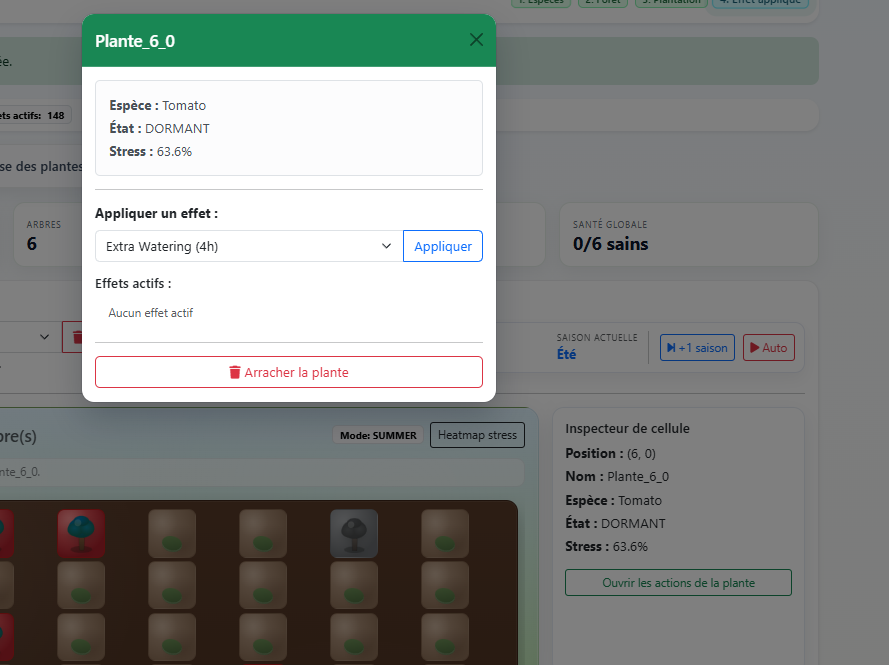

Ici, on applique l'effet `Extra Watering (4h)` sur la plante `Plante_6_0` en cliquant sur **Appliquer**.

**Capture - Après application : évolution du stress**

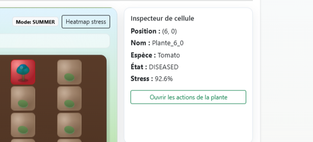

Après application et recalcul de simulation, le stress passe de `63.6%` à `92.6%` et l'état devient `DISEASED`.
Cela montre que `Extra Watering` est bien pris en compte, mais que le score final dépend aussi des autres écarts environnementaux et de l'évolution au tick suivant.

**Résumé NVF**

- N : nécessaire pour passer de l'observation à l'action.
- V : accélère l'optimisation des conditions culturales.
- F : services et endpoints dédiés déjà présents.

### 4.5 Feature 5 - Simulation & alertes

Capteurs (Sensor Readings) : collectent et historisent les mesures (température, humidité, lux, pluie) pour une plante.

Readings → Mise à jour : chaque lecture met à jour les valeurs courantes de la plante (`sensors`) et alimente la simulation.

Alertes : déclenchées automatiquement quand une mesure s'éloigne trop des valeurs optimales de l'espèce (`WARNING`/`CRITICAL`).

**1) Objectif (fonctionnel)**

Cette feature permet de simuler un système de capteurs connecté à chaque plante, d'enregistrer un historique de mesures, puis de générer automatiquement des alertes quand les conditions s'éloignent trop des valeurs optimales définies par l'espèce.

Elle sert à :

- alimenter la simulation avec des données "terrain" (température, humidité, lumière, pluie),
- mettre à jour l'état de santé de la plante (stress + `PlantState`),
- déclencher des alertes (`WARNING`/`CRITICAL`) exploitables côté dashboard/monitoring,
- permettre la consultation des alertes + l'acknowledgement (acquittement).

**2) Modèle de données (ce que le code stocke)**

**2.1 SensorReading (lecture capteur)**

Le code introduit une entité `SensorReading` (collection Mongo `sensor_readings`) qui représente une lecture à un instant donné :

- `plantId` : la plante concernée,
- `timestamp` : date/heure de lecture,
- `temperature` (°C),
- `humidity` (%),
- `lux` (lx),
- `rainfall` (mm / unité simplifiée).

Objectif : garder un historique complet des conditions.

**2.2 PlantAlert (alerte)**

Le code introduit une entité `PlantAlert` (collection Mongo `plant_alerts`) :

- `plantId`,
- `createdAt`,
- `type` (`AlertType`) : `LOW_TEMPERATURE`, `HIGH_TEMPERATURE`, `LOW_HUMIDITY`, `HIGH_HUMIDITY`, `LOW_LIGHT`, `HIGH_LIGHT`, `LOW_WATER`, `HIGH_WATER`,
- `severity` (`AlertSeverity`) : `WARNING` / `CRITICAL`,
- `message` : message explicite (avec valeurs + optimum),
- `acknowledged` : booléen (alerte active = non acquittée).

Objectif : rendre les anomalies lisibles + actionnables.

**3) Flux technique (basé sur le code)**

**Étape A - Enregistrement d'une lecture capteur**

Quand on envoie une nouvelle lecture via l'API :

- le service récupère la plante par `plantId`,
- il crée un `SensorReading` avec :
- `timestamp` (fourni ou `now`),
- `temperature` / `humidity` / `lux` / `rainfall`,
- il sauvegarde la lecture dans MongoDB.

Cela crée un historique consultable et filtrable.

**Étape B - Mise à jour "temps réel" de la plante (simulation)**

Après avoir enregistré la lecture, le service met à jour la plante avec les valeurs reçues :

- `plant.temperature = req.temperature`
- `plant.humidity = req.humidity`
- `plant.lux = req.lux`

Et pour l'eau (mapping simplifié pluie -> eau) :

- `plant.waterLevel = max(0, plant.waterLevel + rainfall)`

Ensuite le code recalcule l'état de la plante :

- `plant.setPlantState(plant.evaluateState())`

`evaluateState()` :

- recalcule `stressIndex` via `calculateStressIndex()`,
- applique les seuils :
- `< 0.3` -> `HEALTHY`
- `< 0.6` -> `STRESSED`
- `< 0.9` -> `DORMANT`
- sinon -> `DISEASED`

Puis il sauvegarde la plante en base.

Résultat : chaque lecture capteur met à jour la plante comme si elle "vivait" en temps réel.

**Étape C - Génération automatique d'alertes**

Après mise à jour, le service déclenche :

- `PlantAlertService.evaluateAndCreateAlerts(plant)`

Ce service compare les valeurs de la plante avec les optimaux de l'espèce (`Species`) et crée des alertes si dépassement de seuils :

Température :

- si `|temp - optimalTemp| > 4°C` -> alerte,
- `WARNING` si `> 4°C`, `CRITICAL` si `> 8°C`,
- type : `LOW_TEMPERATURE` ou `HIGH_TEMPERATURE`.

Humidité :

- si `|humidity - optimalHumidity| > 10%` -> alerte,
- `WARNING` si `> 10%`, `CRITICAL` si `> 20%`,
- type : `LOW_HUMIDITY` ou `HIGH_HUMIDITY`.

Lumière (lux) :

- trop faible si `lux < 0.7 * optimalLux`,
- `CRITICAL` si `lux < 0.5 * optimalLux`,
- type : `LOW_LIGHT`,
- trop forte si `lux > 1.3 * optimalLux`,
- `CRITICAL` si `lux > 1.6 * optimalLux`,
- type : `HIGH_LIGHT`.

Eau :

- si `|water - optimalWater| > 15 mL` -> alerte,
- `CRITICAL` si `> 30 mL`,
- type : `LOW_WATER` ou `HIGH_WATER`.

Chaque alerte contient un message explicite du style :

`Temperature 30.0°C (optimal 22.0°C) - écart 8.0°C`

**4) Anti-spam (important : c'est dans votre code)**

Le code applique une règle anti-duplication :

- ne pas recréer la même alerte (même type pour une plante) plus d'une fois toutes les 30 minutes,
- constante : `DEDUP_MINUTES = 30`.

Cela évite d'inonder le dashboard avec des alertes identiques.

**5) API exposée (endpoints exacts)**

**5.1 Capteurs (`SensorReadingController`)**

- `POST /plants/{plantId}/sensor-readings` : ajoute une lecture capteur et déclenche mise à jour plante + alertes.
- `GET /plants/{plantId}/sensor-readings` : liste l'historique (tri décroissant).
- `GET /plants/{plantId}/sensor-readings?from=...&to=...` : liste filtrée entre 2 timestamps (`LocalDateTime.parse()`).
- `GET /plants/{plantId}/sensor-readings/latest` : retourne la dernière lecture.

**5.2 Alertes (`PlantAlertController`)**

- `GET /plants/{plantId}/alerts?active=true|false` : liste les alertes d'une plante (par défaut : actives uniquement).
- `POST /alerts/{alertId}/ack` : acquitte une alerte (`acknowledged=true`).

**6) Scénario d'usage (simple à présenter)**

1. L'utilisateur envoie une lecture capteur : `temp=32°C`, `humidity=40%`, `lux=12000`, `rainfall=0`.
2. Le système sauvegarde la lecture, met à jour la plante, recalcule `stressIndex` + état.
3. Le système déclenche des alertes : `HIGH_TEMPERATURE`, `LOW_HUMIDITY`, `HIGH_LIGHT` selon dépassement.
4. Sur le dashboard, l'utilisateur consulte : `GET /plants/{id}/alerts?active=true`.
5. Après intervention, il acquitte : `POST /alerts/{alertId}/ack`.

**Wireframe / screenshot**


**Capture - Alertes serre en cours**

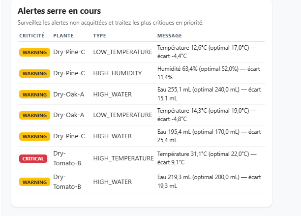

### 4.6 Feature 6 - Simulation écosystème

**But feature** : piloter une simulation globale multi-plantes/multi-forêts.

**Description fonctionnelle**

Simulation d'un écosystème : propagation d'une maladie végétale. Cette fonctionnalité simule la propagation d'une maladie végétale au sein d'une forêt selon une logique locale : l'état d'une plante dépend de l'état de ses voisines directes (inspiré du modèle de Schelling).

**Principe**

La forêt est modélisée comme une grille d'EcosystemCell.  
Une cellule peut contenir une plante ou être vide.  
Une plante peut être saine ou malade.  
Chaque cellule observe ses voisines (adjacentes + diagonales).  
Les cellules vides ne sont pas prises en compte dans les calculs de ratio.  
A chaque tick, la maladie progresse chez les plantes infectées (progress()).  
A chaque tick, les décisions d'infection ou de guérison sont évaluées.  
A chaque tick, les changements sont appliqués simultanément (évite les effets en chaîne).

**Scénarios / Personas**

Persona : Responsable agronomique / opérateur simulation  
Scénario : lancer tick, simulate/{n} ou simulate/{forestId}/{n}, puis analyser l'état des cellules (cells).

**Différence avec le modèle de Schelling**

| Critère | Schelling | Modèle |
|---|---|---|
| Type d'agent | Ménage | Plantes |
| Etat de l'agent | Niveau de satisfaction | Malade / non |
| Préférence | Proportion des voisins différents acceptés (seuil de satisfaction) | Ratio sur les voisins pour si le seuil est dépassé |
| Changement | Déplacement vers une case non vide | Maladie dominante |
| Interaction | Locale (voisinage) | Locale (voisinage) |
| Objet | Ségrégation spatiale | Propagation / extinction de maladie |
| Nature du changement | Déplacement physique | Changement d'état |

Si dans le modèle de Schelling, c'est le seuil de satisfaction qui détermine si un individu est satisfait ou non avant de se déplacer, ici une plante sera malade ou non en fonction de ses voisins.

**Infection : plus qu'un simple nombre de voisins malades**

- Une plante saine peut devenir infectée si elle contient effectivement une plante.
- Elle ne doit pas être déjà malade.
- Elle doit avoir au moins un voisin avec plante.
- La proportion de voisins infectés parmi les voisins contenant une plante doit dépasser un seuil.
- Une maladie dominante doit être identifiée parmi les voisines (sévérité moyenne la plus élevée).
- Le seuil utilisé est celui défini par la maladie dominante (`getInfectionThreshold()`).
- L'infection dépend du ratio de voisins infectés.
- L'infection dépend du type de maladie présente.
- L'infection dépend du seuil propre à cette maladie.
- L'infection dépend de la présence effective de plantes autour.

**Guérison : condition symétrique mais indépendante**

- Une plante malade peut guérir si elle contient une plante.
- Elle doit être actuellement infectée.
- Elle doit posséder au moins un voisin contenant une plante.
- La proportion de voisins sains doit dépasser le seuil de guérison.
- Le seuil utilisé est celui défini par la maladie actuelle (`getRecoveryThreshold()`).
- La guérison dépend du ratio de voisins sains.
- La guérison dépend du seuil propre à la maladie en cours.
- La guérison dépend de la densité locale de plantes.

**Wireframe / screenshot**

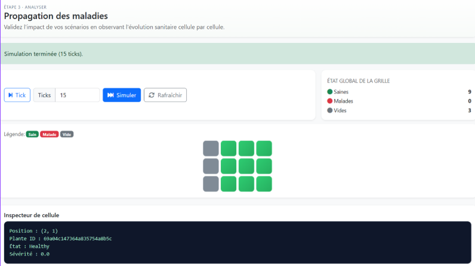

**Résumé NVF**

- N : nécessaire pour simuler l'évolution à l'échelle système.
- V : permet d'anticiper les dérives et d'ajuster la stratégie.
- F : endpoints `EcosystemController` disponibles et testables.

### 4.7 Feature 7 - Greenhouse Ops (KPI / ROI)

**But**

Classer les forêts selon leur ROI (Return on Investment) afin de piloter les décisions d'exploitation (prioriser les actions, limiter les pertes, optimiser les coûts).

**1) Description (fonctionnelle)**

La feature **Classement ROI par forêt** mesure la performance globale de chaque forêt sur une période de simulation et produit un classement `Top / Worst`.

Objectifs :

- calculer un ROI pour chaque forêt à partir des résultats de simulation,
- classer les forêts (`Top / Worst`) selon leur ROI,
- comparer rapidement plusieurs forêts / scénarios,
- aider à la décision : identifier les forêts à optimiser (stress élevé, maladies, pertes, interventions coûteuses, effets trop fréquents).

Résultat attendu côté UI / dashboard :

- valeur économique estimée (`€/jour`),
- indice de risque (`/100`),
- coût estimé (`€/jour`),
- tableau de classement par forêt (niveau / ROI score / tendance / risque / coût),
- bouton `Export CSV`.

**2) Données d'entrée (issues de la simulation)**

`A. Plantes / états (Plant + Forest)`

- nombre total de plantes,
- répartition : `HEALTHY`, `STRESSED`, `DORMANT`, `DISEASED`,
- stress moyen (moyenne de `stressIndex`),
- croissance moyenne (delta `height` ou croissance calculée),
- pertes / pénalité forte sur `DISEASED`.

`B. Effets / interventions (PlantEffect + Effect)`

- nombre d'effets appliqués,
- coût total des interventions (estimé par type d'effet),
- durée totale d'intervention (heures, si applicable).

`C. Écosystème / maladies (Ecosystem / cells)`

- taux de cellules infectées (ou nombre de plantes malades),
- tendance infection (augmente / stable / diminue).

`D. Temps / période`

- fenêtre temporelle (ex : `24h`, `7 jours`),
- nombre de ticks ou mois simulés.

**3) Formule ROI (définition utilisée)**

Le ROI est basé sur : valeur produite - coûts - pénalités.

**3.1 Score santé (Health Score)**

Variables :

- `HealthyRatio = #HEALTHY / #TOTAL`
- `StressedRatio = #STRESSED / #TOTAL`
- `DormantRatio = #DORMANT / #TOTAL`
- `DiseasedRatio = #DISEASED / #TOTAL`
- `StressMean = moyenne(stressIndex)` (`0..1`)

Pondération :

- `HealthScore = 100 * (1.0*HealthyRatio + 0.6*StressedRatio + 0.3*DormantRatio - 0.8*DiseasedRatio)`
- `HealthScore = HealthScore - (StressMean * 20)`
- `HealthScore = clamp(HealthScore, 0, 100)`

**3.2 Valeur économique estimée (Economic Value)**

- `EconomicValuePerDay = BaseValue * #TOTAL * (HealthScore/100)`

Exemple : `BaseValue = 2.0 €/plante/jour`, `#TOTAL=50`, `HealthScore=80` -> `80 €/jour`.

**3.3 Coût des interventions (Cost)**

- `Cost = Σ (count(effectType) * unitCost(effectType))`

Exemples :

- `ExtraWatering` : `0.20 € / application`
- `Fertilizer` : `0.50 € / application`
- `Heating` : `1.00 € / heure` (ou `/ application`)
- `Shade` : `0.10 € / application`

**3.4 Pénalité de risque (Risk Penalty)**

- `RiskScore = 100 * (0.6*StressMean + 0.4*DiseasedRatio)`
- `RiskScore = clamp(RiskScore, 0, 100)`
- `RiskPenalty = (RiskScore/100) * RiskWeight`

Exemple : `RiskWeight = 20 €/jour`.

**3.5 ROI final (score de classement)**

Option A (recommandée) :

- `ROI = EconomicValuePerDay - Cost - RiskPenalty`

(Option B ratio possible, mais moins lisible pour le classement.)

**4) Agrégation & classement (algorithme)**

Pour chaque forêt :

- récupérer les plantes placées,
- compter les états, calculer `StressMean`,
- récupérer les effets appliqués et calculer `Cost`,
- récupérer l'indicateur maladie (taux infecté / `diseased ratio`),
- calculer `HealthScore`, `EconomicValuePerDay`, `RiskScore`, `RiskPenalty`, `ROI`,
- trier les forêts par `ROI DESC`,
- produire `Top N` et `Worst N`.

**5) Niveaux (`STABLE` / `A_RISQUE` / `CRITIQUE`)**

- `STABLE` si `RiskScore < 35` et `ROI >= 0`
- `A_RISQUE` si `35 <= RiskScore < 70` ou `ROI < 0`
- `CRITIQUE` si `RiskScore >= 70`

**6) Lecture du dashboard (capture)**

`ROI serre (estimation)`

- `Économie eau/jour (L)` : gain direct (moins de gaspillage d'eau grâce au pilotage).
- `Indice risque (/100)` : probabilité de pertes / dégradation (stress + maladies).
- `Coût estimé/jour (€)` : investissement quotidien en interventions (effets/stimulus).

`Classement ROI par forêt`

- `NIVEAU` : stable ou à risque (priorisation).
- `ROI SCORE` : rentabilité estimée (plus haut = mieux).
- `TENDANCE ROI` : évolution (`Stable / Positive`).
- `RISQUE` : risque propre à la forêt.
- `COÛT/J` : coût des interventions pour cette forêt.

`Gain agriculteur`

- économie d'eau + valeur économique estimée,
- baisse du risque (moins de pertes),
- ROI net plus élevé (valeur - coûts - pénalités).

`Coût`

- représente les interventions nécessaires pour stabiliser/améliorer la production.

**7) Export CSV (téléchargement)**

Le bouton `Export CSV ROI forêts` télécharge le classement pour analyse/reporting.

CSV (colonnes typiques) :

- `forest_name`
- `level`
- `roi_score`
- `roi_trend`
- `risk_score`
- `cost_per_day`
- (optionnel) `health_score`, `stress_mean`, `%diseased`, `effects_count`, `water_saving_per_day`

**8) Exemple**

Fenêtre `24h` :

- Forêt A : `#TOTAL=50`, `HealthScore=80`, `Cost=10€`, `RiskPenalty=5€`
- `EconomicValue=80€` -> `ROI=80-10-5 = 65 €/jour` (`Top`)

- Forêt C : `#TOTAL=50`, `HealthScore=30`, `Cost=25€`, `RiskPenalty=20€`
- `EconomicValue=30€` -> `ROI=30-25-20 = -15 €/jour` (`Worst`)

**Wireframe / screenshot**

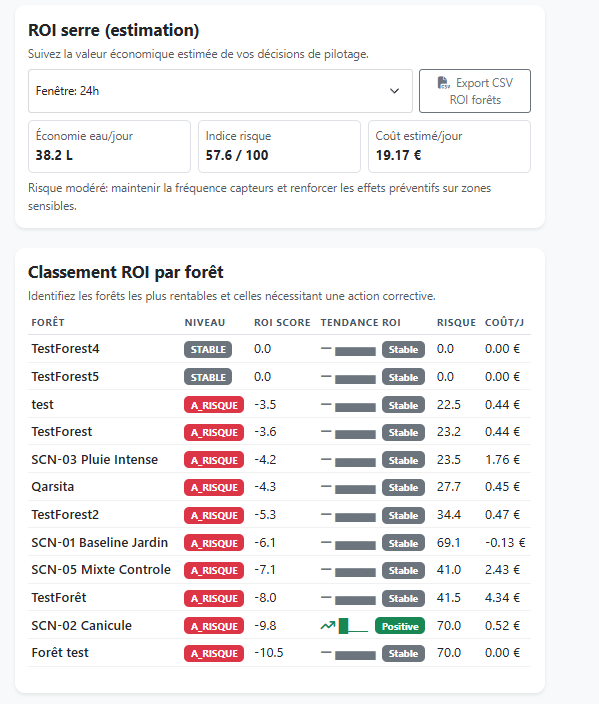

**9) Description du test ROI (lecture de la capture)**

`Fenêtre : 24h`

Tous les calculs affichés sont agrégés sur les 24 dernières heures (ou la période sélectionnée).  
Cela permet de comparer les résultats d'un jour à l'autre.

`Économie eau/jour : 38.2 L`

C'est un gain direct pour l'agriculteur : le système estime combien d'eau a été économisée grâce à un pilotage plus intelligent :

- mesures capteurs,
- interventions ciblées (pas d'arrosage inutile),
- actions préventives (ex : ombrage) qui évitent une surconsommation.

Plus ce chiffre est élevé, plus l'exploitation réduit ses charges et son gaspillage.

`Indice risque : 57.6 / 100`

C'est un niveau de danger global sur la production (`0` = aucun risque, `100` = critique).  
Il reflète typiquement :

- stress moyen élevé,
- plantes en état dégradé (`STRESSED` / `DORMANT` / `DISEASED`),
- présence/propagation de maladies,
- conditions trop éloignées des valeurs optimales.

`57.6/100` correspond à un risque modéré/élevé : il faut surveiller et renforcer la prévention.

`Coût estimé/jour : 19.17 €`

C'est ce que l'exploitation dépense pour piloter et stabiliser :

- arrosage supplémentaire,
- chauffage,
- engrais,
- ombrage, etc.

Ce coût est l'investissement. Il est acceptable si :

- le risque baisse,
- les forêts remontent au classement,
- la tendance ROI devient positive.

`Recommandation (texte)`

Le message résume l'action à prendre :  
"Risque modéré : maintenir la fréquence capteurs et renforcer les effets préventifs..."

Donc on n'augmente pas forcément les coûts partout : on cible les zones sensibles.

`Bloc du bas : Classement ROI par forêt`

Ce tableau compare toutes les forêts/scénarios sur la même fenêtre.

- `FORÊT` : nom de la forêt (ou scénario), ex : `SCN-02 Canicule`, `SCN-03 Pluie Intense`.
- `NIVEAU (STABLE / A_RISQUE)` :
- `STABLE` : forêt maîtrisée (faible risque et/ou ROI acceptable),
- `A_RISQUE` : forêt à traiter (risque élevé et/ou ROI négatif).
- `ROI SCORE` : rentabilité estimée (proche de `0`/positif = correct, négatif = perte sur la période).
- `TENDANCE ROI` (`Stable / Positive`) :
- `Stable` : pas d'amélioration notable,
- `Positive` : amélioration en cours (les actions commencent à payer).
- `RISQUE` : valeur numérique du danger pour la forêt.
- `COÛT/J` : dépense liée aux interventions.

Lecture opérationnelle :

- si le coût monte mais que la tendance ROI ne s'améliore pas, la stratégie est à revoir,
- si le coût reste raisonnable et la tendance ROI devient positive, le pilotage est efficace.

`Conclusion agriculteur`

- gains visibles : économie d'eau + amélioration du ROI (quand il remonte),
- coûts visibles : coût/jour des interventions (investissement),
- décision : le classement indique où agir en priorité (forêts à risque / ROI négatif), et l'export CSV permet le reporting et la comparaison des périodes.

### 4.8 Feature 8 - Capteurs (Sensor Readings)

**But feature** : historiser et exploiter les mesures capteurs des plantes.

**Scénarios / Personas**

- Persona : Opérateur technique
- Scénario : injecter une mesure capteur, puis lire la dernière valeur (`latest`) pour une plante.

**Wireframe / screenshot**


**Résumé NVF**

- N : nécessaire pour relier simulation et données observées.
- V : améliore la détection précoce des anomalies.
- F : `SensorReadingController` et service dédiés implémentés.

### 4.9 Feature 9 - Optimiseur de placement des plantes (Prototype / extension)

**But** : proposer automatiquement un placement recommandé des plantes sur la grille d'une forêt afin de réduire le placement manuel.

**Description fonctionnelle**

Cette fonctionnalité vise à assister l'utilisateur en générant des propositions de placement (`x,y`) basées sur les contraintes métier et les besoins des espèces.
L'utilisateur peut comparer une proposition automatique à un placement manuel et décider de l'appliquer.

**Parcours utilisateur (cible)**

- L'utilisateur choisit la forêt et sélectionne les plantes à organiser.
- Il lance l'optimisation (`Run Optimizer`) : l'application calcule un placement proposé et un score (`fitness`).
- Il peut valider la proposition et l'appliquer à la forêt (`Apply to Forest`).
- Optionnel : affichage d'une heatmap des zones recommandées/neutres/déconseillées pour une espèce.

**Info technique (approche)**

Le module s'appuie sur une logique d'optimisation inspirée d'un algorithme génétique :

- génération de placements candidats,
- évaluation via une fonction de fitness,
- sélection des meilleurs candidats,
- croisement + mutation contrôlée,
- itérations sur plusieurs générations.

**Statut d'implémentation**

Les fondations nécessaires sont déjà présentes : modèle de forêt (grille), placement (`x,y`), contraintes (position occupée, diversité/anti-clones), données espèces/plantes.

L'algorithme d'optimisation automatique complet (GA + heatmap + endpoints dédiés) est une extension prévue.

---

## 5. Matrice de Responsabilités & Réalisations

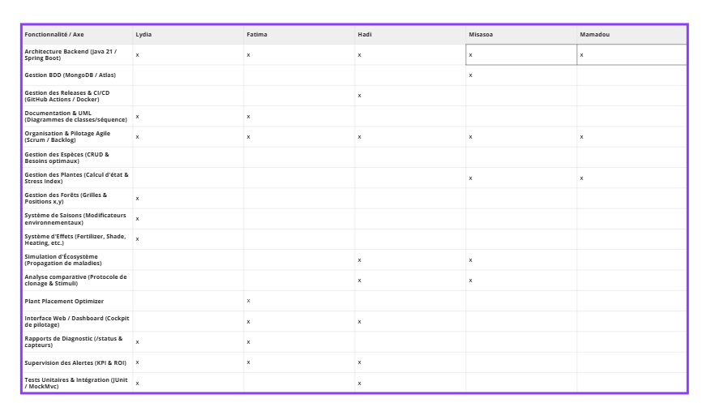

---

## 6. Tests effectués

### 6.1 Couverture

#### 6.1.1 Taux de couverture

| Indicateur | Taux actuel | Seuil cible |
|---|---:|---:|
| LINE | `81.04%` | `>= 70%` |
| BRANCH | `52.47%` | `>= 45%` |
| CLASS | `98.18%` | `>= 90%` |

#### 6.1.2 Tableau des tests effectués (54 suites)

| Suites de tests exécutées | Type | Description | Objectif |
|---|---|---|---|
| **Contrôleurs API (12)**<br>`PlantAlertControllerTest`<br>`EcosystemControllerTest`<br>`EffectControllerTest`<br>`SeasonControllerTest`<br>`ForestControllerTest`<br>`ForestSeasonControllerTest`<br>`GreenhouseOpsControllerTest`<br>`HomeControllerTest`<br>`PlantControllerTest`<br>`SensorReadingControllerTest`<br>`SpeciesControllerTest`<br>`StimulusControllerTest` | Intégration API (MockMvc) | Vérifie les routes REST, codes HTTP, payloads, validations et gestion d'erreurs côté contrôleurs. | Garantir que les endpoints exposés sont conformes au contrat API et stables en régression. |
| **Services métier (9)**<br>`EcosystemServiceTest`<br>`EffectServiceTest`<br>`ForestServiceTest`<br>`GreenhouseOpsServiceTest`<br>`NotFoundTests`<br>`PlantAlertServiceTest`<br>`SeasonServiceTest`<br>`SensorReadingServiceTest`<br>`StimulusServiceTest` | Unitaire métier | Teste les règles de gestion, calculs, transitions d'état et scénarios d'exception dans la couche service. | Valider la logique fonctionnelle centrale indépendamment du transport HTTP. |
| **Repositories (8)**<br>`EffectRepositoryTest`<br>`ForestRepositoryTest`<br>`PlantEffectRepositoryTest`<br>`PlantRepositoryTest`<br>`SeasonCycleRepositoryTest`<br>`SensorReadingRepositoryTest`<br>`SpeciesRepositoryTest`<br>`StimulusRepositoryTest` | Intégration persistance | Contrôle les opérations de lecture/écriture, requêtes et mapping avec la couche de persistance. | Sécuriser l'accès aux données et éviter les régressions de stockage/recherche. |
| **Entités & modèle domaine (17)**<br>`PlantAlertTest`<br>`DiseasesTest`<br>`EcosystemCellTest`<br>`EcosystemTest`<br>`EnvironmentDataTest`<br>`SeasonCycleTest`<br>`SeasonTest`<br>`SeasonTypeTest`<br>`ForestTest`<br>`InterventionTest`<br>`PlantEffectTest`<br>`PlantStateTest`<br>`PlantTest`<br>`SensorReadingTest`<br>`SpeciesTest`<br>`StimulusTest`<br>`TestEffects` | Unitaire modèle | Vérifie invariants, comportements, transitions internes et cohérence des objets métier. | Assurer la robustesse du modèle de données utilisé par les services et simulations. |
| **Scénarios transverses / legacy (8)**<br>`TestEcosystemServices`<br>`TestEffects`<br>`TestForestAndSeasons`<br>`TestPlantLifecycle`<br>`TestPlantServices`<br>`TestSensorReadingsAndAlerts`<br>`TestSimulationEnvironment`<br>`TestSpeciesServices` | Intégration fonctionnelle | Exécute des scénarios bout-en-bout couvrant plusieurs composants en chaîne (services + domaine + API). | Valider les parcours métier complets et la cohérence globale de l'application. |

#### 6.1.3 Outils utilisés

- **JUnit 5** : exécution des tests unitaires et d'intégration.
- **Spring MockMvc** : tests contrôleurs/API.
- **JaCoCo** : mesure de couverture (LINE/BRANCH/CLASS).
- **Gradle Wrapper** : orchestration build + tests + rapport.

Commandes principales :

```bash
./gradlew test
./gradlew test jacocoTestReport
./gradlew clean check
```

#### 6.1.4 Capture JaCoCo


### 6.2 CI/CD (Documentation complète + CI)

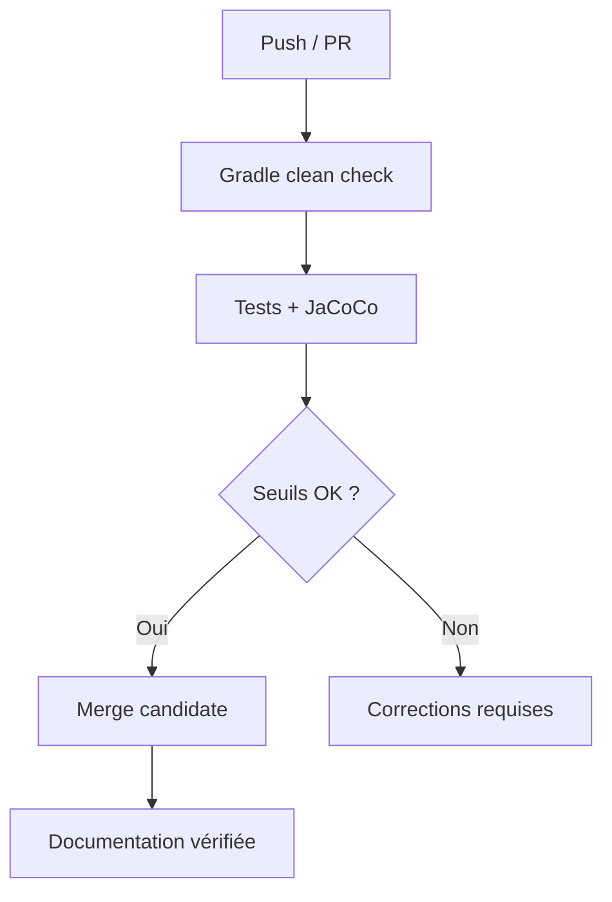
```mermaid
flowchart TD
	A[Push / PR] --> B[Gradle clean check]
	B --> C[Tests + JaCoCo]
	C --> D{Seuils OK ?}
	D -->|Oui| E[Merge candidate]
	D -->|Non| F[Corrections requises]
	E --> G[Documentation vérifiée]
```

Ce schéma CI/CD résume le contrôle qualité GreenDesk du push jusqu'à la validation de merge.
Chaque changement passe par `clean check`, les tests et la couverture JaCoCo avant d'être considéré intégrable.
La vérification documentaire dans le pipeline garantit que le code et la documentation restent alignés à chaque livraison.

Commandes standard :

```bash
./gradlew test
./gradlew clean check
./gradlew test jacocoTestReport
```

### 6.3 Captures qualité


---

## 7. Guide d'Installation & Déploiement

### 7.1 Prérequis

- Java 21
- Docker (optionnel mais recommandé)
- Port 8080 disponible

### 7.2 Exécution locale

```bash
./gradlew clean bootRun
```

- App : `http://localhost:8080/`
- Swagger : `http://localhost:8080/swagger-ui/index.html`

### 7.3 Exécution Docker

```bash
docker compose up -d --build
```

- App : `http://localhost:8080`
- Mongo Express : `http://localhost:8081`

### 7.4 Vérifications rapides

```bash
curl -s http://localhost:8080/api/species
curl -s http://localhost:8080/api/forests
curl -s http://localhost:8080/api/greenhouse/overview
```

### 7.5 Dépannage

- API inaccessible : vérifier port 8080 et logs applicatifs.
- Mongo indisponible : vérifier URI, credentials, service DB.
- Tests en échec : ouvrir le rapport tests et corriger par lot.

---

## 8. Annexe API REST

### 8.1 Base URL

`http://localhost:8080`

### 8.2 Endpoints principaux

| Domaine | Méthode | Endpoint |
|---|---|---|
| Espèces | GET | `/api/species` |
| Espèces | POST | `/api/species` |
| Espèces | GET | `/api/species/{name}` |
| Espèces | PUT | `/api/species/{id}` |
| Espèces | DELETE | `/api/species/{id}` |
| Plantes | GET | `/api/plants` |
| Plantes | POST | `/api/plants/create` |
| Plantes | GET | `/plants/{plantId}` |
| Plantes | GET | `/api/plants/{plantId}/state` |
| Plantes | GET | `/api/plants/{plantId}/status` |
| Forêts | POST | `/api/forests` |
| Forêts | GET | `/api/forests/{forestId}` |
| Forêts | DELETE | `/api/forests/{forestId}` |
| Forêts | POST | `/api/forests/{forestId}/plants` |
| Forêts | DELETE | `/api/forests/{forestId}/plants` (params requis : `x`/`y` ou `plantId`) |
| Saisons | GET | `/api/seasons` |
| Saisons | GET | `/api/forests/{forestId}/season-cycle` |
| Saisons | POST | `/api/forests/{forestId}/season-cycle` |
| Saisons | DELETE | `/api/forests/{forestId}/season-cycle` |
| Saisons | POST | `/api/forests/{forestId}/season-cycle/advance` |
| Effets | GET | `/api/effects` |
| Effets | POST | `/api/effects` |
| Effets | POST | `/api/plants/{plantId}/effects/{effectId}` |
| Effets | GET | `/api/plants/{plantId}/effects` |
| Effets | GET | `/api/plants/{plantId}/effects/active` |
| Effets | DELETE | `/api/plants/effects/{plantEffectId}` |
| Stimuli | POST | `/api/stimuli` |
| Capteurs (sensor-readings) | GET | `/plants/{plantId}/sensor-readings` |
| Capteurs (sensor-readings) | POST | `/plants/{plantId}/sensor-readings` |
| Alertes | GET | `/plants/{plantId}/alerts` |
| Alertes | POST | `/alerts/{alertId}/ack` |
| Écosystème | POST | `/api/ecosystem/simulate/{n}` |
| Écosystème | POST | `/api/ecosystem/tick` |
| Greenhouse | GET | `/api/greenhouse/overview` |
| Greenhouse | GET | `/api/greenhouse/roi` |
| Greenhouse | GET | `/api/greenhouse/roi/forests` |
| Greenhouse | GET | `/api/greenhouse/roi/forests/export.csv` |

### 8.3 Exemples payload

**Créer espèce**

```json
{
  "name": "Basilic",
  "optimalWaterNeeds": 45,
  "optimalTemperature": 24,
  "optimalHumidity": 55,
  "optimalLuxNeeds": 280,
  "baseGrowthRate": 1.1,
  "seedProductionRate": 0.9
}
```

**Créer forêt**

```json
{
  "name": "Zone-Nord",
  "width": 8,
  "height": 8
}
```

**Tick Greenhouse**

```json
{
  "forestId": "<FOREST_ID>",
  "profile": "NORMAL"
}
```

### 8.4 Captures API (CLI)

#### Espèces

| Capture 1 | Capture 2 |
|---|---|
| 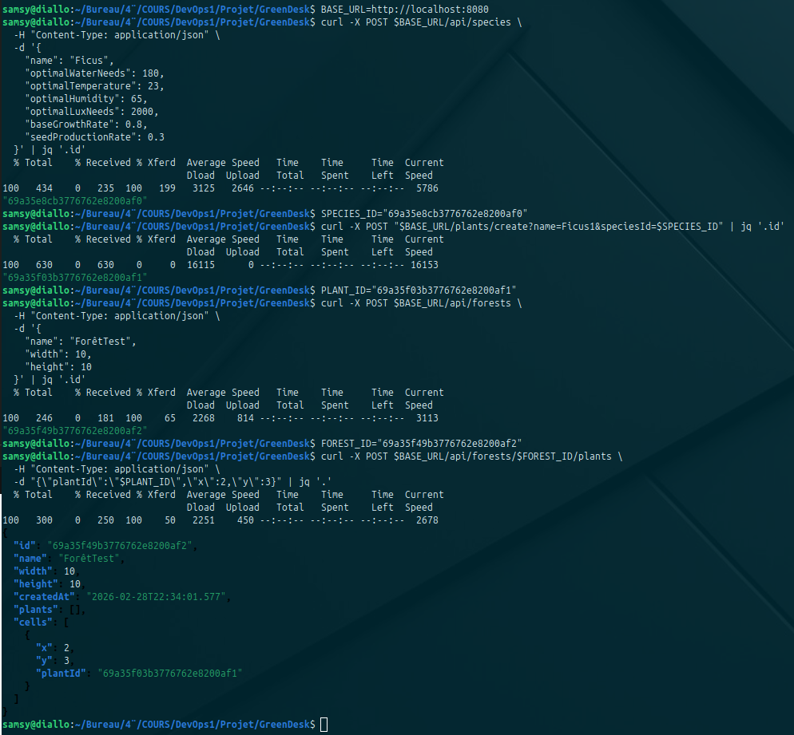 | 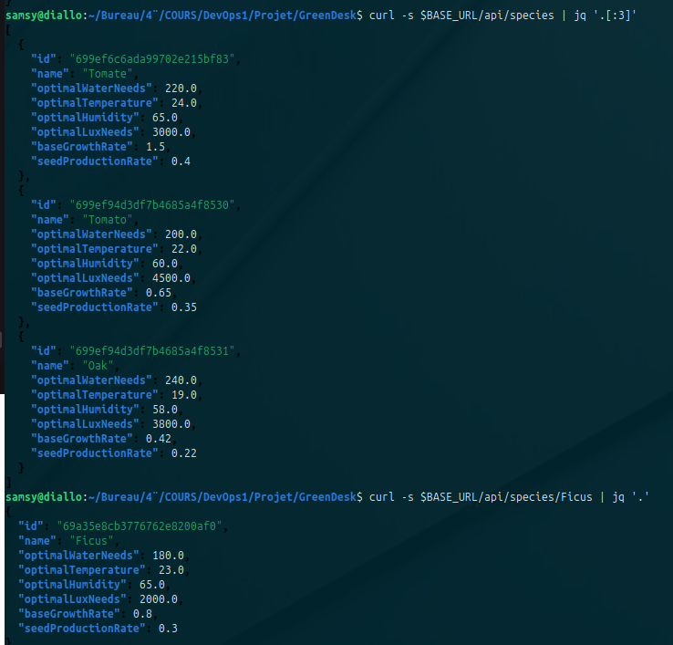 |

#### Plantes

| Capture 1 | Capture 2 |
|---|---|
| 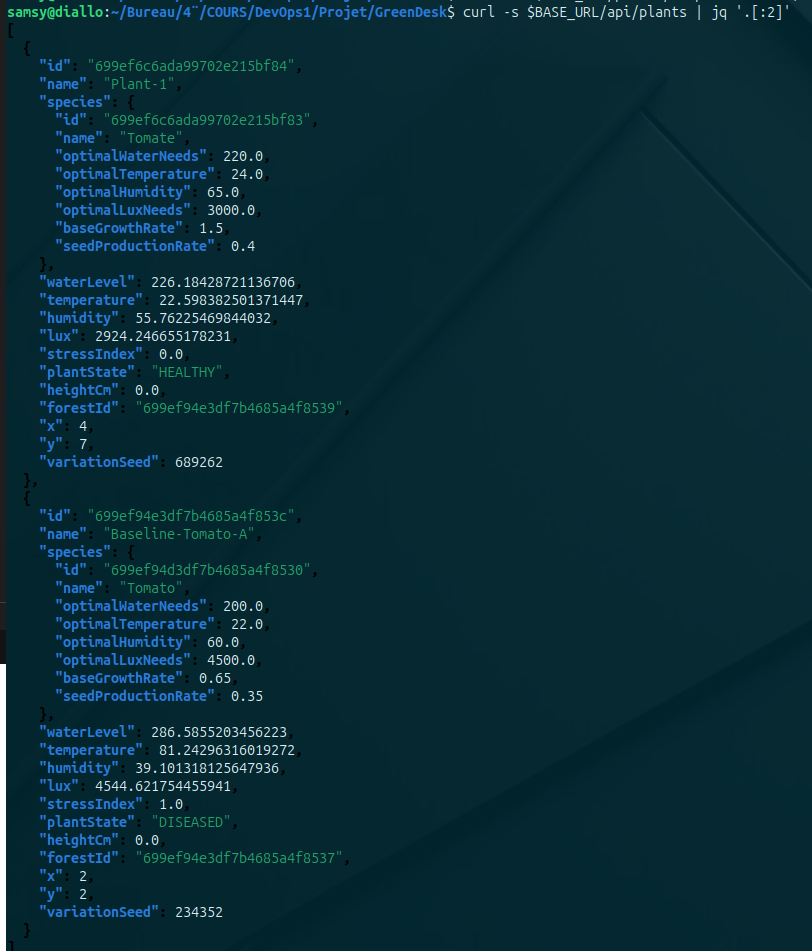 | 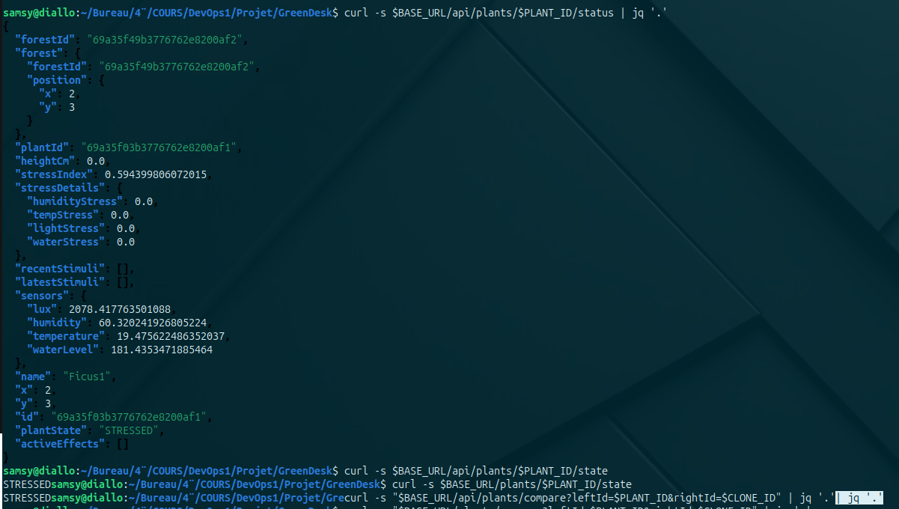 |

#### Forêts

| Capture 1 | Capture 2 |
|---|---|
| 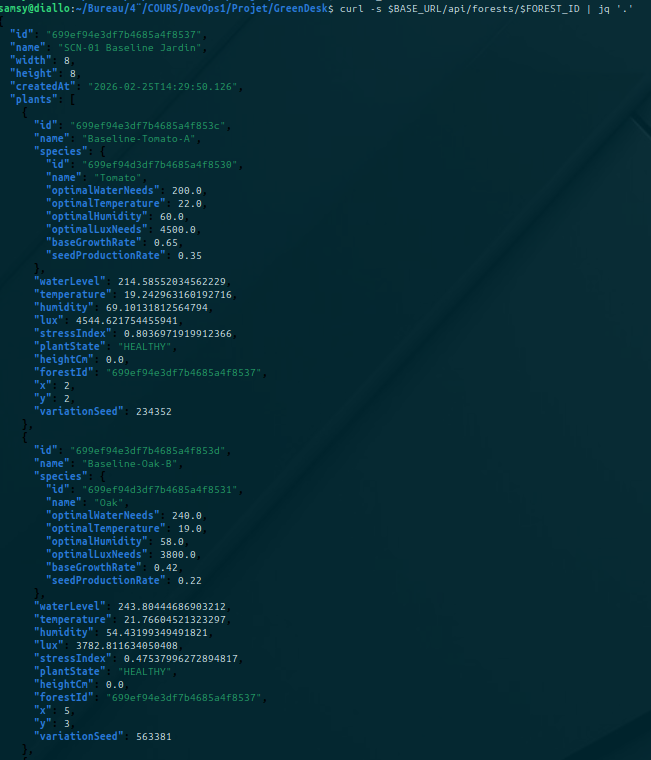 | 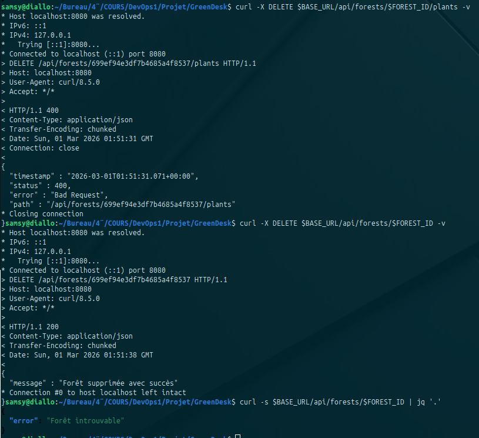 |

#### Saisons

| Capture 1 | Capture 2 |
|---|---|
| 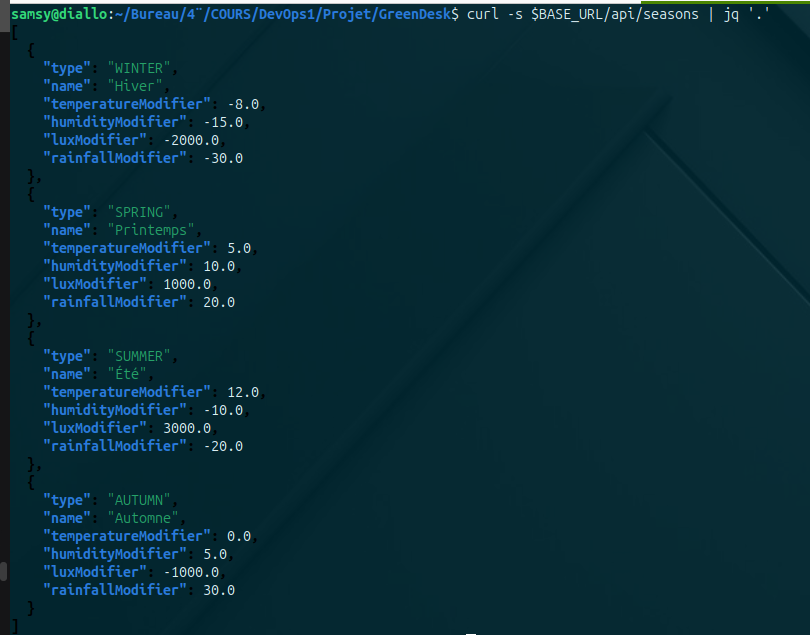 | 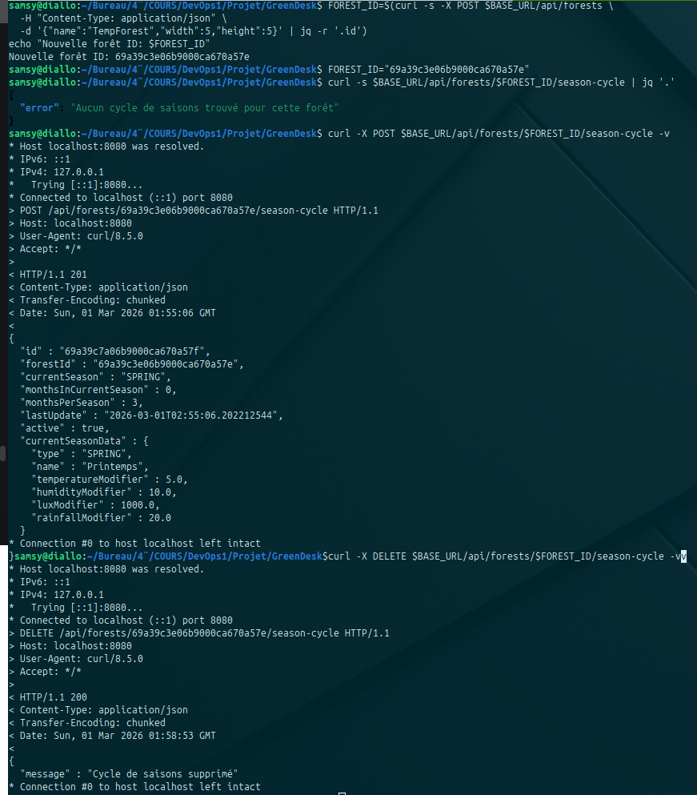 |

#### Effets

| Capture 1 | Capture 2 |
|---|---|
| 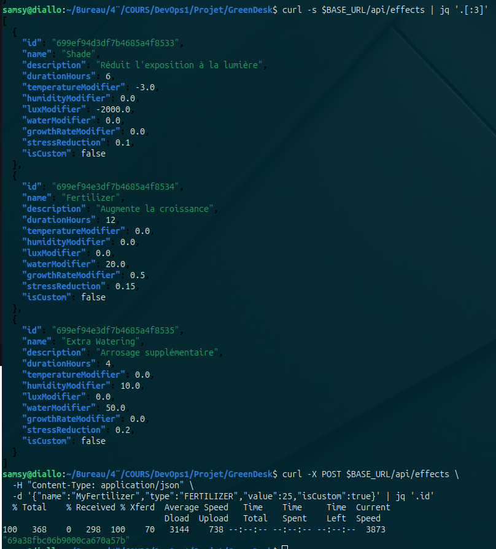 | 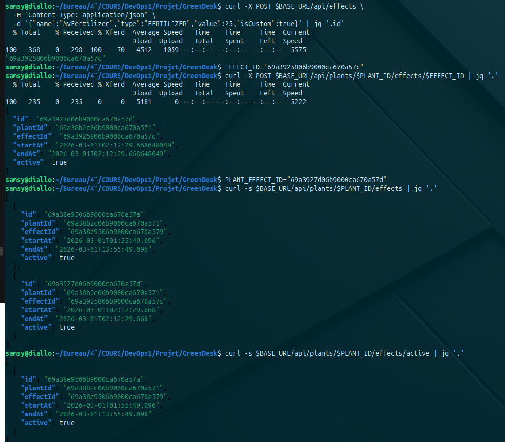 |

#### Stimuli

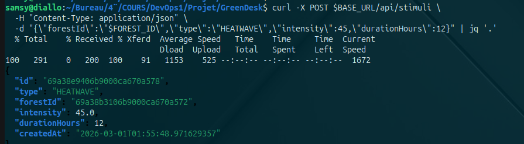

#### Capteurs (sensor-readings)

| Capture 1 | Capture 2 |
|---|---|
| 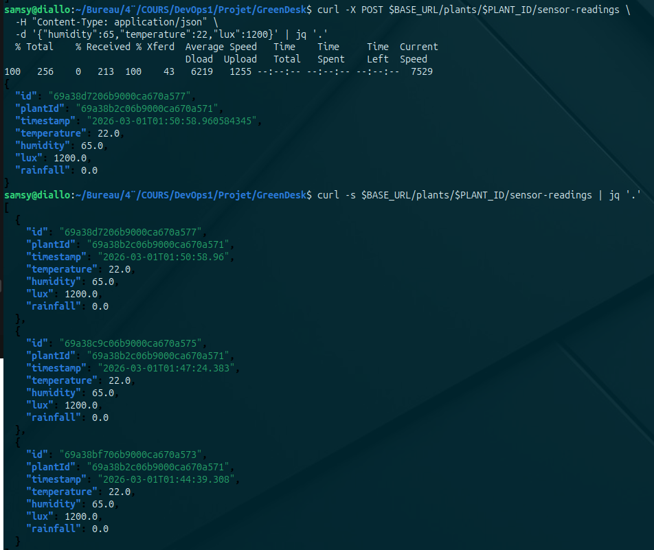 | 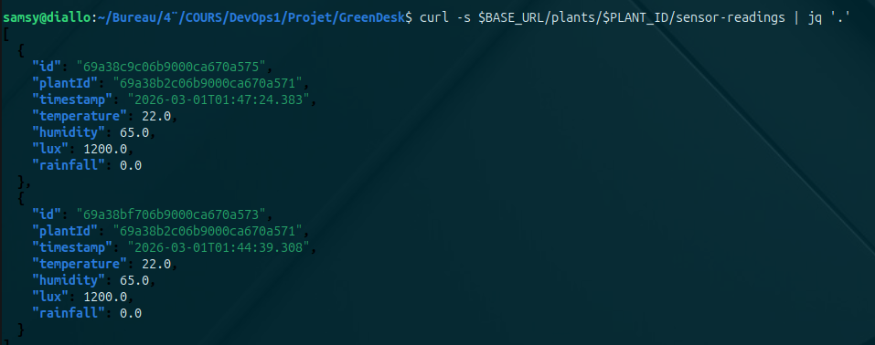 |

#### Alertes

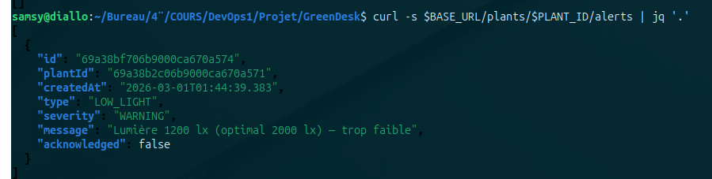

### 8.5 Format d'erreur structuré

```json
{
  "error": "message lisible",
  "endpoint": "/api/greenhouse/...",
  "timestamp": "2026-02-26T12:34:56"
}
```
