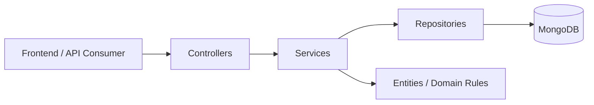
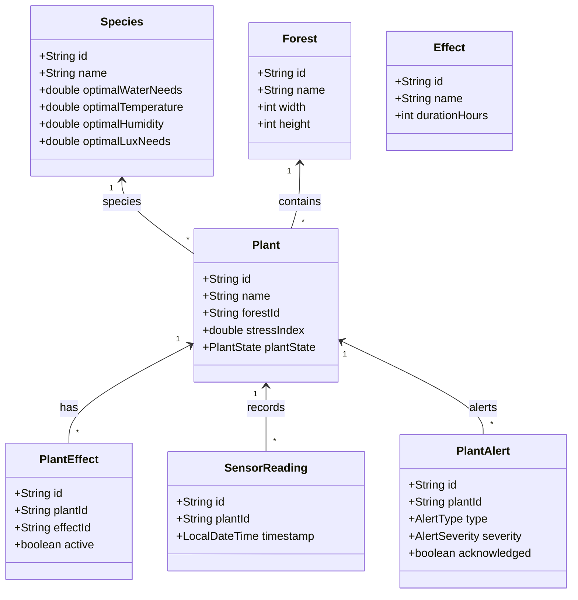
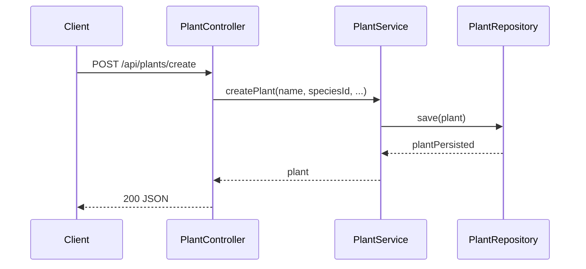
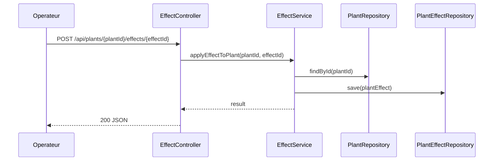
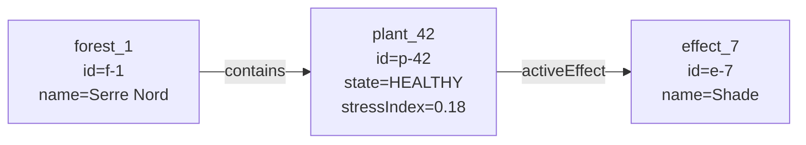
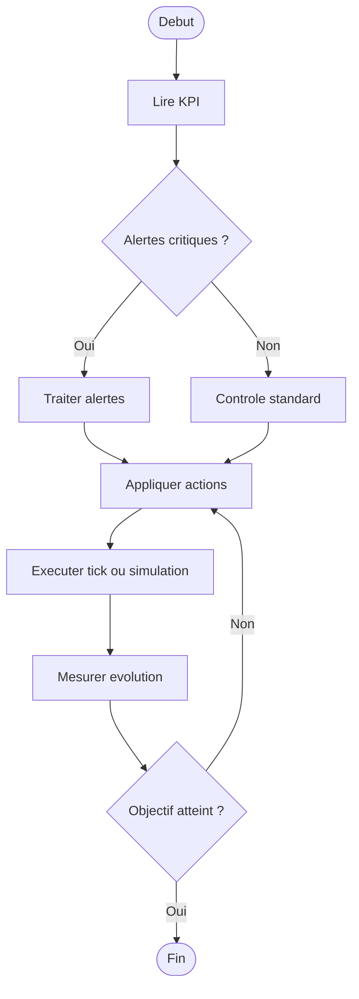
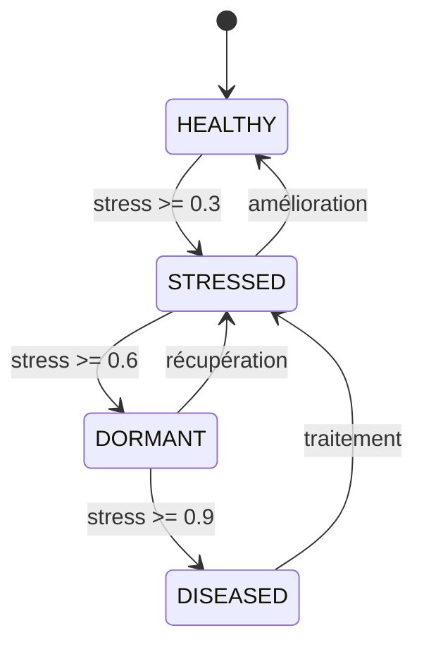
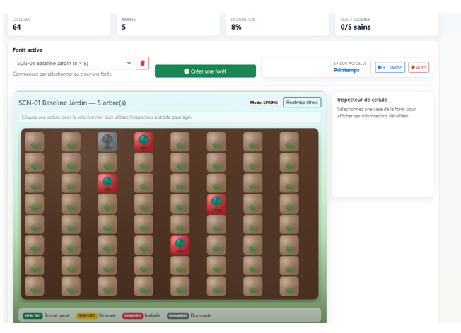
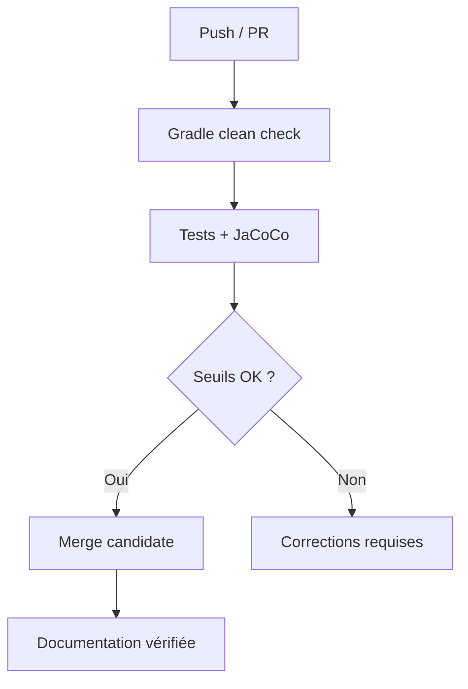

# Dossier Technique & Manuel Utilisateur

## Projet DevOps - Application GreenDesk

<div class="doc-hero">
  <h2 style="margin:0;">GreenDesk - Documentation officielle</h2>
  <p style="margin:8px 0 0;">Version strictement alignée sur le plan du document de référence, adaptée au contexte GreenDesk.</p>
  <div class="doc-meta">
    <span class="doc-chip">Version : v1.1.0</span>
    <span class="doc-chip">Date : 26 février 2026</span>
    <span class="doc-chip">Type : Dossier technique + manuel utilisateur</span>
  </div>
</div>

**Auteurs / Équipe**

- *Hadi ISSA*
- *Fatima SAIDI*
- *Lydia AMROUCHE*
- *Misasoa ROBINSON*
- *Mamadou DIALLO*

<div class="doc-callout">
<strong>Export PDF :</strong> le bouton <em>Exporter en PDF</em> en haut de page déclenche l’impression PDF (style A4 optimisé).
</div>

## Sommaire

- **1. [Présentation Générale](#1-présentation-générale)**
	- 1.1 [Objectif du Projet](#11-objectif-du-projet)
	- 1.2 [Équipe & Contributeurs](#12-équipe--contributeurs)
	- 1.3 [Gestion de Projet & DevOps](#13-gestion-de-projet--devops)

- **2. [Concurrence](#2-concurrence)**
	- 2.1 [Étude de la concurrence](#21-étude-de-la-concurrence)
	- 2.2 [Utilisabilité & Design](#22-utilisabilité--design)

- **3. [Architecture Technique](#3-architecture-technique)**
	- 3.1 [Stack Technologique](#31-stack-technologique)
	- 3.2 [Modélisation (UML) & Structure des Données](#32-modélisation-uml--structure-des-données)

- **4. [Fonctionnalités Détaillées (User Guide)](#4-fonctionnalités-détaillées-user-guide)**
	- 4.1 [Feature 1 - Gestion des espèces et plantes CRUD](#41-feature-1--gestion-des-espèces-et-plantes-crud)
	- 4.2 [Feature 2 - Simulation évolutive d’une plante](#42-feature-2--simulation-évolutive-dune-plante)
	- 4.3 [Feature 3 - Forêts & saisons](#43-feature-3--forêts--saisons)
	- 4.4 [Feature 4 - Effets & stimuli](#44-feature-4--effets--stimuli)
	- 4.5 [Feature 5 - Simulation & alertes](#45-feature-5--simulation--alertes)
	- 4.6 [Feature 6 - Simulation écosystème](#46-feature-6--simulation-écosystème)
	- 4.7 [Feature 7 - Greenhouse Ops (KPI / ROI)](#47-feature-7--greenhouse-ops-kpi--roi)
	- 4.8 [Feature 8 - Capteurs (Sensor Readings)](#48-feature-8--capteurs-sensor-readings)

- **5. [Matrice de Responsabilités & Réalisations](#5-matrice-de-responsabilités--réalisations)**

- **6. [Tests effectués](#6-tests-effectués)**
	- 6.1 [Couverture](#61-couverture)
	- 6.2 [CI/CD (Documentation complète + CI)](#62-cicd-documentation-complète--ci)
	- 6.3 [Captures qualité](#63-captures-qualité)

- **7. [Guide d’Installation & Déploiement](#7-guide-dinstallation--déploiement)**
	- 7.1 [Prérequis](#71-prérequis)
	- 7.2 [Exécution locale](#72-exécution-locale)
	- 7.3 [Exécution Docker](#73-exécution-docker)
	- 7.4 [Vérifications rapides](#74-vérifications-rapides)
	- 7.5 [Dépannage](#75-dépannage)

- **8. [Annexe API REST](#8-annexe-api-rest)**
	- 8.1 [Base URL](#81-base-url)
	- 8.2 [Endpoints principaux](#82-endpoints-principaux)
	- 8.3 [Exemples payload](#83-exemples-payload)
	- 8.4 [Format d’erreur structuré](#84-format-derreur-structuré)

---

## 1. Présentation Générale

### 1.1 Objectif du Projet

**Le projet GreenDesk vise à centraliser les opérations clés de gestion agronomique dans une application unique. Le système permet** :

- la gestion des espèces et des plantes,
- la simulation d’environnements **(forêts, saisons, effets, stimuli)**,
- la supervision des alertes,
- l’analyse de KPI et d’indicateurs **ROI**.

L’objectif est de fournir une base décisionnelle fiable, testée et documentée, utilisable autant par les opérateurs métiers que par l’équipe technique.

**Qui ?**

- **Opérateurs serre** : utilisent les fonctions terrain (espèces, plantes, forêts, interventions).
- **Responsables agronomiques** : pilotent les alertes, la simulation et les décisions **KPI/ROI**.
- **Équipe technique** : maintient l’**API**, la qualité logicielle et l’exploitation.

**Quoi ?**

- Une plateforme unique pour gérer les données agronomiques, simuler les évolutions et suivre la performance.
- Un socle **API** documenté et testable pour intégrer des interfaces et automatisations.

**Pourquoi ?**

- Réduire la dispersion des informations et améliorer la traçabilité opérationnelle.
- Accélérer la prise de décision grâce à des indicateurs consolidés.
- Limiter les régressions via une approche qualité/CI continue.

**Scénario d’usage (application actuelle)**

**Objectif**

Décrire le flux opérationnel réel de l’application GreenDesk, de la création de plante jusqu’au pilotage par indicateurs.

**Quoi ?**

Un scénario métier concret qui combine création, simulation, alertes, corrections et suivi KPI dans le fonctionnement actuel.

**Contexte** : exploitation quotidienne d’une serre simulée dans GreenDesk.

**Acteurs**

- Opérateur serre
- Responsable agronomique
- Manager exploitation

**Déroulé du scénario**

1. L’opérateur crée une espèce puis une plante (`/api/species`, `/api/plants/create`).
2. Il crée une forêt et positionne la plante dans la grille (`/api/forests`, `/api/forests/{forestId}/plants`).
3. Le responsable lance une simulation (`/api/ecosystem/tick` ou `/api/ecosystem/simulate/{n}`) pour observer l’évolution.
4. L’équipe consulte l’état et les alertes de la plante (`/status`, `/plants/{plantId}/alerts`).
5. Si besoin, elle applique des effets/stimuli correctifs (`/api/plants/{plantId}/effects/{effectId}`, `/api/stimuli`).
6. Les alertes traitées sont acquittées (`/alerts/{alertId}/ack`) et un nouveau cycle est relancé.
7. Le manager vérifie les KPI opérationnels (`/api/greenhouse/overview`, `/api/greenhouse/roi`) pour décider des actions suivantes.

**Résultat attendu**

- Cycle complet de gestion plante → forêt → simulation → correction.
- Diminution du stress/alertes après intervention.
- Décision pilotée par indicateurs Greenhouse Ops.

### 1.2 Équipe & Contributeurs

Membres du groupe :

- **Hadi ISSA**
- **Fatima SAIDI**
- **Lydia AMROUCHE**
- **Misasoa ROBINSON**
- **Mamadou DIALLO**

Répartition des contributions :

- Produit & cadrage : vision, backlog, priorités métier.
- Backend & API : contrôleurs, services, persistance.
- Qualité & CI : tests, couverture, validation pipeline.
- Documentation : dossier unique, annexes, export PDF.

### 1.3 Gestion de Projet & DevOps

L’organisation suit une approche itérative inspirée Agile/Scrum :

- cycles courts orientés valeur,
- revues PR systématiques,
- intégration continue orientée qualité,
- documentation maintenue dans le même cycle que le code.

**Mécanismes opérationnels**

- Versioning Git avec branches feature.
- Contrôle qualité local : `./gradlew clean check`.
- Validation CI : tests + JaCoCo + cohérence doc.
- Traçabilité : PR explicites avec impact API/métier.

---

## 2. Concurrence

### 2.1 Étude de la concurrence

L’analyse concurrentielle est réalisée sur trois familles de solutions utilisées dans des contextes proches de GreenDesk.

| Type d’outil | Forces | Limites | Écart couvert par GreenDesk |
|---|---|---|---|
| Tableurs / scripts | Démarrage très rapide, peu de friction | Données dispersées, faible traçabilité, logique difficile à maintenir | Référentiel centralisé + API versionnable + règles métier explicites |
| Plateformes IoT orientées capteurs | Excellente télémétrie temps réel | Faible profondeur métier agronomique, faible simulation native | Intègre capteurs + états plante + alertes + simulation dans un même modèle |
| Simulateurs spécialisés | Moteurs avancés de simulation | Coûts/licences élevés, intégration SI plus lourde | Approche pragmatique API-first, plus légère à intégrer et exploiter |

**Lecture stratégique**

- Les outils simples sont rapides, mais deviennent coûteux en maintenance quand le périmètre grandit.
- Les outils très spécialisés sont puissants, mais peuvent être surdimensionnés pour un usage opérationnel quotidien.
- **GreenDesk** cible une zone d’équilibre : suffisamment structuré pour durer, suffisamment simple pour rester exploitable.

**Positionnement GreenDesk**

- Architecture API-first pour faciliter intégration et automatisation.
- Couplage métier + qualité (tests, couverture, CI) pour fiabilité continue.
- Vision opérationnelle complète : espèces → plantes → forêts → alertes/simulation → KPI/ROI.

### 2.2 Utilisabilité & Design

L’utilisabilité est pensée pour réduire le temps entre observation et action.

**Principes UX retenus**

- Navigation orientée tâches métier (créer, diagnostiquer, corriger, vérifier).
- Accès rapide aux points critiques (état plante, alertes, KPI, ROI).
- Lisibilité forte des signaux (stress, sévérité, tendances).
- Documentation mono-page pour lecture continue et export PDF instantané.

**Décisions de design**

- Interface responsive pour usage sur postes variés.
- Hiérarchie visuelle stable (titres, blocs, tableaux, callouts).
- Cohérence de vocabulaire entre UI, API et documentation.
- Diagrammes Mermaid + captures réelles pour accélérer la compréhension.

**Critères d’utilisabilité visés**

- Comprendre les informations clés en moins de 30 secondes sur un écran de synthèse.
- Retrouver une action principale en moins de 3 clics.
- Identifier un état anormal sans ambiguïté grâce aux alertes et statuts.

**Bénéfice attendu**

- Moins d’erreurs d’interprétation.
- Décisions plus rapides côté exploitation.
- Meilleure adoption par les profils non techniques.

---

## 3. Architecture Technique

### 3.1 Stack Technologique

**Backend**

- Langage : Java 21
- Framework : Spring Boot 3.3.3
- Architecture : MVC/REST (`Controller` → `Service` → `Repository`)
- Persistance : MongoDB (Spring Data)

**Frontend / Documentation**

- UI app : HTML5/CSS3/JavaScript
- Documentation : Docsify + Mermaid

**Build & Qualité**

- Build : Gradle Wrapper
- Tests : JUnit + MockMvc
- Couverture : JaCoCo
- API interactive : Swagger/OpenAPI

### 3.2 Modélisation (UML) & Structure des Données

#### 3.2.1 Diagramme d’architecture



#### 3.2.2 Diagramme de classes (back)



#### 3.2.3 Diagrammes de séquence (back)

**Création d’une plante**



**Application d’un effet**



**Consultation ROI**


#### 3.2.4 Diagramme d’objet (back)



#### 3.2.5 Diagramme de cas d’utilisation


#### 3.2.6 Diagramme d’activité



#### 3.2.7 Diagramme d’état



---

## 4. Fonctionnalités Détaillées (User Guide)

> Exigence stricte : 6 fonctionnalités, chacune avec **But feature**, **Scénarios/Personas**, **Wireframes/Screenshots**, **Résumé NVF**.

### 4.1 Feature 1 - Gestion des espèces et plantes CRUD

**But feature** : centraliser le référentiel agronomique.

**Scénarios / Personas**

- Persona : Opérateur serre
- Scénario : création d’une espèce puis réutilisation lors de la création de plantes.

**Wireframe / screenshot**


**Résumé NVF**

- N : nécessaire pour définir les seuils de référence.
- V : valeur forte sur la cohérence des diagnostics.
- F : faisable via endpoints CRUD déjà exposés.

### 4.2 Feature 2 - Simulation évolutive d’une plante

**But feature** : suivre les plantes à granularité individuelle.

**Scénarios / Personas**

- Persona : Opérateur serre
- Scénario : création, lecture état/statut, comparaison de deux plantes.

**Wireframe / screenshot**


**Résumé NVF**

- N : indispensable pour le pilotage opérationnel.
- V : visibilité sur stress/état par individu.
- F : endpoints disponibles + logique métier stable.

### 4.3 Feature 3 - Forêts & saisons

**But feature** : organiser la plantation dans l’espace et le temps.

**Scénarios / Personas**

- Persona : Responsable agronomique
- Scénario : créer forêt, placer plantes sans conflit, avancer cycle saisonnier.

**Wireframe / screenshot**

**Capture - Forêt & saisons (test terrain)**



**Résumé NVF**

- N : nécessaire à la simulation réaliste.
- V : améliore la planification des interventions.
- F : mécanismes de grille et season cycle implémentés.

### 4.4 Feature 4 - Effets & stimuli

**But feature** : agir sur l’environnement simulé et observer les impacts.

**Scénarios / Personas**

- Persona : Opérateur serre
- Scénario : appliquer un effet, déclencher un stimulus, vérifier évolution.

**Wireframe / screenshot**


**Résumé NVF**

- N : nécessaire pour passer de l’observation à l’action.
- V : accélère l’optimisation des conditions culturales.
- F : services et endpoints dédiés déjà présents.

### 4.5 Feature 5 - Simulation & alertes

**But feature** : anticiper les dérives et gérer les incidents.

**Scénarios / Personas**

- Persona : Responsable agronomique
- Scénario : simuler plusieurs ticks, analyser alertes, acquitter les alertes traitées.

**Wireframe / screenshot**


**Résumé NVF**

- N : indispensable pour réduction du risque.
- V : priorisation par sévérité.
- F : module simulation + module alertes testés.

### 4.6 Feature 6 - Simulation écosystème

**But feature** : piloter une simulation globale multi-plantes/multi-forêts.

**Scénarios / Personas**

- Persona : Responsable agronomique / opérateur simulation
- Scénario : lancer `tick`, `simulate/{n}` ou `simulate/{forestId}/{n}`, puis analyser l’état des cellules (`cells`).

**Wireframe / screenshot**


**Résumé NVF**

- N : nécessaire pour simuler l’évolution à l’échelle système.
- V : permet d’anticiper les dérives et d’ajuster la stratégie.
- F : endpoints `EcosystemController` disponibles et testables.

### 4.7 Feature 7 - Greenhouse Ops (KPI / ROI)

**But feature** : fournir des indicateurs décisionnels consolidés pour le pilotage.

**Scénarios / Personas**

- Persona : Responsable exploitation / Tech lead
- Scénario : consulter `overview`, `alerts`, `roi`, `roi/forests` puis déclencher `sensor-stream/tick`.

**Wireframe / screenshot**


**Résumé NVF**

- N : nécessaire pour le pilotage data-driven.
- V : améliore l’arbitrage coût/risque/performance.
- F : endpoints `GreenhouseOpsController` opérationnels.

### 4.8 Feature 8 - Capteurs (Sensor Readings)

**But feature** : historiser et exploiter les mesures capteurs des plantes.

**Scénarios / Personas**

- Persona : Opérateur technique
- Scénario : injecter une mesure capteur, puis lire la dernière valeur (`latest`) pour une plante.

**Wireframe / screenshot**


**Résumé NVF**

- N : nécessaire pour relier simulation et données observées.
- V : améliore la détection précoce des anomalies.
- F : `SensorReadingController` et service dédiés implémentés.

---

## 5. Matrice de Responsabilités & Réalisations

| Fonctionnalité / Domaine | Hadi ISSA | Fatima SAIDI | Lydia AMROUCHE | Misasoa ROBINSON | Mamadou DIALLO |
|---|---:|---:|---:|---:|---:|
| Architecture backend | Oui | Oui | Oui | Oui | Oui |
| Gestion des espèces et plantes CRUD |  |  |  | Oui |  |
| Simulation évolutive d’une plante |  |  |  |  | Oui |
| Forêts & saisons |  |  | Oui |  |  |
| Effets & stimuli |  |  | Oui |  |  |
| Alertes | Oui |  |  |  |  |
| Écosystème | Oui |  |  | Oui |  |
| Documentation |  |  | Oui |  |  |
| UML (classes, séquence, activité, état, objet) |  |  | Oui |  |  |
| Gestion BDD |  |  |  | Oui |  |
| Tests (unitaires / intégration) | Oui |  |  |  |  |
| CI/CD & qualité pipeline | Oui | Oui |  |  |  |
| Organisation & gestion de projet |  | Oui |  |  |  |
| Releases (versions) |  | Oui |  |  |  |
| Tags du projet |  |  |  |  | Oui |
| Workflow | Oui |  |  |  |  |

---

## 6. Tests effectués

### 6.1 Couverture

#### 6.1.1 Taux de couverture

| Indicateur | Taux actuel | Seuil cible |
|---|---:|---:|
| LINE | `81.04%` | `>= 70%` |
| BRANCH | `52.47%` | `>= 45%` |
| CLASS | `98.18%` | `>= 90%` |

#### 6.1.2 Tableau des tests effectués (54 suites)

| Suites de tests exécutées | Type | Description | Objectif |
|---|---|---|---|
| **Contrôleurs API (12)**<br>`PlantAlertControllerTest`<br>`EcosystemControllerTest`<br>`EffectControllerTest`<br>`SeasonControllerTest`<br>`ForestControllerTest`<br>`ForestSeasonControllerTest`<br>`GreenhouseOpsControllerTest`<br>`HomeControllerTest`<br>`PlantControllerTest`<br>`SensorReadingControllerTest`<br>`SpeciesControllerTest`<br>`StimulusControllerTest` | Intégration API (MockMvc) | Vérifie les routes REST, codes HTTP, payloads, validations et gestion d’erreurs côté contrôleurs. | Garantir que les endpoints exposés sont conformes au contrat API et stables en régression. |
| **Services métier (9)**<br>`EcosystemServiceTest`<br>`EffectServiceTest`<br>`ForestServiceTest`<br>`GreenhouseOpsServiceTest`<br>`NotFoundTests`<br>`PlantAlertServiceTest`<br>`SeasonServiceTest`<br>`SensorReadingServiceTest`<br>`StimulusServiceTest` | Unitaire métier | Teste les règles de gestion, calculs, transitions d’état et scénarios d’exception dans la couche service. | Valider la logique fonctionnelle centrale indépendamment du transport HTTP. |
| **Repositories (8)**<br>`EffectRepositoryTest`<br>`ForestRepositoryTest`<br>`PlantEffectRepositoryTest`<br>`PlantRepositoryTest`<br>`SeasonCycleRepositoryTest`<br>`SensorReadingRepositoryTest`<br>`SpeciesRepositoryTest`<br>`StimulusRepositoryTest` | Intégration persistance | Contrôle les opérations de lecture/écriture, requêtes et mapping avec la couche de persistance. | Sécuriser l’accès aux données et éviter les régressions de stockage/recherche. |
| **Entités & modèle domaine (17)**<br>`PlantAlertTest`<br>`DiseasesTest`<br>`EcosystemCellTest`<br>`EcosystemTest`<br>`EnvironmentDataTest`<br>`SeasonCycleTest`<br>`SeasonTest`<br>`SeasonTypeTest`<br>`ForestTest`<br>`InterventionTest`<br>`PlantEffectTest`<br>`PlantStateTest`<br>`PlantTest`<br>`SensorReadingTest`<br>`SpeciesTest`<br>`StimulusTest`<br>`TestEffects` | Unitaire modèle | Vérifie invariants, comportements, transitions internes et cohérence des objets métier. | Assurer la robustesse du modèle de données utilisé par les services et simulations. |
| **Scénarios transverses / legacy (8)**<br>`TestEcosystemServices`<br>`TestEffects`<br>`TestForestAndSeasons`<br>`TestPlantLifecycle`<br>`TestPlantServices`<br>`TestSensorReadingsAndAlerts`<br>`TestSimulationEnvironment`<br>`TestSpeciesServices` | Intégration fonctionnelle | Exécute des scénarios bout-en-bout couvrant plusieurs composants en chaîne (services + domaine + API). | Valider les parcours métier complets et la cohérence globale de l’application. |

#### 6.1.3 Outils utilisés

- **JUnit 5** : exécution des tests unitaires et d’intégration.
- **Spring MockMvc** : tests contrôleurs/API.
- **JaCoCo** : mesure de couverture (LINE/BRANCH/CLASS).
- **Gradle Wrapper** : orchestration build + tests + rapport.

Commandes principales :

```bash
./gradlew test
./gradlew test jacocoTestReport
./gradlew clean check
```

#### 6.1.4 Capture JaCoCo


### 6.2 CI/CD (Documentation complète + CI)



Commandes standard :

```bash
./gradlew test
./gradlew clean check
./gradlew test jacocoTestReport
```

### 6.3 Captures qualité


**Capture test forêt**


---

## 7. Guide d’Installation & Déploiement

### 7.1 Prérequis

- Java 21
- Docker (optionnel mais recommandé)
- Port 8080 disponible

### 7.2 Exécution locale

```bash
./gradlew clean bootRun
```

- App : `http://localhost:8080/`
- Swagger : `http://localhost:8080/swagger-ui/index.html`

### 7.3 Exécution Docker

```bash
docker compose up -d --build
```

- App : `http://localhost:8080`
- Mongo Express : `http://localhost:8081`

### 7.4 Vérifications rapides

```bash
curl -s http://localhost:8080/api/species
curl -s http://localhost:8080/api/forests
curl -s http://localhost:8080/api/greenhouse/overview
```

### 7.5 Dépannage

- API inaccessible : vérifier port 8080 et logs applicatifs.
- Mongo indisponible : vérifier URI, credentials, service DB.
- Tests en échec : ouvrir le rapport tests et corriger par lot.

---

## 8. Annexe API REST

### 8.1 Base URL

`http://localhost:8080`

### 8.2 Endpoints principaux

| Domaine | Méthode | Endpoint |
|---|---|---|
| Espèces | GET | `/api/species` |
| Espèces | POST | `/api/species` |
| Plantes | POST | `/api/plants/create` |
| Plantes | GET | `/api/plants/{id}/status` |
| Forêts | POST | `/api/forests` |
| Forêts | POST | `/api/forests/{forestId}/plants` |
| Saisons | POST | `/api/forests/{id}/season-cycle/advance` |
| Effets | POST | `/api/plants/{plantId}/effects/{effectId}` |
| Stimulus | POST | `/api/stimuli` |
| Alertes | GET | `/plants/{plantId}/alerts` |
| Alertes | POST | `/alerts/{alertId}/ack` |
| Écosystème | POST | `/api/ecosystem/simulate/{n}` |
| Greenhouse | GET | `/api/greenhouse/overview` |
| Greenhouse | GET | `/api/greenhouse/roi` |
| Greenhouse | POST | `/api/greenhouse/sensor-stream/tick` |

### 8.3 Exemples payload

**Créer espèce**

```json
{
  "name": "Basilic",
  "optimalWaterNeeds": 45,
  "optimalTemperature": 24,
  "optimalHumidity": 55,
  "optimalLuxNeeds": 280,
  "baseGrowthRate": 1.1,
  "seedProductionRate": 0.9
}
```

**Créer forêt**

```json
{
  "name": "Zone-Nord",
  "width": 8,
  "height": 8
}
```

**Tick Greenhouse**

```json
{
  "forestId": "<FOREST_ID>",
  "profile": "NORMAL"
}
```

### 8.4 Format d’erreur structuré

```json
{
  "error": "message lisible",
  "endpoint": "/api/greenhouse/...",
  "timestamp": "2026-02-26T12:34:56"
}
```


