# Dossier Technique & Manuel Utilisateur
## Projet DevOps 2 - Application GreenDesk

| Information | Valeur |
|---|---|
| Version | `v2.0.0` |
| Projet | GreenDesk |
| Type | Dossier technique, manuel utilisateur et rapport DevOps 2 |
| Dépôt GitHub | `MisasoaRobison/GreenDesk` |
| Date | 13 juin 2026 |
| Équipe | Hadi ISSA, Fatima SAIDI, Lydia AMROUCHE, Misasoa ROBISON, Mamadou DIALLO |

---

## Sommaire

1. Architecture technique
2. Fonctionnalités détaillées
3. Tests effectués
4. Matrice de responsabilités et réalisations
5. Guide d'installation et déploiement
6. Annexe API REST
7. Conclusion

---

## 1. Architecture technique

GreenDesk est une application de gestion agronomique et de simulation. Elle centralise les plantes, les forêts, les mesures environnementales, les alertes météo et les tâches de soin. Son architecture associe une API Spring Boot, une interface web statique, MongoDB et une chaîne DevOps automatisée avec GitHub Actions.

### 1.1 Vue d'ensemble de l'architecture

Le backend suit une architecture modulaire en couches :

- les **Controllers** exposent les endpoints REST et valident les requêtes ;
- les **Services** portent la logique métier ;
- les **Repositories** assurent l'accès aux collections MongoDB ;
- les **Entities** représentent les données persistées ;
- les **DTOs** définissent les objets d'entrée et de sortie ;
- les ressources HTML, CSS et JavaScript constituent le frontend ;
- GitHub Actions automatise les tests, la documentation et les releases.

Cette séparation facilite les tests, la maintenance et l'évolution indépendante des fonctionnalités météo et du calendrier de soins.

### 1.2 Stack technologique

| Couche | Technologie | Rôle |
|---|---|---|
| Frontend | HTML, CSS, JavaScript, Bootstrap | Interfaces utilisateur et appels à l'API |
| Backend | Java 21, Spring Boot 3.3.3 | API REST et logique métier |
| Sécurité | Spring Security, BCrypt, sessions | Authentification et autorisation |
| Base de données | MongoDB, Spring Data MongoDB | Persistance des plantes, tâches et alertes |
| Build | Gradle Wrapper 9.2.0 | Compilation, tests, JAR et Javadoc |
| Tests | JUnit 5, Mockito, Spring Boot Test | Tests unitaires et d'intégration |
| Couverture | JaCoCo 0.8.12 | Mesure de couverture du code |
| CI/CD | GitHub Actions | Build, tests, documentation et release |
| Documentation | Markdown, Pandoc, XeLaTeX | Génération des documents PDF |
| Déploiement | Docker, Docker Compose | Exécution conteneurisée |
| Services externes | Tomorrow.io, Open-Meteo, Google Calendar | Météo et calendrier externe |

### 1.3 Architecture applicative et transition de S1 vers S2

#### 1.3.1 Diagramme d'architecture applicative

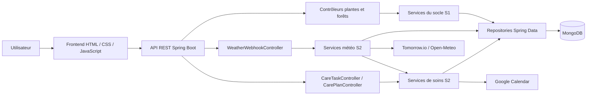

Le socle applicatif S1 gère notamment les espèces, les plantes et les forêts. S2 étend ce socle sans le remplacer : les services météo analysent les événements externes et mettent à jour les plantes existantes, tandis que les services de soins utilisent leur état pour créer ou reporter des tâches. Toutes les données restent persistées dans MongoDB.

#### 1.3.2 Diagramme de classes - Transition DevOps S1 vers DevOps S2

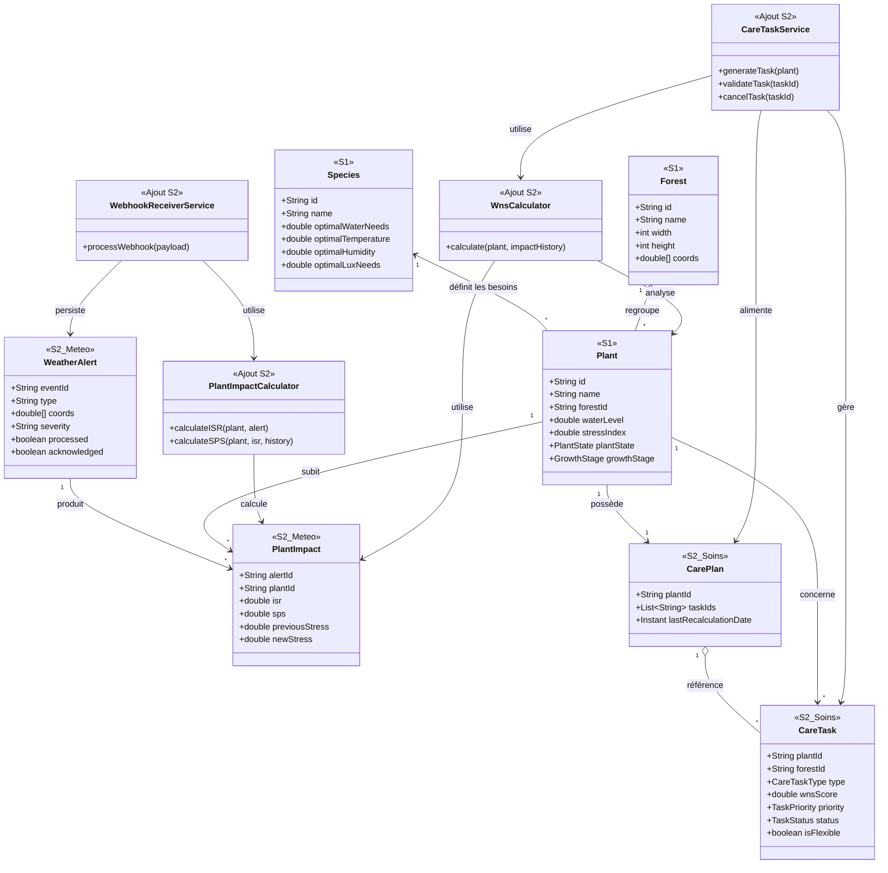

La transition vers S2 conserve les objets fondamentaux de S1 et leur ajoute deux chaînes métier :

- **Feature météo** : `WeatherAlert` décrit l'événement externe et `PlantImpact` conserve son effet ISR/SPS sur une `Plant` existante ;
- **Calendrier de soins** : `WnsCalculator` exploite l'état de la plante et son historique d'impacts pour permettre à `CareTaskService` de créer des `CareTask` regroupées dans un `CarePlan`.

Cette évolution relie directement la supervision météo aux décisions de soin tout en réutilisant les entités `Species`, `Plant` et `Forest` déjà présentes dans S1.

| Périmètre | Classes principales | Évolution |
|---|---|---|
| Socle S1 conservé | `Species`, `Plant`, `Forest` | Gestion des besoins biologiques, de l'état des plantes et de leur organisation en forêts |
| Ajout S2 - Météo | `WeatherAlert`, `PlantImpact`, `WebhookReceiverService`, `PlantImpactCalculator` | Réception des alertes, calcul ISR/SPS et mise à jour des plantes existantes |
| Ajout S2 - Soins | `CareTask`, `CarePlan`, `WnsCalculator`, `CareTaskService` | Transformation de l'état des plantes et des impacts météo en tâches de soins |

### 1.4 Organisation du projet

| Élément | Rôle |
|---|---|
| `.github/workflows/` | Workflows CI, documentation, UML, rapport et release |
| `src/main/java/org/example/controllers/` | Contrôleurs REST |
| `src/main/java/org/example/services/` | Services métier |
| `src/main/java/org/example/repositories/` | Repositories MongoDB |
| `src/main/java/org/example/entities/` | Entités persistées |
| `src/main/java/org/example/dto/` | DTOs d'entrée et de sortie |
| `src/main/resources/static/` | Frontend web |
| `src/test/java/` | Tests unitaires et d'intégration |
| `docs/` | Documentation et captures |
| `docs/reports/` | Rapports de livraison |
| `build.gradle` | Dépendances et tâches Gradle |
| `Dockerfile` | Construction du conteneur applicatif |
| `docker-compose.yml` | Orchestration GreenDesk, MongoDB et Mongo Express |

---

## 2. Fonctionnalités détaillées

Le périmètre DevOps 2 est organisé autour de deux fonctionnalités principales : le jumeau numérique météo et le calendrier de soins dynamique.

### 2.1 Feature 1 - Jumeau numérique météo / Tomorrow.io

#### 2.1.1 Objectif de la fonctionnalité

La première fonctionnalité importante de cette version concerne la gestion des alertes météo. L'objectif est de permettre à GreenDesk de recevoir des événements météo depuis un système externe, puis d'adapter l'état des plantes et les tâches de soins en conséquence.

Cette fonctionnalité permet notamment de :

- recevoir une alerte météo via un webhook ;
- vérifier et valider le payload reçu ;
- sauvegarder l'alerte dans la base de données ;
- identifier les forêts et les plantes potentiellement impactées ;
- calculer un impact météo pour chaque plante concernée ;
- mettre à jour l'état des plantes ;
- réordonnancer certaines tâches de soins si nécessaire.

Cette logique permet à l'application de réagir automatiquement à des événements externes, comme une forte pluie, une vague de chaleur, du gel ou du vent important.

#### 2.1.2 Logique métier

Lorsqu'une alerte météo est reçue, le système suit un processus précis.

Le webhook météo envoie une requête HTTP vers l'API GreenDesk. Le contrôleur météo reçoit la requête, vérifie le secret et délègue le traitement au service métier. Le service valide le payload et vérifie d'abord que l'alerte n'a pas déjà été traitée.

Si l'alerte est nouvelle, elle est sauvegardée dans la base de données. Ensuite, GreenDesk recherche les forêts proches de la zone concernée. À partir de ces forêts, le système récupère les plantes potentiellement impactées.

Pour chaque plante sensible à l'événement, un calcul d'impact est réalisé. Ce calcul permet d'estimer le niveau de risque ou de stress provoqué par l'événement météo grâce aux scores ISR et SPS. L'état de la plante est ensuite mis à jour et l'impact est persisté.

Enfin, le système peut déclencher un réordonnancement des tâches flexibles. Par exemple, une tâche d'arrosage peut être reportée si une forte pluie est prévue ou détectée.

#### 2.1.3 Classes impliquées

Les principales classes impliquées dans cette fonctionnalité sont :

| Classe | Rôle |
|---|---|
| `WeatherWebhookController` | Reçoit les alertes météo via l'API, vérifie le secret et valide la requête |
| `WebhookReceiverService` | Contient la logique principale de traitement du webhook |
| `WeatherAlert` | Représente une alerte météo |
| `WeatherAlertRepository` | Persiste les alertes météo |
| `PlantImpact` | Représente l'impact d'une alerte sur une plante |
| `PlantImpactRepository` | Persiste les impacts calculés |
| `PlantImpactCalculator` | Calcule les scores d'impact ISR et SPS |
| `PlantStateUpdater` | Met à jour l'état de la plante |
| `CareTaskWeatherRescheduler` | Réordonnance les tâches flexibles |
| `ForestRepository` | Récupère les forêts concernées |
| `PlantRepository` | Récupère les plantes impactées |

La vérification du secret webhook est réalisée directement dans `WeatherWebhookController`. Le projet ne contient pas de classe séparée nommée `TomorrowWebhookVerifier`. De même, le service réel de réordonnancement est `CareTaskWeatherRescheduler`.

#### 2.1.4 Exemple de scénario météo

Un exemple de scénario est le suivant :

1. Tomorrow.io envoie une alerte de forte pluie.
2. GreenDesk reçoit l'alerte via le webhook.
3. L'alerte est validée et sauvegardée.
4. Le système identifie les forêts proches des coordonnées météo.
5. Les plantes de ces forêts sont analysées.
6. Le score d'impact est calculé pour chaque plante.
7. L'état des plantes est mis à jour si nécessaire.
8. Les tâches d'arrosage flexibles sont reportées.
9. L'alerte est marquée comme traitée.

Cette fonctionnalité donne à GreenDesk une capacité de réaction automatique face à des événements climatiques.

#### 2.1.5 Résultat fonctionnel

À la fin du traitement, l'alerte météo est tracée dans MongoDB, chaque impact calculé est associé à une plante et les tâches flexibles concernées sont mises à jour. Les utilisateurs disposent ainsi d'un état cohérent entre les conditions météo, la santé des plantes et le calendrier de soins.

#### 2.1.6 Diagramme de séquence - Réception d'une alerte météo

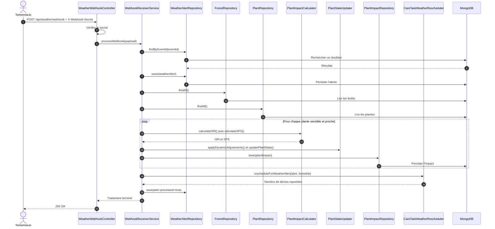

Le diagramme reprend les noms réellement présents dans le code. La recherche des plantes s'appuie sur les coordonnées des forêts, puis le traitement est limité aux plantes sensibles au type d'événement.

#### 2.1.7 Types d'alertes météo pris en charge

Le jumeau numérique traite cinq catégories d'événements Tomorrow.io. Chaque alerte est rapprochée des sensibilités déclarées pour l'espèce avant le calcul de l'impact.

| Type technique | Événement représenté | Conséquence principale |
|---|---|---|
| `heatwave` | Vague de chaleur | Évaluation du stress thermique et adaptation des soins |
| `frost` | Gel | Évaluation du risque de gel et des besoins de protection |
| `heavy_rain` | Pluie intense | Réévaluation ou report des tâches d'arrosage flexibles |
| `high_wind` | Vent fort | Évaluation du risque mécanique et adaptation des tâches concernées |
| `uv_alert` | Niveau UV élevé | Évaluation de l'exposition et de l'impact sur les plantes sensibles |

Le calcul est assuré par `PlantImpactCalculator`, qui produit les scores ISR et SPS. `PlantStateUpdater` applique ensuite les ajustements nécessaires à l'état de la plante.

#### 2.1.8 API météo, consultation et notifications

La Feature 1 ne se limite pas à la réception du webhook. Elle fournit également les opérations nécessaires à la consultation, au suivi et à la configuration des alertes.

| Méthode et endpoint | Rôle |
|---|---|
| `POST /api/weather/webhook` | Recevoir et traiter une alerte externe |
| `GET /api/weather/alerts` | Consulter les alertes, avec filtres optionnels `forestId`, `plantId` et `activeOnly` |
| `POST /api/weather/alerts/{alertId}/ack` | Acquitter une alerte |
| `GET /api/weather/impact/{plantId}` | Consulter l'historique des impacts d'une plante |
| `POST /api/weather/alert-config` | Configurer les seuils d'alerte d'une forêt |
| `GET /api/weather/notifications` | Consulter les notifications météo |
| `POST /api/weather/notifications/{id}/read` | Marquer une notification comme lue |
| `POST /api/weather/notifications/read-all` | Marquer toutes les notifications comme lues |

#### 2.1.9 Interface utilisateur

Le tableau de bord présente une section **Alertes météo** alimentée par l'API. L'utilisateur peut afficher les alertes reçues, limiter l'affichage aux alertes non acquittées et acquitter une alerte depuis l'interface. Cette intégration est portée par `dashboard.html` et `dashboard.js`.

L'historique persistant permet de conserver une trace de l'événement reçu, des plantes concernées et des impacts calculés, même après l'acquittement de l'alerte.

##### 2.1.9.1 Suivi opérationnel des alertes météo


Cette vue représente le point de contrôle opérationnel de la Feature 1. Chaque ligne correspond à une alerte Tomorrow.io persistée par GreenDesk. Le tableau affiche sa date, son type, sa sévérité, les coordonnées de la zone concernée et son statut.

Le filtre par forêt permet de limiter l'analyse à une zone précise. L'option **Non acquittées uniquement** met en évidence les événements restant à traiter. Le bouton **Acquitter** confirme qu'un utilisateur a pris connaissance de l'alerte sans supprimer son historique.

##### 2.1.9.2 Projection de l'évolution des plantes


Cette vue complète le suivi météo par une représentation prédictive. L'utilisateur sélectionne une plante et une durée, puis le frontend appelle `GET /api/predictions/plant/{plantId}?days={days}`. Le graphique compare deux séries :

- le stress prévisionnel, exprimé en pourcentage ;
- la hauteur prévisionnelle, exprimée en centimètres.

`PredictionService` calcule ces projections à partir de l'état courant de la plante, de sa hauteur, de son facteur de croissance et des caractéristiques de son espèce. Une alerte prédictive est ajoutée lorsque le stress projeté dépasse le seuil critique de `70 %`. Cette visualisation aide donc l'utilisateur à anticiper une dégradation après avoir observé les alertes et impacts produits par le jumeau numérique météo.

#### 2.1.10 Robustesse et sécurité du traitement

Plusieurs mécanismes protègent le traitement contre les erreurs et les doublons :

- le webhook exige l'en-tête `X-Webhook-Secret`, comparé au secret configuré par `WeatherWebhookController` ;
- `WebhookReceiverService` valide la présence de `event_id`, du type, de l'horodatage et de deux coordonnées exploitables ;
- l'identifiant externe `event_id` permet d'éviter de traiter deux fois la même alerte ;
- la recherche géographique s'appuie sur les coordonnées des forêts afin de limiter l'analyse aux zones proches ;
- seules les plantes sensibles au type d'événement sont retenues pour le calcul d'impact ;
- l'alerte est marquée comme traitée après l'analyse et le réordonnancement.

L'authentification Spring Security de la Feature V6 protège l'utilisation générale de l'application et les espaces réservés. Le webhook météo constitue cependant un point d'entrée externe spécifique : il utilise donc son propre secret plutôt qu'une session HTTP utilisateur.

##### 2.1.10.1 Contrôle d'accès à la Feature 1

L'accès humain aux informations produites par la Feature 1 passe par le système d'authentification de GreenDesk. Avant de consulter le tableau de bord et les alertes météo, l'utilisateur doit ouvrir une session depuis `login.html`. Les identifiants sont transmis à `POST /api/auth/login`, puis Spring Security crée une session HTTP utilisée lors des requêtes suivantes.


La page de connexion présente également les comptes de démonstration `admin / admin123` et `demo / demo123`. Après authentification, `auth-guard.js` vérifie la session avec `GET /api/auth/me` et redirige vers `/login.html` toute personne non connectée qui tente d'accéder à une page protégée.

Deux niveaux d'accès sont distingués :

| Rôle | Accès associé |
|---|---|
| `USER` | Consultation des pages protégées, du tableau de bord et des informations météo autorisées |
| `ADMIN` | Accès utilisateur standard et administration des comptes via `/api/admin/**` |

L'écran **Gestion des comptes utilisateurs** est réservé au rôle `ADMIN`. Il centralise le nombre total de comptes, les administrateurs, les utilisateurs et les comptes actifs. Il permet également de rechercher, modifier, réinitialiser ou supprimer un compte.

Depuis le bouton **Nouveau compte**, l'administrateur ouvre une fenêtre de création. Il renseigne le nom d'utilisateur, l'adresse email et le mot de passe, puis attribue explicitement le rôle **Utilisateur** ou **Administrateur**. Cette séparation empêche un utilisateur standard de s'attribuer lui-même des droits élevés.

Ainsi, la sécurité de la Feature 1 repose sur deux mécanismes complémentaires :

- la session Spring Security et les rôles protègent l'accès des utilisateurs aux écrans et aux API internes ;
- le secret `X-Webhook-Secret` authentifie les alertes envoyées par le fournisseur météo externe, qui ne peut pas ouvrir une session utilisateur.

#### 2.1.11 Tests et scripts locaux

La fonctionnalité météo est couverte à plusieurs niveaux :

| Test ou outil | Périmètre vérifié |
|---|---|
| `WeatherWebhookControllerTest` | Réception HTTP, secret webhook, payloads valides et invalides |
| `WebhookReceiverServiceTest` | Validation, idempotence et orchestration du traitement |
| `PlantImpactCalculatorTest` | Calcul des impacts ISR et SPS selon les événements |
| `WeatherForecastServiceTest` | Exploitation des prévisions météo |
| `WeatherAlertIntegrationTest` | Parcours intégré avec persistance et endpoints |
| `test-weather.sh` et `test-weather.bat` | Test local du webhook, de la liste des alertes et du filtre `activeOnly` |

Les deux scripts locaux utilisent la variable d'environnement `WEATHER_WEBHOOK_SECRET`, envoient une alerte de chaleur de démonstration puis vérifient sa présence dans l'API.

### 2.2 Feature 2 - Calendrier de soins dynamique

#### 2.2.1 Présentation et objectifs fonctionnels

La Feature 2 transforme l'état des plantes, leur historique météo et les prévisions de pluie en tâches de soins planifiées, priorisées et suivies. Elle permet de décider si une intervention est nécessaire, de créer la tâche correspondante, de la synchroniser avec Google Calendar et de gérer son cycle de vie jusqu'à sa validation, son annulation ou son expiration.

La documentation de cette fonctionnalité suit l'organisation d'un dossier technique :

| Partie | Contenu |
|---|---|
| Architecture générale | Vue d'ensemble et responsabilités principales |
| Classes et données | Énumérations, entités MongoDB, services et infrastructure |
| Module de décision WNS | Calcul du besoin, seuil, justification et priorité |
| Processus métier | Génération, idempotence, validation et réordonnancement |
| Interface et API | Utilisation depuis le frontend et endpoints REST |
| Validation | Tests unitaires et scénarios d'intégration |

#### 2.2.2 Architecture générale et périmètre

Cette section détaille les spécifications techniques de la fonctionnalité de gestion, de planification et de synchronisation externe des tâches de soins agronomiques. Elle est rédigée strictement à partir du code source de l'application et alignée sur le formalisme du dossier technique.

La fonctionnalité assure l'automatisation du cycle de vie des soins appliqués aux plantes suivies par GreenDesk, ainsi que la création manuelle d'interventions par l'utilisateur.

Le système :

- évalue le besoin agronomique avec le score **WNS** ;
- utilise le dernier score **SPS** pour attribuer la priorité métier ;
- prend en compte l'état de la plante, son stade de croissance, son stress et la pluie prévue ;
- génère automatiquement une tâche lorsque le score WNS dépasse le seuil ;
- permet la création manuelle d'une intervention ;
- planifie l'exécution et l'échéance des tâches ;
- évite les doublons en recherchant une tâche identique au statut `PENDING` ;
- gère le cycle de vie des tâches avec les statuts `PENDING`, `DONE` et `CANCELED` ;
- associe les tâches au `CarePlan` de chaque plante ;
- synchronise les interventions avec Google Calendar ;
- reporte les tâches flexibles lors de certaines alertes météo ;
- annule automatiquement les tâches expirées grâce à `CareTaskExpirationScheduler` ;
- expose le score WNS et son détail dans `CareTaskResponseDto`.

**Architecture générale de la Feature 2**

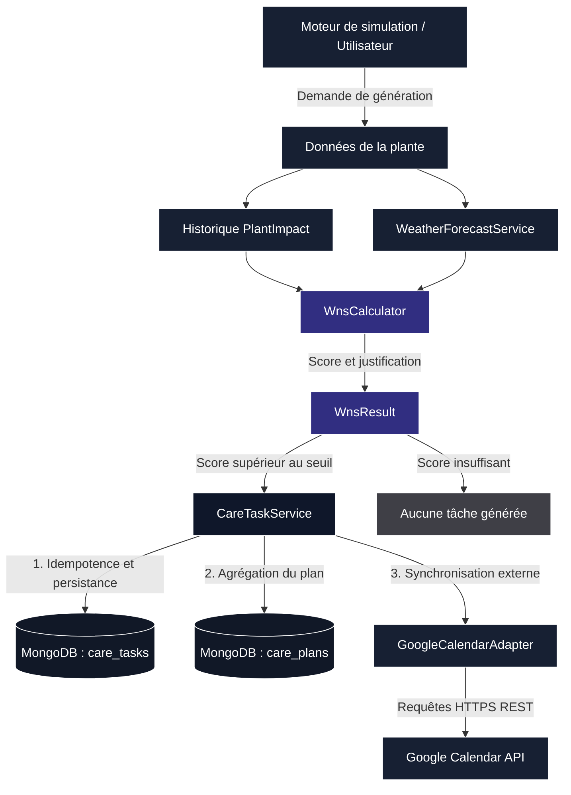

Le diagramme représente l'architecture complète de la Feature 2. `WnsCalculator` analyse les données de la plante, l'historique `PlantImpact` et la prévision fournie par `WeatherForecastService`. `WnsResult` transmet le score et sa justification à `CareTaskService`. Lorsque le seuil est dépassé, le moteur d'exécution contrôle l'idempotence, persiste la tâche dans `care_tasks`, l'associe au plan stocké dans `care_plans` et délègue sa synchronisation à `GoogleCalendarAdapter`.

Le bloc de décision intervient avant la création effective d'une tâche. Le bloc d'exécution prend ensuite en charge sa persistance, son association à un plan et son suivi opérationnel.

#### 2.2.3 Classes utilisées et structure des données

L'implémentation logicielle du moteur de tâches suit une architecture modulaire et découplée. Elle s'appuie sur des énumérations métier, des documents MongoDB, des repositories, des services d'orchestration et un adaptateur vers Google Calendar.

##### 2.2.3.1 Énumérations du domaine métier

**CareTaskType**

Spécifie la nature de l'action agronomique requise :

- `WATERING` : arrosage ;
- `FERTILIZATION` : fertilisation ;
- `PRUNING` : taille ;
- `HEATING_ADJUSTMENT` : ajustement du chauffage.

**TaskPriority**

Détermine la sévérité et l'ordre d'affichage de la tâche :

- `LOW` ;
- `MEDIUM` ;
- `HIGH` ;
- `CRITICAL`.

**TaskStatus**

Pilote le cycle de vie de la tâche :

- `PENDING` : tâche active ;
- `DONE` : tâche clôturée avec succès ;
- `CANCELED` : tâche annulée ou expirée.

**WeatherDependency**

Qualifie la dépendance d'une tâche aux conditions météorologiques :

- `NONE` ;
- `RAIN_AVOIDED` ;
- `HEAT_ALERT` ;
- `FROST_ALERT`.

##### 2.2.3.2 Entités métier et persistance MongoDB

**CareTask**

`CareTask` est le document central stocké dans la collection `care_tasks`. Il porte l'index composé suivant :

```java
@CompoundIndex(
    name = "plant_type_schedule_idx",
    def = "{'plantId':1, 'type':1, 'scheduledAt':1}"
)
```

Ses attributs clés sont :

- `id`, `plantId`, `forestId` ;
- `type`, `description`, `priority`, `wnsScore` ;
- `isFlexible`, `scheduledAt`, `dueAt` ;
- `status`, `weatherDependency`, `externalId` ;
- `createdAt`, `closedAt`.

`CareTaskRepository` assure la persistance, le tri, la recherche des tâches expirées et l'idempotence par recherche d'une tâche du même type au statut `PENDING`.

**CarePlan**

`CarePlan` est stocké dans la collection `care_plans`. Il contient :

- `id` ;
- `plantId` ;
- `taskIds` de type `List<String>` ;
- `lastRecalculationDate` de type `Instant`.

Ses méthodes métier sont `addTask()`, `removeTask()` et `touchRecalculation()`.

##### 2.2.3.3 Couche service et architecture d'infrastructure

| Composant | Méthodes ou responsabilités principales |
|---|---|
| `CarePlanService` | `getOrCreatePlan(plantId)`, `addTaskToPlan(plantId, taskId)`, `recomputeGlobalPlan(forestId, plantId)` |
| `CareTaskService` | `generateTask(plant)`, `createManualTask(request)`, `markAsDone(taskId)`, `cancelTask(taskId)`, `getAllTasks()` |
| `ExternalCalendarService` | Contrat `push`, `update`, `remove` |
| `GoogleCalendarAdapter` | Implémentation de la synchronisation Google Calendar |
| `CareTaskExpirationScheduler` | Annulation périodique des tâches expirées |

`GoogleCalendarAdapter` utilise les classes Google `Calendar`, `Event`, `EventDateTime` et `GoogleCredentials`. Il est configuré avec :

```properties
google.calendar.id
google.api.credentials-path
```

Lorsque les identifiants Google ne sont pas disponibles en CI ou en test, l'adaptateur retourne un identifiant simulé commençant par `mock-google-`.

#### 2.2.4 Module de décision WNS, priorisation et recommandation

Cette section complète le moteur de tâches de soins présenté précédemment. Alors que `CareTaskService` prend en charge la création, la persistance, la synchronisation externe et le cycle de vie des tâches, le module WNS intervient en amont pour déterminer si une intervention est réellement nécessaire.

La priorité métier est ensuite attribuée dans `CareTaskService` à partir du dernier score SPS disponible. Il n'existe pas de service de priorisation séparé dans le projet.

##### 2.2.4.1 Objectif du module WNS

Le module WNS a pour objectif d'évaluer le besoin d'intervention d'une plante à partir de plusieurs facteurs métier.

Il permet notamment de :

- analyser l'état courant d'une plante ;
- prendre en compte son niveau de stress ;
- prendre en compte son stade de croissance ;
- intégrer la taille de la plante ;
- intégrer la pluie prévue ;
- calculer un score de besoin ;
- déterminer si une tâche doit être générée ;
- contribuer à la décision et à la priorisation de la tâche ;
- enrichir la réponse API avec des informations compréhensibles.

L'objectif est d'éviter une génération arbitraire des tâches. Une intervention automatique n'est créée que si les données métier montrent qu'elle est pertinente et si le score dépasse le seuil configuré.

##### 2.2.4.2 Rôle de `WnsCalculator`

La classe `WnsCalculator` est responsable du calcul du score WNS. Le WNS peut être compris comme un **Watering Need Score**, c'est-à-dire un score de besoin d'intervention ou d'arrosage. Il estime si une plante a besoin d'un soin à partir de son état et du contexte environnemental.

Le calcul repose principalement sur les éléments suivants :

| Facteur | Rôle dans le calcul |
|---|---|
| Taille de la plante | Une plante plus développée peut avoir des besoins plus importants |
| Stade de croissance | Certaines phases biologiques nécessitent davantage d'attention |
| Stress de la plante | Un stress élevé augmente l'urgence d'intervention |
| Pluie prévue | Une pluie proche peut réduire ou bloquer le besoin d'arrosage |

La formule implémentée est :

```text
WNS = (0,3 x Taille) + (0,2 x Stade) + (0,15 x Stress) - (0,25 x Pluie prévue)
```

Le résultat du calcul n'est pas uniquement un nombre. Il sert de base à une décision métier : générer ou non une tâche, puis transmettre les informations nécessaires au moteur de planification. Cette partie constitue la couche de décision de la Feature 2.

##### 2.2.4.3 Rôle de `WnsResult`

Le calcul du WNS retourne un résultat structuré représenté par `WnsResult`.

Ce résultat transporte :

- le score WNS final avec `score` ;
- les détails du calcul avec `breakdown` ;
- l'indication de pluie prévue dans les six heures avec `rainWithin6Hours` ;
- l'information permettant de bloquer une tâche d'arrosage avec `skipWatering` ;
- la méthode `requiresTask()`, qui indique si le score dépasse le seuil métier et si l'arrosage n'est pas bloqué.

Le seuil réel est défini par `WnsResult.THRESHOLD = 0.8`. Cette structure rend la décision plus transparente. `CareTaskResponseDto` expose ensuite `wnsScore` et `wnsBreakdown`, afin que le frontend puisse afficher la tâche et la justification de sa génération.

##### 2.2.4.4 Normalisation des données

Les données utilisées par le calcul WNS ne sont pas toutes exprimées dans la même unité :

- la taille est exprimée en centimètres ;
- le stress peut être exprimé sous forme d'indice ou de pourcentage ;
- le stade de croissance est une valeur métier ;
- la pluie prévue est fournie sous forme d'intensité météo.

Pour rendre ces valeurs comparables, `WnsCalculator` les transforme en facteurs normalisés :

- le facteur de taille utilise `heightCm` et `Species.maxHeight` ;
- le facteur de stade associe une valeur à chaque `GrowthStage` ;
- le facteur de stress ramène les pourcentages sur une échelle décimale et retient le maximum entre le stress de la plante et le dernier ISR ;
- la pluie est normalisée par `WeatherForecastService.RainForecast.normalizedIntensity()`, avec une intensité plafonnée à `1.0`.

Le principe général est ensuite d'appliquer les coefficients de la formule WNS, de réduire davantage le score lorsqu'une pluie est prévue dans les six heures, puis de bloquer l'arrosage lorsque l'intensité normalisée atteint le seuil prévu. `CareTaskService` exploite enfin ce résultat pour décider de la création effective d'une `CareTask`.

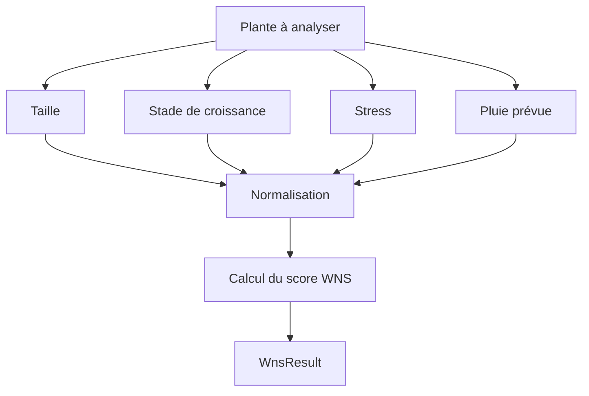

Le score obtenu devient ensuite exploitable par `CareTaskService`.

##### 2.2.4.5 Seuil de déclenchement

Une tâche ne doit pas être créée automatiquement pour chaque plante. Le système vérifie d'abord si le score WNS dépasse le seuil métier réel `WnsResult.THRESHOLD = 0.8`.

Si le score est insuffisant, le moteur ne génère aucune tâche. Si le score dépasse le seuil et que la pluie ne bloque pas l'arrosage, la génération peut continuer.

Ce mécanisme permet :

- d'éviter les tâches inutiles ;
- de limiter les doublons fonctionnels ;
- de garder un calendrier lisible ;
- de concentrer les interventions sur les plantes qui en ont réellement besoin.

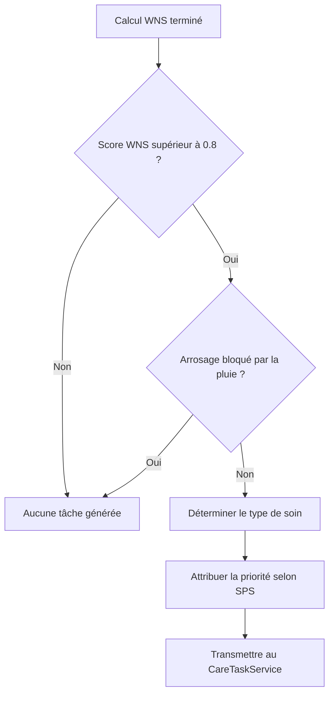

##### 2.2.4.6 Priorisation des tâches

Après le calcul du besoin, la tâche est classée selon son urgence. La priorité organise le calendrier et met en avant les interventions les plus importantes.

| Priorité | Signification |
|---|---|
| `LOW` | Intervention peu urgente |
| `MEDIUM` | Intervention à surveiller |
| `HIGH` | Intervention importante |
| `CRITICAL` | Intervention prioritaire |

Dans le code réel, `CareTaskService.determinePriority()` attribue la priorité à partir du dernier score SPS :

| Score SPS | Priorité attribuée |
|---:|---|
| `>= 0.8` | `CRITICAL` |
| `>= 0.6` | `HIGH` |
| `>= 0.4` | `MEDIUM` |
| `< 0.4` | `LOW` |

Le WNS décide principalement si une tâche est nécessaire, tandis que le SPS détermine son urgence. Le système ne se contente donc pas de créer une tâche : il indique aussi son niveau d'importance.

##### 2.2.4.7 Exposition des scores dans la réponse API

La réponse API permet de comprendre pourquoi une tâche a été générée. `CareTaskResponseDto` expose notamment :

- le type de tâche ;
- la priorité ;
- le score `wnsScore` ;
- le détail du calcul `wnsBreakdown` ;
- la dépendance météo ;
- le statut de la tâche ;
- la date prévue et la date d'échéance.

Le DTO ne contient pas de champ SPS dédié. Toutefois, le dernier ISR et le dernier SPS peuvent apparaître dans `wnsBreakdown` lorsqu'ils sont fournis au calculateur. Cette exposition rend l'interface plus claire et justifie la recommandation affichée dans le calendrier de soins.

##### 2.2.4.8 Connexion entre WNS et `CareTaskService`

Le module WNS ne remplace pas `CareTaskService` : il lui fournit une information de décision. Le rôle de `CareTaskService` est de créer et gérer la tâche, tandis que `WnsCalculator` aide à décider si cette tâche doit exister.

Le flux global est le suivant :

1. `CareTaskService` récupère une plante et son historique d'impacts.
2. `WnsCalculator` demande la pluie prévue à `WeatherForecastService`.
3. `WnsCalculator` calcule le score WNS.
4. `WnsResult` retourne le score et les détails.
5. Le score est comparé au seuil métier.
6. Si le seuil est dépassé, le type de tâche est déterminé.
7. La priorité est attribuée à partir du dernier SPS.
8. `CareTaskService` vérifie l'idempotence.
9. La tâche est créée, synchronisée et sauvegardée.

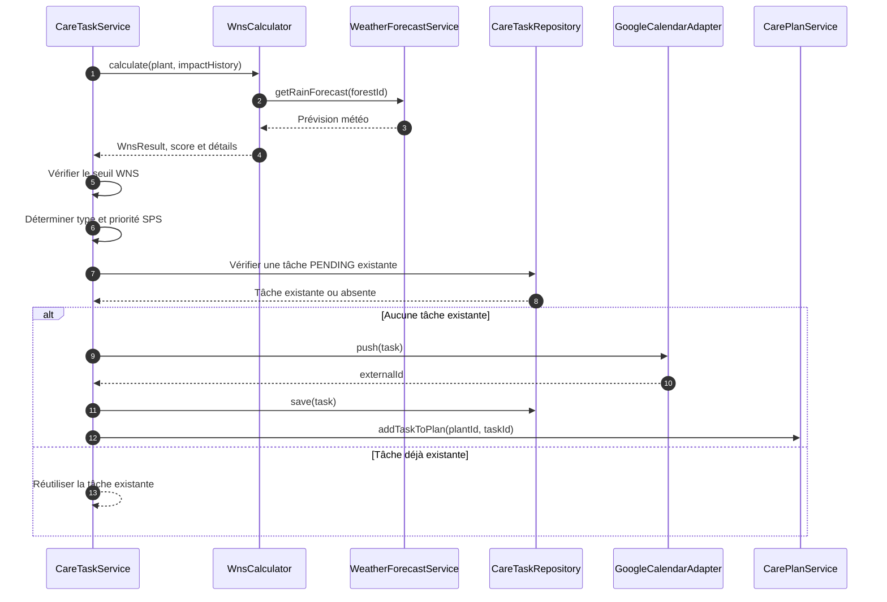

Ce diagramme montre la complémentarité entre la partie décisionnelle et la partie exécution.

##### 2.2.4.9 Complémentarité avec le moteur de tâches

| Composant | Responsabilité |
|---|---|
| Module WNS | Calcul du besoin, décision et justification |
| `CareTaskService` | Création, persistance, cycle de vie et orchestration |
| `CareTaskRepository` | Recherche et sauvegarde des tâches |
| `CarePlanService` | Association des tâches à un plan de soins |
| `GoogleCalendarAdapter` | Synchronisation avec Google Calendar |
| `CareTaskExpirationScheduler` | Nettoyage automatique des tâches expirées |

Cette séparation rend la fonctionnalité plus lisible. Le calcul du besoin est isolé de la persistance et du cycle de vie des tâches, tout en restant connecté au moteur d'exécution par `CareTaskService`.

#### 2.2.5 Processus métier et algorithmes

Cette partie décrit l'enchaînement opérationnel complet après la décision WNS : génération d'une tâche, contrôle de l'idempotence, synchronisation externe, validation par l'utilisateur et adaptation aux alertes météo.

##### 2.2.5.1 Génération automatique, idempotence et expiration

`CareTaskService.generateTask(plant)` calcule le WNS, arrête le traitement si le score est inférieur ou égal à `0.8`, détermine le type de tâche, puis vérifie avec `CareTaskRepository` si une tâche identique au statut `PENDING` existe déjà. Si elle existe, elle est réutilisée. Sinon, une nouvelle tâche est synchronisée avec Google Calendar, sauvegardée, puis ajoutée au `CarePlan`.

Le nettoyage automatique repose sur `CareTaskExpirationScheduler.cleanupExpiredTasks()`. Le scheduler collecte les tâches expirées avec :

```java
findByStatusAndDueAtBefore(
    TaskStatus.PENDING,
    Instant.now()
)
```

Chaque tâche trouvée passe au statut `CANCELED`. La tolérance aux pannes repose sur un `try/catch` par tâche : une erreur isolée n'interrompt pas le reste du batch.

##### 2.2.5.2 Génération globale d'une tâche

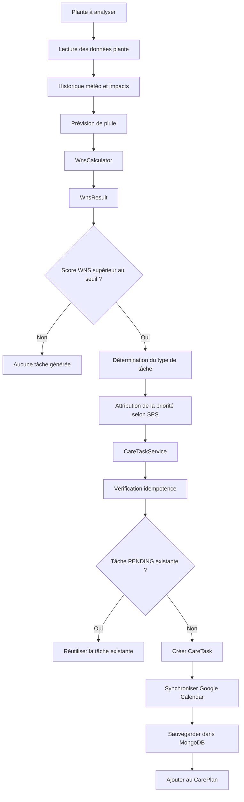

Lydia intervient sur le calcul WNS, l'aide à la priorisation et la justification exposée par l'API. Le collègue intervient sur la création, la persistance, le cycle de vie et Google Calendar. Les deux contributions sont connectées par `CareTaskService`.

##### 2.2.5.3 Séquence complète entre WNS et `CareTaskService`

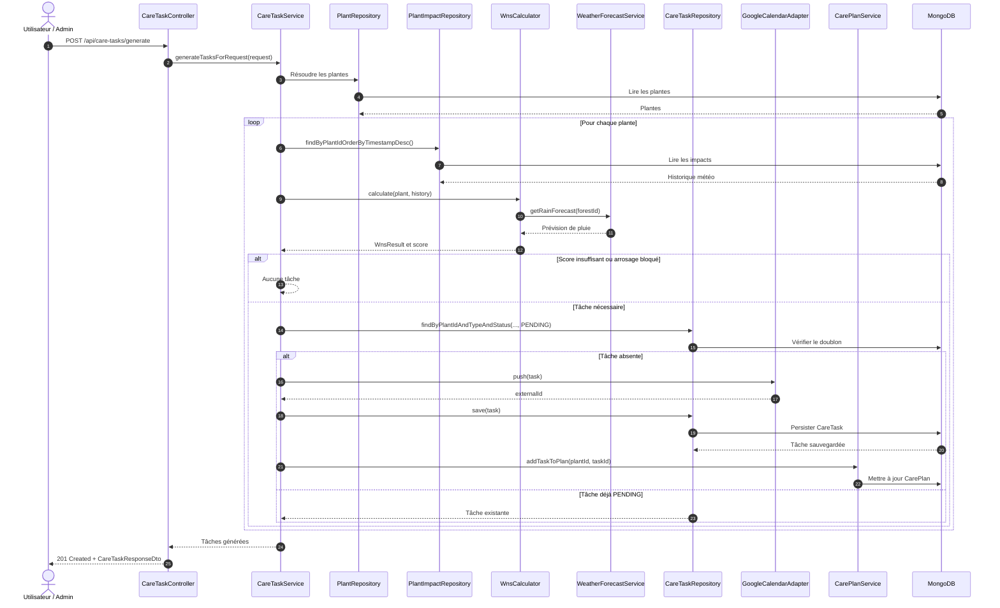

##### 2.2.5.4 Validation d'une tâche

Lorsqu'une tâche est validée, `CareTaskService` la récupère, vérifie qu'elle est `PENDING`, passe son statut à `DONE`, renseigne `closedAt` et la sauvegarde. Le service récupère ensuite la plante associée, applique l'intervention, recalcule son état et la sauvegarde.

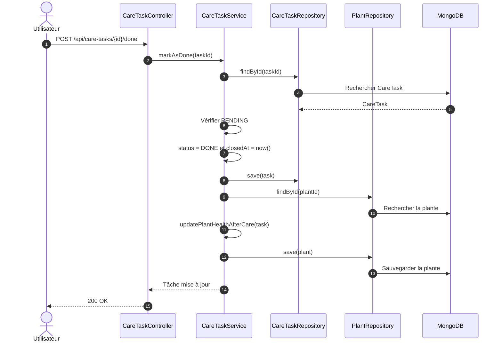

La validation appartient au moteur de tâches. Dans l'implémentation actuelle, elle ne supprime pas l'événement Google Calendar ; cette suppression est réalisée lors de l'annulation ou de l'expiration.

##### 2.2.5.5 Réordonnancement météo des tâches flexibles

`CareTaskWeatherRescheduler` traite les alertes `heavy_rain`, `heatwave`, `frost` et `high_wind`. Il recherche les tâches `PENDING` des forêts impactées, filtre les tâches flexibles concernées, puis les reporte de 24 heures. La date d'échéance est replacée quatre heures après la nouvelle date et Google Calendar est mis à jour lorsque `externalId` existe.

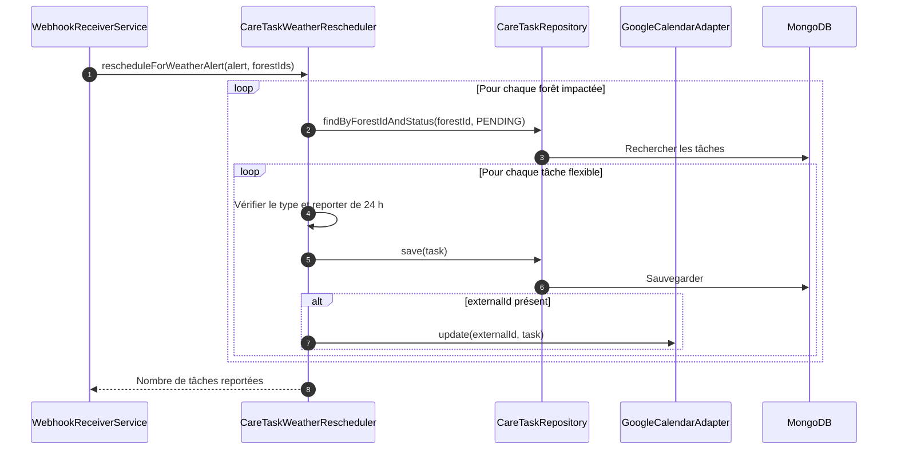

#### 2.2.6 Interface utilisateur, composants et API

La couche d'exposition rend le moteur de soins utilisable depuis le frontend et par les clients REST. Elle regroupe l'interface `care-calendar.html`, les contrôleurs et les DTO retournés par l'API.

##### 2.2.6.1 Interface utilisateur `care-calendar.html`

La page `care-calendar.html` permet de consulter les tâches, visualiser leur priorité et leur statut, filtrer les résultats, créer une tâche manuelle et déclencher les actions de validation, report ou annulation. Elle utilise les endpoints `/api/care-tasks` et `/api/care-plan`. Les champs `wnsScore` et `wnsBreakdown` du `CareTaskResponseDto` rendent la décision plus explicable côté frontend.

**Vue d'ensemble et création manuelle**


Cette première vue représente le tableau de pilotage de la Feature 2. Elle fournit une synthèse immédiate du calendrier grâce aux compteurs du nombre total de tâches et de leur répartition entre les statuts `PENDING`, `DONE` et `CANCELED`.

Les filtres permettent de sélectionner une priorité, un statut ou une plante. Ils facilitent ainsi l'identification des interventions urgentes ou encore en attente. Le bouton **Refresh** recharge les données retournées par `GET /api/care-tasks`.

Le formulaire **Création manuelle** permet à l'utilisateur de choisir une plante, un type de soin et une priorité. La demande est transmise à `CareTaskService`, qui crée la tâche, la persiste dans MongoDB, l'associe au plan de soins et tente sa synchronisation avec Google Calendar. Cette création manuelle complète la génération automatique déclenchée par le score WNS.

**Suivi du cycle de vie et synchronisation externe**


Cette seconde vue détaille chaque tâche sous forme de carte. Elle expose les informations nécessaires à la décision et au suivi :

- le type de soin, par exemple `WATERING` ou `HEATING_ADJUSTMENT` ;
- la plante concernée ;
- le score WNS ayant contribué à la recommandation ;
- la priorité métier ;
- le statut courant ;
- la date d'échéance ;
- l'identifiant de synchronisation Google Calendar.

Une tâche `PENDING` propose les actions **Done**, **Cancel** et **Reschedule**. L'action **Done** clôture l'intervention et peut mettre à jour la santé de la plante. **Cancel** passe la tâche au statut `CANCELED` et nettoie sa synchronisation externe. **Reschedule** déplace une tâche flexible et met à jour l'événement Google Calendar associé.

Les tâches déjà `DONE` ou `CANCELED` sont affichées comme clôturées et ne proposent plus d'action incompatible. Cette interface rend donc visible le cycle de vie géré par `CareTaskService` et permet à l'utilisateur de comprendre l'état réel du calendrier de soins.

##### 2.2.6.2 Vue consolidée des composants impliqués

| Classe | Bloc | Rôle |
|---|---|---|
| `CareTaskController` | API | Expose les endpoints de gestion des tâches |
| `CarePlanController` | API | Expose les endpoints du plan de soins |
| `CareTaskService` | Moteur de tâches | Création, validation, annulation et orchestration |
| `CareTaskRepository` | Moteur de tâches | Persistance, recherche et idempotence |
| `CarePlan` | Moteur de tâches | Modèle du plan associé à une plante |
| `CarePlanService` | Moteur de tâches | Association des tâches au plan |
| `GoogleCalendarAdapter` | Moteur de tâches | Synchronisation avec Google Calendar |
| `ExternalCalendarService` | Moteur de tâches | Contrat de synchronisation externe |
| `CareTaskExpirationScheduler` | Moteur de tâches | Annulation automatique des tâches expirées |
| `CareTaskWeatherRescheduler` | Moteur de tâches | Report des tâches flexibles selon la météo |
| `WnsCalculator` | Calcul et décision | Calcul du score WNS |
| `WnsResult` | Calcul et décision | Résultat détaillé du calcul |
| `WeatherForecastService` | Calcul et décision | Prévision de pluie |
| `CareTaskResponseDto` | Réponse API | Exposition des scores et informations métier |

##### 2.2.6.3 Endpoints API de la Feature 2

| Méthode | Endpoint | Rôle | Entrée | Sortie | Erreurs possibles |
|---|---|---|---|---|---|
| `GET` | `/api/care-tasks` | Lister les tâches | Aucune | Liste de tâches | Erreur serveur |
| `POST` | `/api/care-tasks` | Générer une tâche pour une plante | `plantId` | Tâche créée | Plante absente, WNS insuffisant |
| `POST` | `/api/care-tasks/generate` | Générer plusieurs tâches | `plantId` ou `forestId` facultatif | Liste créée | Validation, accès refusé |
| `PATCH` | `/api/care-tasks/{id}` | Modifier une tâche flexible | Dates, flexibilité, description | Tâche modifiée | Tâche absente ou non flexible |
| `PUT` | `/api/care-tasks/{id}/validate` | Valider une tâche | Identifiant | Tâche `DONE` | Statut invalide |
| `POST` | `/api/care-tasks/{id}/done` | Marquer une tâche terminée | Identifiant | Tâche `DONE` | Statut invalide |
| `DELETE` | `/api/care-tasks/{id}` | Annuler une tâche | Identifiant | `204 No Content` | Statut invalide |
| `POST` | `/api/care-tasks/manual` | Créer une tâche manuelle | DTO de création | Tâche créée | Plante absente, validation |
| `GET` | `/api/care-plan/{plantId}` | Lire le plan d'une plante | Identifiant de plante | Plan et tâches | Erreur serveur |
| `POST` | `/api/care-plan/recompute` | Recalculer un plan | `plantId` et/ou `forestId` | `200 OK` | Accès refusé, erreur serveur |

#### 2.2.7 Validation et tests associés

##### 2.2.7.1 Tests unitaires

**`CarePlanServiceTest`**

Cette classe vérifie la gestion du plan de soins :

- retour d'un plan existant ;
- création et sauvegarde automatiques lorsqu'aucun plan n'existe ;
- ajout idempotent d'une tâche et accumulation de tâches distinctes ;
- propagation d'une erreur de persistance ;
- recalcul global pour une plante ou pour une forêt entière lorsque `plantId` est `null` ;
- création du plan pendant un recalcul et gestion des identifiants vides.

**`CareTaskServiceTest`**

Cette classe vérifie les règles du moteur de tâches :

- génération d'une tâche lorsque le WNS dépasse `0.8` ;
- absence de génération sous le seuil et blocage de l'arrosage lorsqu'une pluie est prévue ;
- idempotence lors de la génération ;
- passage au statut `DONE` et mise à jour de la santé de la plante ;
- passage au statut `CANCELED` et suppression de l'événement du calendrier externe ;
- rejet des transitions de statut invalides et des dates incohérentes ;
- récupération des tâches dans l'ordre attendu pour le dashboard.

**`CareTaskExpirationSchedulerTest`**

Cette classe valide le nettoyage automatique :

- absence d'action lorsqu'aucune tâche n'est expirée ;
- passage de toutes les tâches périmées au statut `CANCELED` ;
- simulation d'une panne MongoDB pendant une sauvegarde ;
- continuité du batch malgré l'échec d'une tâche.

**`WnsCalculatorTest`**

Les tests du calculateur couvrent le score WNS, le seuil de déclenchement, le stress de la plante et la prise en compte de la pluie.

##### 2.2.7.2 Tests d'intégration

**`TaskLifecycleIntegrationTest`**

Cette classe teste le cycle métier avec la persistance réelle :

- génération d'une tâche `PENDING` pour une plante à besoin élevé, construite avec un `stressIndex` de `0.95` ;
- contrôle strict de l'idempotence lors d'une seconde génération ;
- passage de la tâche au statut `DONE` avec renseignement de `closedAt` ;
- régénération d'une nouvelle tâche après la clôture ou l'annulation de la précédente ;
- génération indépendante de tâches pour plusieurs plantes.

**`CareIntegrationFlowTest`**

Cette classe valide les flux transversaux :

- validation manuelle d'une tâche au statut `DONE` ;
- annulation manuelle et gestion des identifiants inconnus ;
- annulation automatique des tâches dont `dueAt` est dépassé ;
- conservation des tâches expirées déjà clôturées ;
- tri des tâches retournées au dashboard.

Le tri est implémenté par `CareTaskRepository.findAllByOrderByPriorityDescDueAtAsc()` et validé par les tests :

```text
TaskPriority DESC
puis dueAt ASC
```

Les tâches sont donc regroupées par priorité décroissante. Pour une même priorité, l'échéance la plus proche est affichée en premier.

Un test dédié à `CareTaskResponseDto` reste à compléter : aucun test spécifique à ce DTO n'est actuellement présent.

#### 2.2.8 Synthèse de la Feature 2

La Feature 2 repose sur la complémentarité entre un moteur de décision et un moteur d'exécution. Le moteur de décision, porté par le calcul WNS et la logique de priorisation, détermine si une intervention est nécessaire. Le moteur d'exécution, porté par `CareTaskService`, crée la tâche, la persiste, la synchronise avec Google Calendar et gère son cycle de vie. Cette séparation rend le calendrier de soins plus lisible, testable et évolutif.

---

## 3. Tests effectués

### 3.1 Objectif des tests

La stratégie de tests vise à garantir la fiabilité métier, éviter les régressions, sécuriser les endpoints, valider la génération des tâches, vérifier le traitement météo et assurer la compatibilité avec la CI/CD.

### 3.2 Tests météo

| Test présent | Type | Objectif | Résultat attendu |
|---|---|---|---|
| `WeatherWebhookControllerTest` | Contrôleur | Vérifier webhook, secret et réponses HTTP | Requêtes acceptées ou refusées correctement |
| `PlantImpactCalculatorTest` | Unitaire | Vérifier les calculs ISR et SPS | Scores conformes aux règles |
| `PlantStateUpdaterTest` | Unitaire | Vérifier les changements d'état | État et stress mis à jour |
| `WebhookReceiverServiceTest` | Unitaire | Vérifier l'orchestration du webhook | Alerte et impacts traités |
| `WeatherForecastServiceTest` | Unitaire | Vérifier les prévisions et replis | Prévision cohérente |
| `WeatherAlertIntegrationTest` | Intégration | Vérifier le flux météo avec MongoDB | Alertes et impacts persistés |

Le projet ne contient pas de tests nommés `TomorrowWebhookVerifierTest` ou `WeatherAlertConfigServiceTest`.

### 3.3 Tests calendrier de soins

| Test présent | Type | Objectif | Résultat attendu |
|---|---|---|---|
| `CareTaskServiceTest` | Unitaire | Tester création, validation, annulation et report | Transitions conformes |
| `CarePlanServiceTest` | Unitaire | Tester l'association des tâches au plan | Plan mis à jour |
| `WnsCalculatorTest` | Unitaire | Tester formule, seuil et pluie | Score et décision corrects |
| `CareTaskExpirationSchedulerTest` | Unitaire | Tester l'expiration automatique | Tâches expirées annulées |
| `TaskLifecycleIntegrationTest` | Intégration | Tester le cycle de vie complet | Transitions persistées |
| `CareIntegrationFlowTest` | Intégration | Tester génération et idempotence | Aucun doublon actif |

Le projet ne contient pas de tests nommés `CareTaskControllerTest`, `CarePlanControllerTest`, `CareReschedulingServiceTest` ou `CareCalendarSmokeTest`.

### 3.4 Tests contrôleurs

Les tests de contrôleurs vérifient les contrats HTTP, les codes de réponse et la délégation vers les services. Les tests suivants sont réellement présents dans `src/test/java/org/example/controllers` :

| Test présent | Périmètre | Vérification principale |
|---|---|---|
| `WeatherWebhookControllerTest` | Météo DevOps 2 | Secret webhook, payload et réponses HTTP |
| `PlantAlertControllerTest` | Alertes plante | Consultation et acquittement |
| `PlantControllerTest` | Plantes | Opérations CRUD et état |
| `ForestControllerTest` | Forêts | Gestion des forêts et associations |
| `GreenhouseOpsControllerTest` | Pilotage | Paramètres, erreurs et indicateurs |
| `EcosystemControllerTest` | Simulation | Appels de simulation et cellules |

Les contrôleurs `CareTaskController` et `CarePlanController` sont couverts indirectement par les tests de services et d'intégration, mais ne disposent pas encore de classes de test dédiées.

### 3.5 Tests CI/CD

GitHub Actions exécute les tests avec Gradle et archive systématiquement :

- `build/reports/tests/test/**` ;
- `build/test-results/test/**` ;
- `build/reports/jacoco/test/**`.

Le workflow de release exécute également les tests avant publication. La CI principale génère JaCoCo, mais n'exécute pas `clean check` : le seuil configuré dans `jacocoTestCoverageVerification` n'est donc pas bloquant dans cette CI.

### 3.6 Couverture JaCoCo

Mesures issues du rapport JaCoCo local vérifié le 13 juin 2026 :

| Métrique | Valeur |
|---|---:|
| LINE | 66,87 % |
| BRANCH | 47,99 % |
| CLASS | 86,84 % |
| METHOD | 65,87 % |

La suite contient **374 tests réussis**, sans échec, erreur ni test ignoré.

Ces résultats confirment la stabilité de la livraison actuelle. La couverture des branches reste cependant plus faible que celle des lignes : les scénarios conditionnels et les cas d'erreur constituent donc la priorité pour les prochains tests.

---

## 4. Matrice de responsabilités et réalisations

La matrice suivante synthétise les responsabilités observées dans la documentation et l'historique Git. Elle doit être validée par l'équipe avant livraison officielle.

| Fonctionnalité | Lydia | Misasoa | Hadi | Fatima | Mamadou | Remarque |
|---|---|---|---|---|---|---|
| Architecture backend | Contribution | Contribution | Contribution | À compléter | Contribution | Validation équipe requise |
| Feature météo | Contribution | À compléter | Contribution | À compléter | Contribution principale | Validation équipe requise |
| Feature calendrier de soins | Contribution | Contribution principale | À compléter | À compléter | Contribution | Validation équipe requise |
| GitHub Actions | Contribution principale | Contribution | Contribution principale | À compléter | À compléter | Workflows versionnés |
| Documentation et PDF | Contribution principale | Contribution | Contribution | Contribution | Contribution | Rapport et captures |
| Tests | Contribution | Contribution principale | Contribution | Contribution | Contribution | 374 tests réussis |
| Docker et déploiement | Contribution | Contribution | Contribution principale | À compléter | À compléter | Docker Compose présent |

---

## 5. Guide d'installation et déploiement

### 5.1 Prérequis

- Git ;
- Java 21 ;
- Gradle Wrapper fourni avec le projet ;
- Docker et Docker Compose ;
- MongoDB pour un lancement hors Docker ;
- variables d'environnement météo et MongoDB ;
- éventuellement une clé Tomorrow.io et des identifiants Google Calendar.

### 5.2 Lancement local

```bash
git clone https://github.com/MisasoaRobison/GreenDesk.git
cd GreenDesk
./gradlew clean bootRun
```

Sous Windows :

```powershell
.\gradlew.bat clean bootRun
```

Variables minimales :

```properties
WEATHER_WEBHOOK_SECRET=un-secret-long-et-aleatoire
SPRING_DATA_MONGODB_URI=mongodb://localhost:27017/greendesk
```

### 5.3 Lancement avec Docker

```bash
docker compose up --build
```

Le projet expose notamment GreenDesk sur `http://localhost:8081`, Mongo Express sur `http://localhost:8082` et MongoDB sur le port `27017`.

### 5.4 Vérifications rapides

```bash
docker compose ps
docker compose logs --tail=100 app
curl http://localhost:8081/api/species
curl http://localhost:8081/v3/api-docs
```

Vérifier également :

- l'ouverture de `http://localhost:8081/home.html` ;
- l'ouverture de `http://localhost:8081/care-calendar.html` ;
- l'accès à Swagger ;
- la connexion MongoDB ;
- les logs applicatifs.

### 5.5 Dépannage

| Problème | Cause possible | Solution |
|---|---|---|
| Port déjà utilisé | Application déjà lancée | Fermer le processus ou changer le port |
| MongoDB inaccessible | Conteneur arrêté ou URI incorrecte | Relancer Docker Compose et vérifier l'URI |
| Webhook retourne `401` | Secret absent ou incorrect | Vérifier `X-Webhook-Secret` |
| PDF non généré localement | Pandoc ou XeLaTeX absent | Utiliser GitHub Actions |
| Release sans PDF | Échec de la conversion | Consulter les logs de `release.yml` |
| `clean check` échoue | Couverture par package sous 80 % | Consulter JaCoCo et ajouter des tests |

---

## 6. Annexe API REST

### 6.1 API météo et notifications

| Méthode | Endpoint | Rôle | Entrée | Sortie | Erreurs |
|---|---|---|---|---|---|
| `POST` | `/api/weather/webhook` | Traiter une alerte | Secret + webhook | Statut | `401`, `500` |
| `GET` | `/api/weather/alerts` | Lister les alertes | Filtres facultatifs | Liste | `500` |
| `POST` | `/api/weather/alerts/{alertId}/ack` | Acquitter une alerte | ID | Message | `404`, `500` |
| `GET` | `/api/weather/impact/{plantId}` | Lire les impacts | ID plante | Liste | `500` |
| `POST` | `/api/weather/alert-config` | Configurer une forêt | JSON | Résultat | `400`, `500` |
| `GET` | `/api/weather/notifications` | Lister les notifications | `unreadOnly` | Liste | `500` |
| `POST` | `/api/weather/notifications/{id}/read` | Marquer comme lue | ID | Message | `500` |
| `POST` | `/api/weather/notifications/read-all` | Tout marquer comme lu | Aucune | Message | `500` |

### 6.2 API CareTask

| Méthode | Endpoint | Rôle | Entrée | Sortie | Erreurs |
|---|---|---|---|---|---|
| `GET` | `/api/care-tasks` | Lister les tâches | Aucune | Liste | Erreur serveur |
| `POST` | `/api/care-tasks` | Créer automatiquement | `plantId` | Tâche | Plante absente, WNS insuffisant |
| `POST` | `/api/care-tasks/generate` | Générer en lot | Filtres | Liste | Validation, autorisation |
| `POST` | `/api/care-tasks/manual` | Créer manuellement | DTO | Tâche | Validation |
| `PATCH` | `/api/care-tasks/{id}` | Modifier une tâche flexible | DTO | Tâche | Statut ou flexibilité |
| `PUT` | `/api/care-tasks/{id}/validate` | Valider | ID | Tâche | Statut invalide |
| `POST` | `/api/care-tasks/{id}/done` | Terminer | ID | Tâche | Statut invalide |
| `DELETE` | `/api/care-tasks/{id}` | Annuler | ID | `204` | Statut invalide |

### 6.3 API CarePlan

| Méthode | Endpoint | Rôle | Entrée | Sortie | Erreurs |
|---|---|---|---|---|---|
| `GET` | `/api/care-plan/{plantId}` | Lire ou créer le plan | ID plante | Plan et tâches | Erreur serveur |
| `POST` | `/api/care-plan/recompute` | Recalculer les tâches | `forestId`, `plantId` | `200 OK` | Autorisation, erreur serveur |

### 6.4 Exemples JSON

**Génération de tâches**

```json
{
  "forestId": "<FOREST_ID>"
}
```

**Création manuelle**

```json
{
  "plantId": "<PLANT_ID>",
  "type": "WATERING",
  "description": "Arrosage manuel",
  "priority": "HIGH",
  "dueAt": "2026-06-14T10:00:00Z"
}
```

**Mise à jour d'une tâche flexible**

```json
{
  "scheduledAt": "2026-06-14T08:00:00Z",
  "dueAt": "2026-06-14T12:00:00Z",
  "description": "Report après alerte météo"
}
```

**Recalcul d'un plan**

```json
{
  "plantId": "<PLANT_ID>"
}
```

---

## 7. Conclusion

GreenDesk associe deux fonctionnalités métier complémentaires à une chaîne DevOps complète. Le jumeau numérique météo reçoit les alertes, calcule leurs impacts et met à jour les plantes. Le calendrier de soins transforme ces informations et les besoins biologiques en tâches priorisées, suivies et éventuellement synchronisées avec Google Calendar.

GitHub Actions assure la compilation, les tests, la mesure JaCoCo, la publication de la documentation, la génération des PDF et la création des releases. Les artefacts publiés offrent une traçabilité directe entre le code, les résultats de validation et la documentation de livraison.

La suite de 374 tests réussis confirme la stabilité fonctionnelle actuelle. Les améliorations prioritaires restent l'augmentation de la couverture, l'activation du contrôle JaCoCo bloquant dans la CI et la poursuite de la sécurisation des configurations de production.
