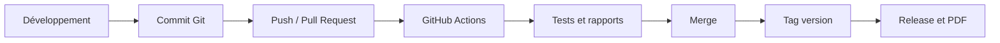
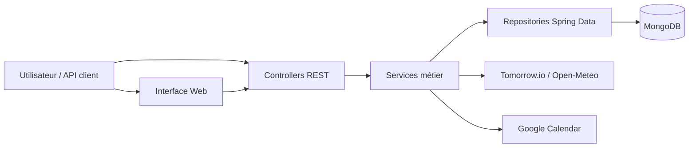
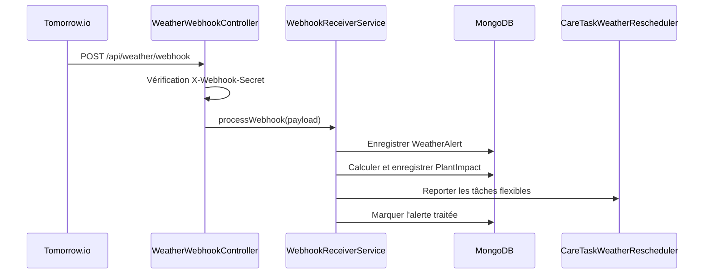
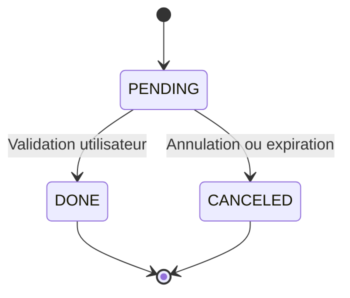

# Dossier Technique & Manuel Utilisateur
# Projet DevOps 2 - Application GreenDesk

**Date du dossier :** 13 juin 2026

**Dépôt GitHub :** `MisasoaRobison/GreenDesk`

**Branche principale :** `master`

**Version actuelle :** `v2.0.1`

**Commit audité :** `92baa43`

> Note de version : les tags `v2.0.0` et `v2.0.1` pointent actuellement sur le même commit. Pour conserver une traçabilité claire, chaque prochaine version devra pointer sur un commit distinct.

---

## 1. Présentation générale

### 1.1 Objectif du projet

GreenDesk est une application de gestion agronomique et de simulation destinée au suivi de plantes et de forêts numériques. Elle centralise les données biologiques, les mesures environnementales, les alertes météo et les actions de soin.

Le périmètre DevOps 2 se concentre principalement sur deux fonctionnalités complémentaires :

1. **Feature 1 - Jumeau numérique météo** : réception et traitement des événements météorologiques, calcul de leur impact et mise à jour de l'état des plantes.
2. **Feature 2 - Calendrier de soins dynamique** : transformation des besoins biologiques et météorologiques en tâches concrètes, planifiées et suivies.

Les objectifs principaux sont :

- anticiper les risques météorologiques ;
- prioriser les interventions sur les plantes ;
- éviter les actions inutiles, comme un arrosage avant une pluie ;
- synchroniser les tâches avec Google Calendar ;
- assurer la qualité du logiciel avec GitHub Actions, Gradle, JUnit et JaCoCo ;
- produire automatiquement les artefacts et documents de release.

### 1.2 Équipe & contributeurs

L'équipe déclarée dans la documentation du projet est composée de :

| Membre | Identité Git observée |
|---|---|
| Hadi ISSA | `Hadi ISSA` |
| Fatima SAIDI | `fasai444`, `fatima saidi` |
| Lydia AMROUCHE | `lydiaamrouche` |
| Misasoa ROBISON | `Misasoa Robison` |
| Mamadou DIALLO | `M Diallo`, `Mamadou Sanoussy DIALLO` |

Les contributions couvrent le backend, les interfaces, les tests, Docker, la CI/CD, la documentation et les releases.

### 1.3 Gestion de projet & DevOps

Le projet suit une organisation itérative :

- développement par fonctionnalités ;
- branches Git dédiées ;
- intégration sur `master` ;
- validation par tests automatisés ;
- documentation versionnée avec le code ;
- création de releases à partir de tags Git.

La chaîne DevOps repose sur :

| Outil | Usage |
|---|---|
| Git / GitHub | Versioning, collaboration, tags et releases |
| GitHub Actions | CI, documentation, UML et release |
| Gradle Wrapper | Build reproductible |
| JUnit 5 / Spring Boot Test | Tests unitaires et d'intégration |
| JaCoCo | Mesure de couverture |
| Docker / Docker Compose | Conteneurisation et orchestration |
| Pandoc / XeLaTeX | Génération automatique des PDF |



---

## 2. Concurrence

### 2.1 Étude de la concurrence

GreenDesk se positionne entre les outils simples de suivi et les plateformes agronomiques spécialisées.

| Solution | Forces | Limites | Réponse GreenDesk |
|---|---|---|---|
| Tableur ou script local | Rapide à démarrer | Données dispersées, peu de traçabilité | API centralisée et données MongoDB |
| Agenda classique | Bonne planification manuelle | Aucun calcul agronomique | Génération automatique par WNS |
| Plateforme IoT | Collecte de données temps réel | Logique métier parfois limitée | Capteurs, météo, état plante et soins |
| Simulateur spécialisé | Modèles scientifiques avancés | Coût et complexité élevés | Solution légère, pédagogique et API-first |

La valeur différenciante de GreenDesk est l'enchaînement complet :

```text
Météo -> Impact plante -> Priorité -> Besoin de soin -> Tâche -> Validation
```

### 2.2 Utilisabilité & design

L'interface vise à rendre les décisions immédiatement compréhensibles :

- cartes de tâches lisibles ;
- badges de priorité et de statut ;
- filtres par priorité, état et recherche ;
- indicateurs de tâches en attente, terminées et annulées ;
- création manuelle d'une tâche ;
- actions rapides pour terminer, reporter ou annuler ;
- navigation protégée par authentification.

Les pages statiques utilisent HTML, CSS, JavaScript et Bootstrap. La page principale de la Feature 2 est :

```text
http://localhost:8081/care-calendar.html
```

---

## 3. Architecture technique

### 3.1 Stack technologique

| Couche | Technologie |
|---|---|
| Langage | Java 21 |
| Framework backend | Spring Boot 3.3.3 |
| API | Spring Web / REST |
| Sécurité | Spring Security, sessions, BCrypt |
| Validation | Jakarta Validation |
| Base de données | MongoDB / Spring Data MongoDB |
| Frontend | HTML, CSS, JavaScript, Bootstrap |
| Build | Gradle Wrapper 9.2.0 |
| Tests | JUnit 5, Mockito, Spring Boot Test |
| Couverture | JaCoCo 0.8.12 |
| Documentation API | Swagger / OpenAPI |
| Conteneurs | Docker, Docker Compose |
| Intégrations | Tomorrow.io, Open-Meteo, Google Calendar |

### 3.2 Architecture globale

GreenDesk utilise une architecture en couches.



Responsabilités :

- **Controllers** : réception des requêtes et réponses HTTP ;
- **Services** : règles métier, WNS, impacts météo et cycle de vie ;
- **Repositories** : accès aux collections MongoDB ;
- **Entities / DTO** : données persistées et contrats API ;
- **Static resources** : interface utilisateur.

### 3.3 Modélisation UML

```mermaid
classDiagram
    class Plant {
        +String id
        +String forestId
        +double stressIndex
        +double heightCm
        +GrowthStage growthStage
    }

    class WeatherAlert {
        +String eventId
        +String type
        +double[] coords
        +String severity
        +boolean acknowledged
    }

    class PlantImpact {
        +String alertId
        +String plantId
        +double isr
        +double sps
    }

    class CarePlan {
        +String plantId
        +List taskIds
        +Instant lastRecalculationDate
    }

    class CareTask {
        +String plantId
        +String forestId
        +CareTaskType type
        +double wnsScore
        +TaskPriority priority
        +TaskStatus status
        +Instant dueAt
    }

    Plant "1" --> "*" PlantImpact
    WeatherAlert "1" --> "*" PlantImpact
    Plant "1" --> "1" CarePlan
    CarePlan "1" --> "*" CareTask
```



### 3.4 Structure du projet

```text
GreenDesk/
|-- .github/workflows/         # Pipelines GitHub Actions
|-- docs/                      # Documentation et captures
|-- scripts/                   # Scripts de démonstration et tests
|-- src/main/java/org/example/
|   |-- config/                # Sécurité et configuration
|   |-- controllers/           # API REST
|   |-- dto/                   # Objets de requête/réponse
|   |-- entities/              # Modèle métier MongoDB
|   |-- repositories/          # Accès aux données
|   `-- services/              # Logique métier
|-- src/main/resources/static/ # Interface utilisateur
|-- src/test/                  # Tests unitaires et intégration
|-- build.gradle
|-- Dockerfile
`-- docker-compose.yml
```

### 3.5 Base de données MongoDB

Les principales collections liées au périmètre DevOps 2 sont :

| Collection | Contenu |
|---|---|
| `plants` | Plantes et état courant |
| `forests` | Forêts et coordonnées géographiques |
| `weather_alerts` | Alertes météo reçues |
| `plant_impacts` | ISR, SPS et changement d'état |
| `care_tasks` | Tâches de soins |
| `care_plans` | Plans de soins associés aux plantes |
| `users` | Comptes et rôles |

Un index composé est défini pour les tâches sur `plantId`, `type` et `scheduledAt`. L'idempotence métier utilise les tâches `PENDING` afin d'éviter plusieurs tâches actives identiques.

---

## 4. Fonctionnalités détaillées

### 4.1 Feature 1 - Jumeau numérique météo

Le jumeau numérique météo reçoit des alertes, détecte les plantes concernées et calcule leur impact.

Types d'alertes pris en charge :

- `heatwave` ;
- `frost` ;
- `heavy_rain` ;
- `high_wind` ;
- `uv_alert`.

Flux principal :



Les indicateurs produits sont :

- **ISR** : indice de stress lié à l'événement météo ;
- **SPS** : score de priorité des soins ;
- changement de `stressIndex` ;
- changement éventuel de l'état de la plante.

### 4.2 Feature 2 - Calendrier de soins dynamique

La Feature 2 transforme les besoins biologiques et météorologiques en tâches actionnables.

Fonctions principales :

- calculer un besoin de soin ;
- créer automatiquement une tâche ;
- générer les tâches d'une plante, d'une forêt ou de toutes les plantes ;
- créer une tâche manuelle ;
- reporter une tâche flexible ;
- terminer ou annuler une tâche ;
- mettre à jour la santé de la plante après validation ;
- synchroniser les tâches avec Google Calendar ;
- annuler automatiquement les tâches expirées.

### 4.3 WNS - Weighted Need Score

Dans le code, WNS représente le score de besoin utilisé par le moteur hybride.

```text
WNS = (0,3 x Taille) + (0,2 x Stade) + (0,15 x Stress) - (0,25 x Pluie prévue)
```

Si une pluie est prévue dans les six heures, une pénalité supplémentaire est appliquée. Un arrosage est ignoré lorsque l'intensité normalisée de pluie atteint le seuil prévu.

| Facteur | Origine |
|---|---|
| Taille | Hauteur de la plante et hauteur maximale de l'espèce |
| Stade | `SEEDLING`, `VEGETATIVE`, `FLOWERING`, `FRUITING`, `MATURE` |
| Stress | Maximum entre stress biologique et ISR météo |
| Pluie prévue | Tomorrow.io, Open-Meteo ou alertes stockées |

Une tâche est requise lorsque :

```text
WNS > 0,8 et arrosage non bloqué par la pluie
```

### 4.4 CareTask et cycle de vie des tâches

Types de tâches :

- `WATERING` ;
- `FERTILIZATION` ;
- `PRUNING` ;
- `HEATING_ADJUSTMENT`.

Priorités :

- `LOW` ;
- `MEDIUM` ;
- `HIGH` ;
- `CRITICAL`.

Cycle de vie :



Les transitions sont protégées : seules les tâches `PENDING` peuvent être déplacées, validées ou annulées.

Lorsqu'une tâche est validée, la plante est mise à jour :

| Type | Effet principal |
|---|---|
| Arrosage | Augmentation du niveau d'eau, baisse du stress |
| Fertilisation | Baisse du stress |
| Taille | Baisse du stress et légère réduction de hauteur |
| Chauffage | Hausse de température et baisse du stress |

### 4.5 Interface Care Calendar

Le manuel utilisateur du calendrier est le suivant :

1. Se connecter avec un compte `USER` ou `ADMIN`.
2. Ouvrir `care-calendar.html`.
3. Consulter les compteurs et la liste des tâches.
4. Filtrer les tâches par priorité ou statut.
5. Rechercher une plante ou une description.
6. Terminer, reporter ou annuler une tâche en attente.
7. Créer une tâche manuelle en sélectionnant la plante, le type et la priorité.

Les actions d'administration sont réservées au rôle `ADMIN` :

- génération batch des tâches ;
- recalcul global d'un plan.

### 4.6 Intégration météo / Tomorrow.io

La récupération de pluie suit une stratégie de repli :

```text
Tomorrow.io -> Open-Meteo -> alertes météo MongoDB
```

Variables :

```properties
TOMORROW_API_KEY=
TOMORROW_WEBHOOK_URL=http://localhost:8081/api/weather/webhook
WEATHER_WEBHOOK_SECRET=secret-long-et-aleatoire
```

Le webhook doit recevoir :

```http
X-Webhook-Secret: <WEATHER_WEBHOOK_SECRET>
```

Les alertes stockées sont filtrées selon leur proximité avec la forêt ciblée afin qu'une pluie éloignée ne bloque pas un arrosage local.

### 4.7 Sécurité et authentification

GreenDesk utilise Spring Security avec :

- mots de passe BCrypt ;
- authentification par session ;
- rôles `USER` et `ADMIN` ;
- réponses JSON `401` et `403` ;
- protection frontend avec `auth-guard.js` ;
- secret partagé pour le webhook météo.

| Route | Accès |
|---|---|
| `/api/auth/**` | Public |
| `/api/admin/**` | `ADMIN` |
| `POST /api/care-tasks/generate` | `ADMIN` |
| `POST /api/care-plan/recompute` | `ADMIN` |
| `/api/care-tasks/**` | `USER` ou `ADMIN` |
| `/api/care-plan/**` | `USER` ou `ADMIN` |

Point de vigilance : CSRF est actuellement désactivé. Ce choix simplifie les appels API mais doit être réévalué avant une exposition publique.

---

## 5. Matrice de responsabilités

### 5.1 Répartition du travail

La matrice ci-dessous combine la documentation du projet et les sujets visibles dans l'historique Git.

| Domaine | Hadi | Fatima | Lydia | Misasoa | Mamadou |
|---|---:|---:|---:|---:|---:|
| Authentification et sécurité | R | C | C | C | C |
| Jumeau numérique météo | R | C | C | C | R |
| Calendrier de soins | C | C | C | R | C |
| Tests et qualité | R | R | R | R | C |
| GitHub Actions / CI/CD | R | C | R | C | C |
| Documentation et PDF | C | C | R | C | R |
| Docker et déploiement | R | C | C | C | C |

Légende : `R` = contribution principale observée, `C` = contribution ou collaboration observée/déclarée.


### 5.2 Contributions individuelles

| Contributeur | Contributions observées |
|---|---|
| Hadi ISSA | Authentification, protection des pages, Docker, workflows GitHub Actions, tests |
| Fatima SAIDI | Documentation et corrections de tests |
| Lydia AMROUCHE | Documentation, GitHub Pages, CI/release, rapports PDF, corrections et tests |
| Misasoa ROBISON | Calendrier de soins dynamique, Google Calendar, tests, MongoDB et simulation écosystème |
| Mamadou DIALLO | Jumeau numérique météo, documentation des fonctionnalités, contrôleurs et interfaces |

Ces attributions sont fondées sur les messages de commits et ne remplacent pas une validation formelle par l'équipe.

### 5.3 Difficultés rencontrées

Les principales difficultés techniques identifiées sont :

- synchroniser les dates réelles avec Google Calendar ;
- empêcher les transitions invalides sur les tâches ;
- garantir l'idempotence sans bloquer les cycles futurs ;
- filtrer les alertes météo selon la forêt ;
- protéger le webhook sans casser les tests d'intégration ;
- gérer les secrets dans Docker et GitHub Actions ;
- maintenir une couverture JaCoCo suffisante sur tous les packages ;
- conserver la cohérence des ports entre local, Docker et documentation ;
- générer automatiquement un PDF complet dans la release.

---

## 6. Tests effectués

### 6.1 Tests unitaires

Les tests unitaires vérifient notamment :

- formule et seuil du WNS ;
- impact de la pluie ;
- prise en compte de l'ISR et du SPS ;
- génération et idempotence des tâches ;
- validation, annulation et report ;
- expiration automatique ;
- calcul d'impact météo ;
- filtrage météo par proximité ;
- validation du secret webhook.

Fichiers représentatifs :

```text
WnsCalculatorTest.java
CareTaskServiceTest.java
CarePlanServiceTest.java
CareTaskExpirationSchedulerTest.java
WeatherForecastServiceTest.java
WebhookReceiverServiceTest.java
```

### 6.2 Tests d’intégration

Les tests d'intégration utilisent Spring Boot et MongoDB embarqué.

Scénarios couverts :

- cycle complet d'une tâche ;
- déblocage de l'idempotence après clôture ;
- génération pour plusieurs plantes ;
- expiration automatique ;
- réception d'un webhook authentifié ;
- stockage et recherche des alertes et impacts.

Fichiers :

```text
CareIntegrationFlowTest.java
TaskLifecycleIntegrationTest.java
WeatherAlertIntegrationTest.java
```

### 6.3 Résultats des tests

Commande exécutée :

```bash
./gradlew test
```

| Indicateur | Résultat |
|---|---:|
| Tests exécutés | 374 |
| Réussis | 374 |
| Échecs | 0 |
| Erreurs | 0 |
| Ignorés | 0 |

### 6.4 Couverture JaCoCo

| Métrique | Couverture mesurée |
|---|---:|
| Lignes | 66,87 % |
| Branches | 47,99 % |
| Classes | 86,84 % |
| Méthodes | 65,87 % |

La commande suivante exécute les tests et la vérification de couverture :

```bash
./gradlew clean check
```

Elle échoue actuellement sur `jacocoTestCoverageVerification`, car `build.gradle` impose **80 % de lignes pour chaque package**. Les tests passent, mais plusieurs packages restent sous ce seuil.

### 6.5 Captures qualité


---

## 7. CI/CD et GitHub Actions

### 7.1 Workflows existants

| Workflow | Déclencheur | Fonction |
|---|---|---|
| `gradle.yml` | Push / pull request | Build, tests et rapports |
| `docs-pages.yml` | Push `main`/`master` | Déploiement GitHub Pages |
| `update-uml.yml` | Changements Java/Gradle | Génération UML et commit |
| `release.yml` | Tag `v*` | JAR, Javadoc, PDF et release |

Le workflow CI principal produit deux artefacts :

- `test-reports` ;
- `coverage-report`.

Point d'amélioration : il exécute `clean test jacocoTestReport`, mais pas `clean check`. La vérification des seuils JaCoCo n'est donc pas bloquante dans GitHub Actions.

### 7.2 Build Gradle

Commandes principales :

```bash
./gradlew test
./gradlew clean check
./gradlew clean assemble javadoc
./gradlew test jacocoTestReport
```

Le wrapper fixe Gradle à la version `9.2.0`, ce qui rend le build reproductible sur les postes et dans GitHub Actions.

### 7.3 Génération automatique du PDF

Le workflow `release.yml` installe Pandoc et XeLaTeX, puis génère :

```text
build/docs/documentation.pdf
build/docs/devops2-report.pdf
```

Le rapport DevOps 2 est produit depuis :

```text
docs/reports/devops-2-github-actions-report.md
```

### 7.4 Release automatique par tag

Une release est déclenchée lors d'un push de tag correspondant à :

```yaml
tags:
  - 'v*'
```

Exemple :

```bash
git tag -a v2.0.2 -m "DevOps 2 - GreenDesk v2.0.2"
git push origin v2.0.2
```

La release `v2.0.0` reçoit un titre spécifique DevOps 2. Les autres tags utilisent le titre générique GreenDesk. Les releases sont actuellement marquées comme préversions avec `prerelease: true`.

### 7.5 Assets publiés

La release publie :

| Asset | Description |
|---|---|
| `*.jar` | Application Java exécutable |
| `javadoc.zip` | Documentation technique Java |
| `documentation.pdf` | Documentation générale |
| `devops2-report.pdf` | Dossier technique DevOps 2 |

Recommandation : ajouter les tests au workflow de release avant publication et produire un checksum des artefacts.

---

## 8. Guide d’installation et de déploiement

### 8.1 Prérequis

- Git ;
- Java 21 ;
- Docker et Docker Compose pour le mode conteneurisé ;
- accès à MongoDB ;
- un secret webhook long et aléatoire ;
- facultativement une clé Tomorrow.io et des credentials Google Calendar.

### 8.2 Lancement local

```bash
git clone https://github.com/MisasoaRobison/GreenDesk.git
cd GreenDesk
```

Configurer les variables nécessaires :

```powershell
$env:WEATHER_WEBHOOK_SECRET="un-secret-long-et-aleatoire"
$env:SPRING_DATA_MONGODB_URI="mongodb://localhost:27017/greendesk"
```

Puis lancer :

```powershell
.\gradlew.bat bootRun
```

Accès :

- application : `http://localhost:8080/home.html` ;
- calendrier : `http://localhost:8080/care-calendar.html` ;
- Swagger : `http://localhost:8080/swagger-ui/index.html`.

### 8.3 Lancement Docker

Créer le fichier `.env` :

```bash
cp env.example .env
```

Renseigner au minimum :

```properties
WEATHER_WEBHOOK_SECRET=un-secret-long-et-aleatoire
```

Lancer :

```bash
docker compose up -d --build
```

Services exposés :

| Service | URL / port |
|---|---|
| GreenDesk | `http://localhost:8081` |
| Care Calendar | `http://localhost:8081/care-calendar.html` |
| Swagger | `http://localhost:8081/swagger-ui.html` |
| Mongo Express | `http://localhost:8082` |
| MongoDB | `localhost:27017` |

### 8.4 Vérifications rapides

```bash
docker compose ps
docker compose logs --tail=100 app
curl http://localhost:8081/api/species
curl http://localhost:8081/v3/api-docs
```

Test météo local :

```bash
export WEATHER_WEBHOOK_SECRET="un-secret-long-et-aleatoire"
./test-weather.sh
```

### 8.5 Dépannage

| Problème | Vérification |
|---|---|
| L'application ne démarre pas | Vérifier `WEATHER_WEBHOOK_SECRET` et MongoDB |
| Erreur MongoDB | Vérifier URI, credentials et conteneur |
| Port occupé | Changer `SERVER_PORT` ou arrêter le service existant |
| Webhook retourne `401` | Vérifier `X-Webhook-Secret` |
| Aucun événement Google | Vérifier le fichier de credentials et le calendrier |
| `clean check` échoue | Consulter le rapport JaCoCo |
| PDF absent de la release | Vérifier Pandoc/XeLaTeX et le workflow `release.yml` |

---

## 9. Annexe API REST

### 9.1 Endpoints météo

| Méthode | Endpoint | Description |
|---|---|---|
| `POST` | `/api/weather/webhook` | Recevoir une alerte authentifiée |
| `GET` | `/api/weather/alerts` | Lister les alertes |
| `POST` | `/api/weather/alerts/{alertId}/ack` | Acquitter une alerte |
| `GET` | `/api/weather/impact/{plantId}` | Historique des impacts |
| `POST` | `/api/weather/alert-config` | Configurer les seuils |
| `GET` | `/api/weather/notifications` | Lister les notifications |

### 9.2 Endpoints care-tasks

| Méthode | Endpoint | Description |
|---|---|---|
| `GET` | `/api/care-tasks` | Lister les tâches |
| `POST` | `/api/care-tasks` | Générer une tâche pour une plante |
| `POST` | `/api/care-tasks/generate` | Génération batch, rôle ADMIN |
| `POST` | `/api/care-tasks/manual` | Créer une tâche manuelle |
| `PATCH` | `/api/care-tasks/{id}` | Reporter une tâche flexible |
| `PUT` | `/api/care-tasks/{id}/validate` | Valider une tâche |
| `POST` | `/api/care-tasks/{id}/done` | Marquer une tâche terminée |
| `DELETE` | `/api/care-tasks/{id}` | Annuler une tâche |

### 9.3 Endpoints care-plan

| Méthode | Endpoint | Description |
|---|---|---|
| `GET` | `/api/care-plan/{plantId}` | Lire le plan d'une plante |
| `POST` | `/api/care-plan/recompute` | Recalculer un plan, rôle ADMIN |

### 9.4 Exemples de payloads

**Webhook météo**

```bash
curl -X POST http://localhost:8081/api/weather/webhook \
  -H "Content-Type: application/json" \
  -H "X-Webhook-Secret: <SECRET>" \
  -d '{
    "event_id": "heatwave-001",
    "type": "heatwave",
    "coords": [48.8566, 2.3522],
    "timestamp": "2026-06-13T12:00:00",
    "severity": "high",
    "details": {"temperature": 39.0}
  }'
```

**Créer automatiquement une tâche**

```json
{
  "plantId": "<PLANT_ID>"
}
```

**Génération batch**

```json
{
  "forestId": "<FOREST_ID>"
}
```

**Créer une tâche manuelle**

```json
{
  "plantId": "<PLANT_ID>",
  "type": "WATERING",
  "description": "Arrosage manuel",
  "priority": "HIGH",
  "dueAt": "2026-06-14T10:00:00Z"
}
```

**Reporter une tâche**

```json
{
  "scheduledAt": "2026-06-14T08:00:00Z",
  "dueAt": "2026-06-14T12:00:00Z",
  "description": "Report après alerte météo"
}
```

**Recalculer un plan**

```json
{
  "plantId": "<PLANT_ID>"
}
```

---

## 10. Conclusion

GreenDesk répond au périmètre DevOps 2 en associant une application métier complète à une chaîne d'automatisation :

- gestion de versions et tags Git ;
- tests unitaires et d'intégration ;
- rapports JaCoCo ;
- build Gradle reproductible ;
- conteneurisation Docker ;
- publication GitHub Pages ;
- génération automatique des PDF ;
- release GitHub avec artefacts.

Les Features 1 et 2 forment un flux cohérent allant de l'observation météo à l'action de soin. La suite de **374 tests réussis** confirme la stabilité fonctionnelle actuelle.

Les priorités restantes avant une qualification pleinement industrialisée sont :

1. rendre `jacocoTestCoverageVerification` bloquant dans la CI ;
2. augmenter la couverture des packages sous le seuil ;
3. exécuter les tests dans le workflow de release ;
4. supprimer les identifiants de production codés en dur ;
5. publier une image Docker versionnée et des checksums ;
6. garantir qu'un tag de version correspond à un commit unique.

> Limite de vérification : l'état en ligne des runs GitHub Actions n'a pas pu être contrôlé directement, car l'authentification `gh` locale était invalide. Les workflows ont été audités depuis les fichiers versionnés et les résultats locaux.
