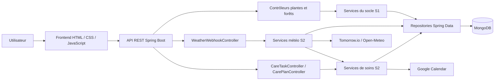
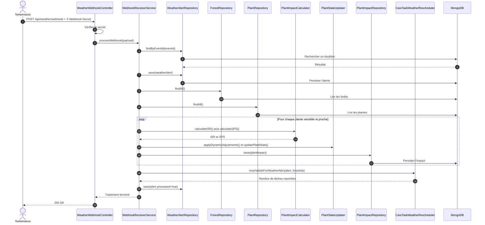
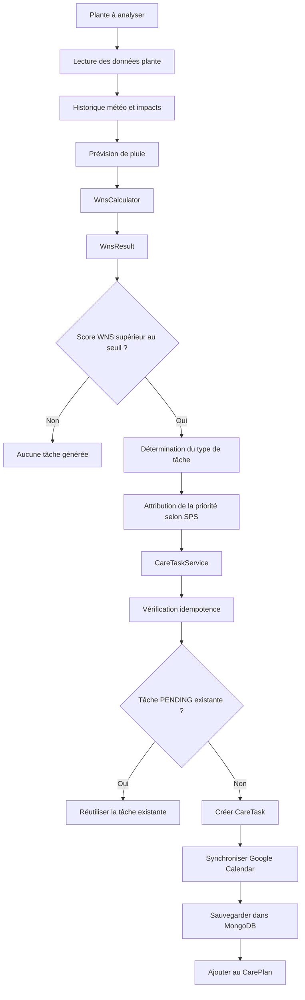
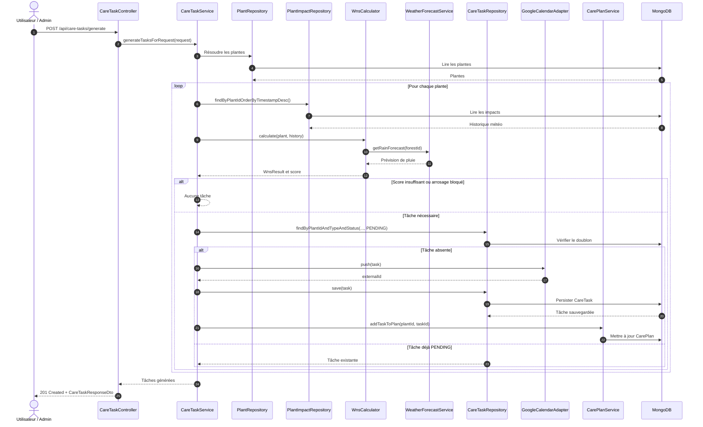
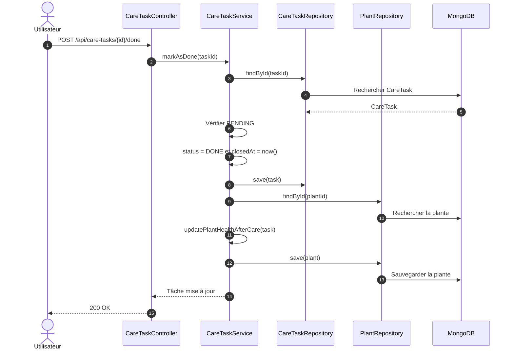
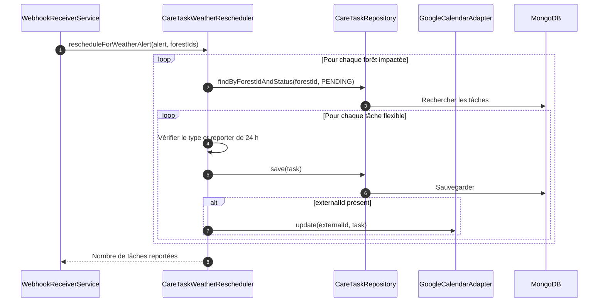
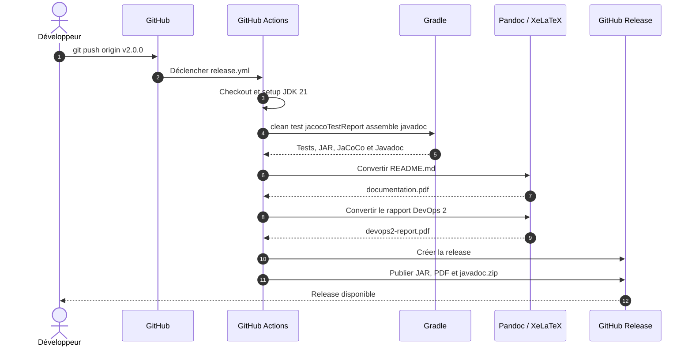

# Dossier Technique & Manuel Utilisateur
## Projet DevOps 2 - Application GreenDesk

| Information | Valeur |
|---|---|
| Version | `v2.0.0` |
| Projet | GreenDesk |
| Type | Dossier technique, manuel utilisateur et rapport DevOps 2 |
| Dépôt GitHub | `MisasoaRobison/GreenDesk` |
| Date | 13 juin 2026 |
| Équipe | Hadi ISSA, Fatima SAIDI, Lydia AMROUCHE, Misasoa ROBISON, Mamadou DIALLO |

---

## Sommaire

1. Architecture technique
2. Fonctionnalités détaillées
3. GitHub Actions et CI/CD
4. Tests effectués
5. Matrice de responsabilités et réalisations
6. Guide d'installation et déploiement
7. Guide de release DevOps 2
8. Annexe API REST
9. Conclusion

---

## 1. Architecture technique

GreenDesk est une application de gestion agronomique et de simulation. Elle centralise les plantes, les forêts, les mesures environnementales, les alertes météo et les tâches de soin. Son architecture associe une API Spring Boot, une interface web statique, MongoDB et une chaîne DevOps automatisée avec GitHub Actions.

### 1.1 Vue d'ensemble de l'architecture

Le backend suit une architecture modulaire en couches :

- les **Controllers** exposent les endpoints REST et valident les requêtes ;
- les **Services** portent la logique métier ;
- les **Repositories** assurent l'accès aux collections MongoDB ;
- les **Entities** représentent les données persistées ;
- les **DTOs** définissent les objets d'entrée et de sortie ;
- les ressources HTML, CSS et JavaScript constituent le frontend ;
- GitHub Actions automatise les tests, la documentation et les releases.

Cette séparation facilite les tests, la maintenance et l'évolution indépendante des fonctionnalités météo et du calendrier de soins.

### 1.2 Stack technologique

| Couche | Technologie | Rôle |
|---|---|---|
| Frontend | HTML, CSS, JavaScript, Bootstrap | Interfaces utilisateur et appels à l'API |
| Backend | Java 21, Spring Boot 3.3.3 | API REST et logique métier |
| Sécurité | Spring Security, BCrypt, sessions | Authentification et autorisation |
| Base de données | MongoDB, Spring Data MongoDB | Persistance des plantes, tâches et alertes |
| Build | Gradle Wrapper 9.2.0 | Compilation, tests, JAR et Javadoc |
| Tests | JUnit 5, Mockito, Spring Boot Test | Tests unitaires et d'intégration |
| Couverture | JaCoCo 0.8.12 | Mesure de couverture du code |
| CI/CD | GitHub Actions | Build, tests, documentation et release |
| Documentation | Markdown, Pandoc, XeLaTeX | Génération des documents PDF |
| Déploiement | Docker, Docker Compose | Exécution conteneurisée |
| Services externes | Tomorrow.io, Open-Meteo, Google Calendar | Météo et calendrier externe |

### 1.3 Architecture applicative et transition de S1 vers S2

#### 1.3.1 Diagramme d'architecture applicative



Le socle applicatif S1 gère notamment les espèces, les plantes et les forêts. S2 étend ce socle sans le remplacer : les services météo analysent les événements externes et mettent à jour les plantes existantes, tandis que les services de soins utilisent leur état pour créer ou reporter des tâches. Toutes les données restent persistées dans MongoDB.

#### 1.3.2 Diagramme de classes - Transition DevOps S1 vers DevOps S2


La transition vers S2 conserve les objets fondamentaux de S1 et leur ajoute deux chaînes métier :

- **Feature météo** : `WeatherAlert` décrit l'événement externe et `PlantImpact` conserve son effet ISR/SPS sur une `Plant` existante ;
- **Calendrier de soins** : `WnsCalculator` exploite l'état de la plante et son historique d'impacts pour permettre à `CareTaskService` de créer des `CareTask` regroupées dans un `CarePlan`.

Cette évolution relie directement la supervision météo aux décisions de soin tout en réutilisant les entités `Species`, `Plant` et `Forest` déjà présentes dans S1.

| Périmètre | Classes principales | Évolution |
|---|---|---|
| Socle S1 conservé | `Species`, `Plant`, `Forest` | Gestion des besoins biologiques, de l'état des plantes et de leur organisation en forêts |
| Ajout S2 - Météo | `WeatherAlert`, `PlantImpact`, `WebhookReceiverService`, `PlantImpactCalculator` | Réception des alertes, calcul ISR/SPS et mise à jour des plantes existantes |
| Ajout S2 - Soins | `CareTask`, `CarePlan`, `WnsCalculator`, `CareTaskService` | Transformation de l'état des plantes et des impacts météo en tâches de soins |

### 1.4 Organisation du projet

| Élément | Rôle |
|---|---|
| `.github/workflows/` | Workflows CI, documentation, UML, rapport et release |
| `src/main/java/org/example/controllers/` | Contrôleurs REST |
| `src/main/java/org/example/services/` | Services métier |
| `src/main/java/org/example/repositories/` | Repositories MongoDB |
| `src/main/java/org/example/entities/` | Entités persistées |
| `src/main/java/org/example/dto/` | DTOs d'entrée et de sortie |
| `src/main/resources/static/` | Frontend web |
| `src/test/java/` | Tests unitaires et d'intégration |
| `docs/` | Documentation et captures |
| `docs/reports/` | Rapports de livraison |
| `build.gradle` | Dépendances et tâches Gradle |
| `Dockerfile` | Construction du conteneur applicatif |
| `docker-compose.yml` | Orchestration GreenDesk, MongoDB et Mongo Express |

---

## 2. Fonctionnalités détaillées

Le périmètre DevOps 2 est organisé autour de deux fonctionnalités principales : le jumeau numérique météo et le calendrier de soins dynamique.

### 2.1 Feature 1 - Jumeau numérique météo / Tomorrow.io

#### 2.1.1 Objectif de la fonctionnalité

La première fonctionnalité importante de cette version concerne la gestion des alertes météo. L'objectif est de permettre à GreenDesk de recevoir des événements météo depuis un système externe, puis d'adapter l'état des plantes et les tâches de soins en conséquence.

Cette fonctionnalité permet notamment de :

- recevoir une alerte météo via un webhook ;
- vérifier et valider le payload reçu ;
- sauvegarder l'alerte dans la base de données ;
- identifier les forêts et les plantes potentiellement impactées ;
- calculer un impact météo pour chaque plante concernée ;
- mettre à jour l'état des plantes ;
- réordonnancer certaines tâches de soins si nécessaire.

Cette logique permet à l'application de réagir automatiquement à des événements externes, comme une forte pluie, une vague de chaleur, du gel ou du vent important.

#### 2.1.2 Logique métier

Lorsqu'une alerte météo est reçue, le système suit un processus précis.

Le webhook météo envoie une requête HTTP vers l'API GreenDesk. Le contrôleur météo reçoit la requête, vérifie le secret et délègue le traitement au service métier. Le service valide le payload et vérifie d'abord que l'alerte n'a pas déjà été traitée.

Si l'alerte est nouvelle, elle est sauvegardée dans la base de données. Ensuite, GreenDesk recherche les forêts proches de la zone concernée. À partir de ces forêts, le système récupère les plantes potentiellement impactées.

Pour chaque plante sensible à l'événement, un calcul d'impact est réalisé. Ce calcul permet d'estimer le niveau de risque ou de stress provoqué par l'événement météo grâce aux scores ISR et SPS. L'état de la plante est ensuite mis à jour et l'impact est persisté.

Enfin, le système peut déclencher un réordonnancement des tâches flexibles. Par exemple, une tâche d'arrosage peut être reportée si une forte pluie est prévue ou détectée.

#### 2.1.3 Classes impliquées

Les principales classes impliquées dans cette fonctionnalité sont :

| Classe | Rôle |
|---|---|
| `WeatherWebhookController` | Reçoit les alertes météo via l'API, vérifie le secret et valide la requête |
| `WebhookReceiverService` | Contient la logique principale de traitement du webhook |
| `WeatherAlert` | Représente une alerte météo |
| `WeatherAlertRepository` | Persiste les alertes météo |
| `PlantImpact` | Représente l'impact d'une alerte sur une plante |
| `PlantImpactRepository` | Persiste les impacts calculés |
| `PlantImpactCalculator` | Calcule les scores d'impact ISR et SPS |
| `PlantStateUpdater` | Met à jour l'état de la plante |
| `CareTaskWeatherRescheduler` | Réordonnance les tâches flexibles |
| `ForestRepository` | Récupère les forêts concernées |
| `PlantRepository` | Récupère les plantes impactées |

La vérification du secret webhook est réalisée directement dans `WeatherWebhookController`. Le projet ne contient pas de classe séparée nommée `TomorrowWebhookVerifier`. De même, le service réel de réordonnancement est `CareTaskWeatherRescheduler`.

#### 2.1.4 Exemple de scénario météo

Un exemple de scénario est le suivant :

1. Tomorrow.io envoie une alerte de forte pluie.
2. GreenDesk reçoit l'alerte via le webhook.
3. L'alerte est validée et sauvegardée.
4. Le système identifie les forêts proches des coordonnées météo.
5. Les plantes de ces forêts sont analysées.
6. Le score d'impact est calculé pour chaque plante.
7. L'état des plantes est mis à jour si nécessaire.
8. Les tâches d'arrosage flexibles sont reportées.
9. L'alerte est marquée comme traitée.

Cette fonctionnalité donne à GreenDesk une capacité de réaction automatique face à des événements climatiques.

#### 2.1.5 Résultat fonctionnel

À la fin du traitement, l'alerte météo est tracée dans MongoDB, chaque impact calculé est associé à une plante et les tâches flexibles concernées sont mises à jour. Les utilisateurs disposent ainsi d'un état cohérent entre les conditions météo, la santé des plantes et le calendrier de soins.

#### 2.1.6 Diagramme de séquence - Réception d'une alerte météo



Le diagramme reprend les noms réellement présents dans le code. La recherche des plantes s'appuie sur les coordonnées des forêts, puis le traitement est limité aux plantes sensibles au type d'événement.

### 2.2 Feature 2 - Calendrier de soins dynamique

#### 2.2.1 Objectif fonctionnel

La Feature 2 transforme l'état des plantes, leur historique météo et les prévisions de pluie en tâches de soins planifiées, priorisées et suivies. Elle permet de décider si une intervention est nécessaire, de créer la tâche correspondante, de la synchroniser avec Google Calendar et de gérer son cycle de vie jusqu'à sa validation, son annulation ou son expiration.

#### 2.2.2 Vue d'ensemble de la Feature 2

La Feature 2 repose sur deux blocs complémentaires reliés par `CareTaskService`.

| Bloc | Responsable fonctionnel | Rôle |
|---|---|---|
| Bloc A - Moteur de tâches | Collègue | Création, persistance, cycle de vie et synchronisation Google Calendar |
| Bloc B - Calcul WNS et priorisation | Lydia | Calcul du besoin, aide à la décision, justification et réponse API |
| Connexion | Les deux | Le résultat WNS alimente `CareTaskService`, qui décide et génère les tâches |

Le bloc de décision intervient avant la création effective d'une tâche. Le bloc d'exécution prend ensuite en charge sa persistance, son association à un plan et son suivi opérationnel.

#### 2.2.3 Bloc A - Moteur de tâches de soins et synchronisation Google Calendar

Le bloc A constitue le moteur d'exécution de la Feature 2. Son composant central, `CareTaskService`, orchestre la génération automatique, la création manuelle, la validation, l'annulation et le déplacement des tâches flexibles.

**Modèle métier et persistance**

- `CareTask` est le document central de la collection `care_tasks`. Il contient notamment le type, la description, la priorité, le score WNS, les dates, le statut, la dépendance météo et l'identifiant du calendrier externe.
- `CareTaskRepository` persiste les tâches, applique les filtres du tableau de bord, recherche les tâches expirées et assure l'idempotence en détectant une tâche identique au statut `PENDING`.
- `CarePlan` regroupe les identifiants des tâches d'une plante et conserve la date du dernier recalcul.
- `CarePlanService` crée ou récupère le plan, ajoute les tâches et déclenche un recalcul global.

**Types et cycle de vie**

| Élément | Valeurs réelles |
|---|---|
| `CareTaskType` | `WATERING`, `FERTILIZATION`, `PRUNING`, `HEATING_ADJUSTMENT` |
| `TaskPriority` | `LOW`, `MEDIUM`, `HIGH`, `CRITICAL` |
| `TaskStatus` | `PENDING`, `DONE`, `CANCELED` |
| `WeatherDependency` | `NONE`, `RAIN_AVOIDED`, `HEAT_ALERT`, `FROST_ALERT` |

Une tâche nouvellement créée est `PENDING`. Sa validation la fait passer à `DONE`. Une annulation manuelle ou une expiration automatique la fait passer à `CANCELED`. Seules les tâches `PENDING` peuvent être déplacées, validées ou annulées.

**Synchronisation Google Calendar**

`ExternalCalendarService` définit les opérations `push`, `update` et `remove`. `GoogleCalendarAdapter` implémente ce contrat avec l'API Google Calendar. Il utilise les propriétés `google.calendar.id` et `google.api.credentials-path`. Lorsque les identifiants Google ne sont pas disponibles en CI ou en test, l'adaptateur retourne un identifiant simulé commençant par `mock-google-`.

**Expiration automatique**

`CareTaskExpirationScheduler` exécute périodiquement `cleanupExpiredTasks()`. Il recherche les tâches `PENDING` dont `dueAt` est dépassé, passe leur statut à `CANCELED`, renseigne `closedAt`, les sauvegarde et supprime leur événement externe lorsqu'un `externalId` existe. Un `try/catch` par tâche empêche une erreur isolée d'interrompre tout le traitement.

#### 2.2.4 Bloc B - Module WNS, priorisation et recommandation

Le bloc B intervient avant la création effective de la tâche. Il détermine si le besoin justifie une intervention et fournit une justification exploitable par le backend et le frontend.

`WnsCalculator` calcule le score WNS à partir de quatre facteurs normalisés :

```text
WNS = (0,3 x Taille) + (0,2 x Stade) + (0,15 x Stress) - (0,25 x Pluie prévue)
```

- la **taille** est calculée à partir de la hauteur de la plante et de la hauteur maximale de son espèce ;
- le **stade de croissance** applique un facteur selon `SEEDLING`, `VEGETATIVE`, `FLOWERING`, `FRUITING` ou `MATURE` ;
- le **stress** retient le maximum entre le stress biologique de la plante et le dernier ISR météo ;
- la **pluie prévue** est normalisée par `WeatherForecastService` et peut diminuer le score ou bloquer un arrosage.

`WnsResult` retourne le score, le détail du calcul dans `breakdown`, la présence de pluie dans les six heures et la décision `skipWatering`. Son seuil de déclenchement réel est `WnsResult.THRESHOLD = 0.8`.

La logique de priorisation est intégrée au flux existant : `CareTaskService` utilise le dernier SPS météo pour attribuer `LOW`, `MEDIUM`, `HIGH` ou `CRITICAL`. Il n'existe pas de `TaskPrioritizationService` séparé.

`CareTaskResponseDto` expose au frontend le `wnsScore`, le `wnsBreakdown`, la priorité, le statut et les autres informations de la tâche.

| Élément | Rôle dans le bloc de calcul et décision |
|---|---|
| `WnsCalculator` | Calcule le score de besoin |
| `WnsResult` | Retourne le score et le détail du calcul |
| Taille | Influence les besoins de la plante |
| Stade de croissance | Ajuste le besoin selon la phase biologique |
| Stress | Augmente l'urgence |
| Pluie prévue | Peut réduire le score ou bloquer l'arrosage |
| `TaskPriority` | Représente la priorité métier attribuée à partir du SPS |
| `CareTaskResponseDto` | Expose les scores et la justification au frontend |

#### 2.2.5 Algorithme global de génération d'une tâche



Lydia intervient sur le calcul WNS, l'aide à la priorisation et la justification exposée par l'API. Le collègue intervient sur la création, la persistance, le cycle de vie et Google Calendar. Les deux contributions sont connectées par `CareTaskService`.

#### 2.2.6 Diagramme de séquence complet - Connexion WNS et CareTask



#### 2.2.7 Validation d'une tâche

Lorsqu'une tâche est validée, `CareTaskService` la récupère, vérifie qu'elle est `PENDING`, passe son statut à `DONE`, renseigne `closedAt` et la sauvegarde. Le service récupère ensuite la plante associée, applique l'intervention, recalcule son état et la sauvegarde.



La validation appartient au moteur de tâches. Dans l'implémentation actuelle, elle ne supprime pas l'événement Google Calendar ; cette suppression est réalisée lors de l'annulation ou de l'expiration.

#### 2.2.8 Réordonnancement météo des tâches flexibles

`CareTaskWeatherRescheduler` traite les alertes `heavy_rain`, `heatwave`, `frost` et `high_wind`. Il recherche les tâches `PENDING` des forêts impactées, filtre les tâches flexibles concernées, puis les reporte de 24 heures. La date d'échéance est replacée quatre heures après la nouvelle date et Google Calendar est mis à jour lorsque `externalId` existe.



#### 2.2.9 Interface utilisateur `care-calendar.html`

La page `care-calendar.html` permet de consulter les tâches, visualiser leur priorité et leur statut, filtrer les résultats, créer une tâche manuelle et déclencher les actions de validation, report ou annulation. Elle utilise les endpoints `/api/care-tasks` et `/api/care-plan`. Les champs `wnsScore` et `wnsBreakdown` du `CareTaskResponseDto` rendent la décision plus explicable côté frontend.

#### 2.2.10 Classes impliquées dans la Feature 2

| Classe | Bloc | Rôle |
|---|---|---|
| `CareTaskController` | API | Expose les endpoints de gestion des tâches |
| `CarePlanController` | API | Expose les endpoints du plan de soins |
| `CareTaskService` | Moteur de tâches | Création, validation, annulation et orchestration |
| `CareTaskRepository` | Moteur de tâches | Persistance, recherche et idempotence |
| `CarePlan` | Moteur de tâches | Modèle du plan associé à une plante |
| `CarePlanService` | Moteur de tâches | Association des tâches au plan |
| `GoogleCalendarAdapter` | Moteur de tâches | Synchronisation avec Google Calendar |
| `ExternalCalendarService` | Moteur de tâches | Contrat de synchronisation externe |
| `CareTaskExpirationScheduler` | Moteur de tâches | Annulation automatique des tâches expirées |
| `CareTaskWeatherRescheduler` | Moteur de tâches | Report des tâches flexibles selon la météo |
| `WnsCalculator` | Calcul et décision | Calcul du score WNS |
| `WnsResult` | Calcul et décision | Résultat détaillé du calcul |
| `WeatherForecastService` | Calcul et décision | Prévision de pluie |
| `CareTaskResponseDto` | Réponse API | Exposition des scores et informations métier |

#### 2.2.11 Endpoints API de la Feature 2

| Méthode | Endpoint | Rôle | Entrée | Sortie | Erreurs possibles |
|---|---|---|---|---|---|
| `GET` | `/api/care-tasks` | Lister les tâches | Aucune | Liste de tâches | Erreur serveur |
| `POST` | `/api/care-tasks` | Générer une tâche pour une plante | `plantId` | Tâche créée | Plante absente, WNS insuffisant |
| `POST` | `/api/care-tasks/generate` | Générer plusieurs tâches | `plantId` ou `forestId` facultatif | Liste créée | Validation, accès refusé |
| `PATCH` | `/api/care-tasks/{id}` | Modifier une tâche flexible | Dates, flexibilité, description | Tâche modifiée | Tâche absente ou non flexible |
| `PUT` | `/api/care-tasks/{id}/validate` | Valider une tâche | Identifiant | Tâche `DONE` | Statut invalide |
| `POST` | `/api/care-tasks/{id}/done` | Marquer une tâche terminée | Identifiant | Tâche `DONE` | Statut invalide |
| `DELETE` | `/api/care-tasks/{id}` | Annuler une tâche | Identifiant | `204 No Content` | Statut invalide |
| `POST` | `/api/care-tasks/manual` | Créer une tâche manuelle | DTO de création | Tâche créée | Plante absente, validation |
| `GET` | `/api/care-plan/{plantId}` | Lire le plan d'une plante | Identifiant de plante | Plan et tâches | Erreur serveur |
| `POST` | `/api/care-plan/recompute` | Recalculer un plan | `plantId` et/ou `forestId` | `200 OK` | Accès refusé, erreur serveur |

#### 2.2.12 Tests associés à la Feature 2

| Test présent | Bloc concerné | Objectif |
|---|---|---|
| `CareTaskServiceTest` | Moteur de tâches | Création, validation, annulation et report |
| `CarePlanServiceTest` | Moteur de tâches | Association des tâches au plan |
| `CareTaskExpirationSchedulerTest` | Moteur de tâches | Expiration automatique et continuité du batch |
| `TaskLifecycleIntegrationTest` | Moteur de tâches | Cycle `PENDING`, `DONE`, `CANCELED` et idempotence |
| `CareIntegrationFlowTest` | Connexion globale | Flux complet entre calcul, tâche et expiration |
| `WnsCalculatorTest` | Calcul et décision | Score, seuil, stress et pluie |
| Test dédié `CareTaskResponseDto` | Réponse API | À compléter : aucun test DTO dédié n'est présent |

#### 2.2.13 Résumé de la Feature 2

La Feature 2 repose sur la complémentarité entre un moteur de décision et un moteur d'exécution. Le moteur de décision, porté par le calcul WNS et la logique de priorisation, détermine si une intervention est nécessaire. Le moteur d'exécution, porté par `CareTaskService`, crée la tâche, la persiste, la synchronise avec Google Calendar et gère son cycle de vie. Cette séparation rend le calendrier de soins plus lisible, testable et évolutif.

---

## 3. GitHub Actions et CI/CD

GreenDesk contient cinq workflows dans `.github/workflows`.

### 3.1 Workflow `gradle.yml`

Le workflow **Java CI with Gradle** s'exécute lors des pushes sur `main`, `master`, `develop` et `feature/**`, ainsi que lors des pull requests vers `main`, `master` ou `develop`.

Il :

1. récupère le code ;
2. installe Temurin JDK 21 ;
3. active le cache Gradle ;
4. exécute `./gradlew clean test jacocoTestReport --no-daemon` ;
5. archive les rapports de tests ;
6. archive le rapport JaCoCo.

### 3.2 Workflow `docs-pages.yml`

Ce workflow publie le dossier `docs` sur GitHub Pages lors d'un push sur `main` ou `master`, ou après un lancement manuel. Il utilise les permissions `pages: write` et `id-token: write`, prépare l'artefact Pages puis déploie la documentation.

### 3.3 Workflow `update-uml.yml`

Ce workflow réagit aux changements dans `src/main/java/**` et `build.gradle`. Il installe Java 21, vérifie si la tâche Gradle `buildClassDiagram` existe, l'exécute si possible, puis utilise `git-auto-commit-action` pour versionner les fichiers `.puml` générés.

### 3.4 Workflow `release.yml`

Le workflow **Release & Documentation PDF** est déclenché par un tag `v*`. Il :

1. récupère le code ;
2. installe JDK 21 ;
3. exécute les tests, JaCoCo, l'assemblage et la Javadoc ;
4. installe Pandoc et XeLaTeX ;
5. génère `documentation.pdf` depuis le README ;
6. génère `devops2-report.pdf` depuis ce rapport ;
7. archive la Javadoc ;
8. définit le titre et le corps de la release ;
9. crée une GitHub Release ;
10. publie les JAR, PDF et la Javadoc.

Le workflow `devops-report.yml` permet également de générer le rapport PDF comme artefact, sans créer de tag.

### 3.5 Diagramme de séquence - Pipeline de release GitHub Actions



Ce pipeline garantit qu'une release regroupe les artefacts exécutables et documentaires produits à partir du même état du dépôt.

---

## 4. Tests effectués

### 4.1 Objectif des tests

La stratégie de tests vise à garantir la fiabilité métier, éviter les régressions, sécuriser les endpoints, valider la génération des tâches, vérifier le traitement météo et assurer la compatibilité avec la CI/CD.

### 4.2 Tests météo

| Test présent | Type | Objectif | Résultat attendu |
|---|---|---|---|
| `WeatherWebhookControllerTest` | Contrôleur | Vérifier webhook, secret et réponses HTTP | Requêtes acceptées ou refusées correctement |
| `PlantImpactCalculatorTest` | Unitaire | Vérifier les calculs ISR et SPS | Scores conformes aux règles |
| `PlantStateUpdaterTest` | Unitaire | Vérifier les changements d'état | État et stress mis à jour |
| `WebhookReceiverServiceTest` | Unitaire | Vérifier l'orchestration du webhook | Alerte et impacts traités |
| `WeatherForecastServiceTest` | Unitaire | Vérifier les prévisions et replis | Prévision cohérente |
| `WeatherAlertIntegrationTest` | Intégration | Vérifier le flux météo avec MongoDB | Alertes et impacts persistés |

Le projet ne contient pas de tests nommés `TomorrowWebhookVerifierTest` ou `WeatherAlertConfigServiceTest`.

### 4.3 Tests calendrier de soins

| Test présent | Type | Objectif | Résultat attendu |
|---|---|---|---|
| `CareTaskServiceTest` | Unitaire | Tester création, validation, annulation et report | Transitions conformes |
| `CarePlanServiceTest` | Unitaire | Tester l'association des tâches au plan | Plan mis à jour |
| `WnsCalculatorTest` | Unitaire | Tester formule, seuil et pluie | Score et décision corrects |
| `CareTaskExpirationSchedulerTest` | Unitaire | Tester l'expiration automatique | Tâches expirées annulées |
| `TaskLifecycleIntegrationTest` | Intégration | Tester le cycle de vie complet | Transitions persistées |
| `CareIntegrationFlowTest` | Intégration | Tester génération et idempotence | Aucun doublon actif |

Le projet ne contient pas de tests nommés `CareTaskControllerTest`, `CarePlanControllerTest`, `CareReschedulingServiceTest` ou `CareCalendarSmokeTest`.

### 4.4 Tests contrôleurs

Les tests de contrôleurs vérifient les contrats HTTP, les codes de réponse et la délégation vers les services. Les tests suivants sont réellement présents dans `src/test/java/org/example/controllers` :

| Test présent | Périmètre | Vérification principale |
|---|---|---|
| `WeatherWebhookControllerTest` | Météo DevOps 2 | Secret webhook, payload et réponses HTTP |
| `PlantAlertControllerTest` | Alertes plante | Consultation et acquittement |
| `PlantControllerTest` | Plantes | Opérations CRUD et état |
| `ForestControllerTest` | Forêts | Gestion des forêts et associations |
| `GreenhouseOpsControllerTest` | Pilotage | Paramètres, erreurs et indicateurs |
| `EcosystemControllerTest` | Simulation | Appels de simulation et cellules |

Les contrôleurs `CareTaskController` et `CarePlanController` sont couverts indirectement par les tests de services et d'intégration, mais ne disposent pas encore de classes de test dédiées.

### 4.5 Tests CI/CD

GitHub Actions exécute les tests avec Gradle et archive systématiquement :

- `build/reports/tests/test/**` ;
- `build/test-results/test/**` ;
- `build/reports/jacoco/test/**`.

Le workflow de release exécute également les tests avant publication. La CI principale génère JaCoCo, mais n'exécute pas `clean check` : le seuil configuré dans `jacocoTestCoverageVerification` n'est donc pas bloquant dans cette CI.

### 4.6 Couverture JaCoCo

Mesures issues du rapport JaCoCo local vérifié le 13 juin 2026 :

| Métrique | Valeur |
|---|---:|
| LINE | 66,87 % |
| BRANCH | 47,99 % |
| CLASS | 86,84 % |
| METHOD | 65,87 % |

La suite contient **374 tests réussis**, sans échec, erreur ni test ignoré.

Ces résultats confirment la stabilité de la livraison actuelle. La couverture des branches reste cependant plus faible que celle des lignes : les scénarios conditionnels et les cas d'erreur constituent donc la priorité pour les prochains tests.

---

## 5. Matrice de responsabilités et réalisations

La matrice suivante synthétise les responsabilités observées dans la documentation et l'historique Git. Elle doit être validée par l'équipe avant livraison officielle.

| Fonctionnalité | Lydia | Misasoa | Hadi | Fatima | Mamadou | Remarque |
|---|---|---|---|---|---|---|
| Architecture backend | Contribution | Contribution | Contribution | À compléter | Contribution | Validation équipe requise |
| Feature météo | Contribution | À compléter | Contribution | À compléter | Contribution principale | Validation équipe requise |
| Feature calendrier de soins | Contribution | Contribution principale | À compléter | À compléter | Contribution | Validation équipe requise |
| GitHub Actions | Contribution principale | Contribution | Contribution principale | À compléter | À compléter | Workflows versionnés |
| Documentation et PDF | Contribution principale | Contribution | Contribution | Contribution | Contribution | Rapport et captures |
| Tests | Contribution | Contribution principale | Contribution | Contribution | Contribution | 374 tests réussis |
| Docker et déploiement | Contribution | Contribution | Contribution principale | À compléter | À compléter | Docker Compose présent |

---

## 6. Guide d'installation et déploiement

### 6.1 Prérequis

- Git ;
- Java 21 ;
- Gradle Wrapper fourni avec le projet ;
- Docker et Docker Compose ;
- MongoDB pour un lancement hors Docker ;
- variables d'environnement météo et MongoDB ;
- éventuellement une clé Tomorrow.io et des identifiants Google Calendar.

### 6.2 Lancement local

```bash
git clone https://github.com/MisasoaRobison/GreenDesk.git
cd GreenDesk
./gradlew clean bootRun
```

Sous Windows :

```powershell
.\gradlew.bat clean bootRun
```

Variables minimales :

```properties
WEATHER_WEBHOOK_SECRET=un-secret-long-et-aleatoire
SPRING_DATA_MONGODB_URI=mongodb://localhost:27017/greendesk
```

### 6.3 Lancement avec Docker

```bash
docker compose up --build
```

Le projet expose notamment GreenDesk sur `http://localhost:8081`, Mongo Express sur `http://localhost:8082` et MongoDB sur le port `27017`.

### 6.4 Vérifications rapides

```bash
docker compose ps
docker compose logs --tail=100 app
curl http://localhost:8081/api/species
curl http://localhost:8081/v3/api-docs
```

Vérifier également :

- l'ouverture de `http://localhost:8081/home.html` ;
- l'ouverture de `http://localhost:8081/care-calendar.html` ;
- l'accès à Swagger ;
- la connexion MongoDB ;
- les logs applicatifs.

### 6.5 Dépannage

| Problème | Cause possible | Solution |
|---|---|---|
| Port déjà utilisé | Application déjà lancée | Fermer le processus ou changer le port |
| MongoDB inaccessible | Conteneur arrêté ou URI incorrecte | Relancer Docker Compose et vérifier l'URI |
| Webhook retourne `401` | Secret absent ou incorrect | Vérifier `X-Webhook-Secret` |
| PDF non généré localement | Pandoc ou XeLaTeX absent | Utiliser GitHub Actions |
| Release sans PDF | Échec de la conversion | Consulter les logs de `release.yml` |
| `clean check` échoue | Couverture par package sous 80 % | Consulter JaCoCo et ajouter des tests |

---

## 7. Guide de release DevOps 2

### 7.1 Modifier le rapport

Le document source est :

```text
docs/reports/devops-2-github-actions-report.md
```

### 7.2 Commit et push

```bash
git add .github/workflows/release.yml docs/reports/devops-2-github-actions-report.md docs/index.md
git commit -m "docs: add DevOps 2 report to documentation"
git push origin master
```

### 7.3 Créer ou recréer le tag `v2.0.0`

Si le tag `v2.0.0` n'existe pas encore :

```bash
git tag -a v2.0.0 -m "DevOps 2 - GreenDesk"
git push origin v2.0.0
```

Si la livraison impose explicitement de recréer `v2.0.0`, supprimer d'abord le tag local et distant, puis le recréer :

```bash
git tag -d v2.0.0
git push origin --delete v2.0.0
git tag -a v2.0.0 -m "DevOps 2 - GreenDesk"
git push origin v2.0.0
```

La recréation d'un tag publié modifie sa traçabilité. Elle doit uniquement être utilisée lorsque la procédure de livraison l'exige.

### 7.4 Vérifier GitHub Actions

Dans GitHub :

1. ouvrir **Actions** ;
2. sélectionner **Release & Documentation PDF** ;
3. attendre la fin du workflow ;
4. vérifier que toutes les étapes sont vertes.

Le workflow **Generate DevOps Report PDF** peut être lancé manuellement pour valider uniquement le rapport.

### 7.5 Télécharger le PDF

Dans GitHub :

1. ouvrir **Releases** ;
2. sélectionner la version publiée ;
3. ouvrir **Assets** ;
4. télécharger `devops2-report.pdf`.

---

## 8. Annexe API REST

### 8.1 API météo et notifications

| Méthode | Endpoint | Rôle | Entrée | Sortie | Erreurs |
|---|---|---|---|---|---|
| `POST` | `/api/weather/webhook` | Traiter une alerte | Secret + webhook | Statut | `401`, `500` |
| `GET` | `/api/weather/alerts` | Lister les alertes | Filtres facultatifs | Liste | `500` |
| `POST` | `/api/weather/alerts/{alertId}/ack` | Acquitter une alerte | ID | Message | `404`, `500` |
| `GET` | `/api/weather/impact/{plantId}` | Lire les impacts | ID plante | Liste | `500` |
| `POST` | `/api/weather/alert-config` | Configurer une forêt | JSON | Résultat | `400`, `500` |
| `GET` | `/api/weather/notifications` | Lister les notifications | `unreadOnly` | Liste | `500` |
| `POST` | `/api/weather/notifications/{id}/read` | Marquer comme lue | ID | Message | `500` |
| `POST` | `/api/weather/notifications/read-all` | Tout marquer comme lu | Aucune | Message | `500` |

### 8.2 API CareTask

| Méthode | Endpoint | Rôle | Entrée | Sortie | Erreurs |
|---|---|---|---|---|---|
| `GET` | `/api/care-tasks` | Lister les tâches | Aucune | Liste | Erreur serveur |
| `POST` | `/api/care-tasks` | Créer automatiquement | `plantId` | Tâche | Plante absente, WNS insuffisant |
| `POST` | `/api/care-tasks/generate` | Générer en lot | Filtres | Liste | Validation, autorisation |
| `POST` | `/api/care-tasks/manual` | Créer manuellement | DTO | Tâche | Validation |
| `PATCH` | `/api/care-tasks/{id}` | Modifier une tâche flexible | DTO | Tâche | Statut ou flexibilité |
| `PUT` | `/api/care-tasks/{id}/validate` | Valider | ID | Tâche | Statut invalide |
| `POST` | `/api/care-tasks/{id}/done` | Terminer | ID | Tâche | Statut invalide |
| `DELETE` | `/api/care-tasks/{id}` | Annuler | ID | `204` | Statut invalide |

### 8.3 API CarePlan

| Méthode | Endpoint | Rôle | Entrée | Sortie | Erreurs |
|---|---|---|---|---|---|
| `GET` | `/api/care-plan/{plantId}` | Lire ou créer le plan | ID plante | Plan et tâches | Erreur serveur |
| `POST` | `/api/care-plan/recompute` | Recalculer les tâches | `forestId`, `plantId` | `200 OK` | Autorisation, erreur serveur |

### 8.4 Exemples JSON

**Génération de tâches**

```json
{
  "forestId": "<FOREST_ID>"
}
```

**Création manuelle**

```json
{
  "plantId": "<PLANT_ID>",
  "type": "WATERING",
  "description": "Arrosage manuel",
  "priority": "HIGH",
  "dueAt": "2026-06-14T10:00:00Z"
}
```

**Mise à jour d'une tâche flexible**

```json
{
  "scheduledAt": "2026-06-14T08:00:00Z",
  "dueAt": "2026-06-14T12:00:00Z",
  "description": "Report après alerte météo"
}
```

**Recalcul d'un plan**

```json
{
  "plantId": "<PLANT_ID>"
}
```

---

## 9. Conclusion

GreenDesk associe deux fonctionnalités métier complémentaires à une chaîne DevOps complète. Le jumeau numérique météo reçoit les alertes, calcule leurs impacts et met à jour les plantes. Le calendrier de soins transforme ces informations et les besoins biologiques en tâches priorisées, suivies et éventuellement synchronisées avec Google Calendar.

GitHub Actions assure la compilation, les tests, la mesure JaCoCo, la publication de la documentation, la génération des PDF et la création des releases. Les artefacts publiés offrent une traçabilité directe entre le code, les résultats de validation et la documentation de livraison.

La suite de 374 tests réussis confirme la stabilité fonctionnelle actuelle. Les améliorations prioritaires restent l'augmentation de la couverture, l'activation du contrôle JaCoCo bloquant dans la CI et la poursuite de la sécurisation des configurations de production.
