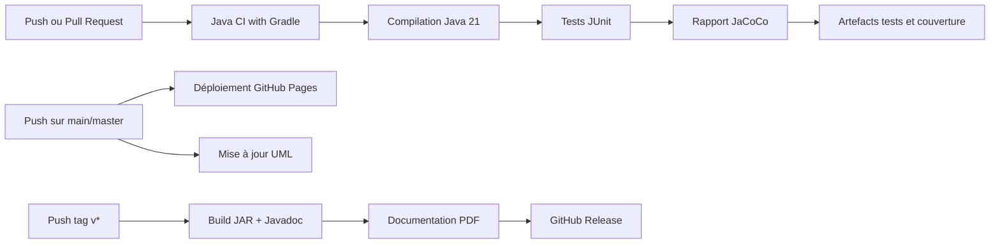

# Rapport DevOps 2 - GitHub Actions et CI/CD

Date d'audit : 12 juin 2026  
Projet : GreenDesk  
Version auditée : `v2.0.0`  
Commit audité : `7736cdb`  
Dépôt : `MisasoaRobison/GreenDesk`

## 1. Synthèse exécutive

GreenDesk dispose d'une chaîne DevOps structurée autour de quatre workflows GitHub Actions :

| Workflow | Déclencheur | Objectif |
|---|---|---|
| `gradle.yml` | Push et pull request | Compiler, tester et produire la couverture |
| `release.yml` | Tag `v*` | Construire les artefacts et créer une release GitHub |
| `docs-pages.yml` | Push sur `main`/`master` | Publier la documentation sur GitHub Pages |
| `update-uml.yml` | Modification Java ou Gradle | Mettre à jour automatiquement les diagrammes UML |

La version `v2.0.0` est correctement taguée sur le commit courant. La suite locale complète contient **374 tests**, tous réussis.

Le principal écart DevOps est que le workflow CI exécute :

```bash
./gradlew clean test jacocoTestReport
```

mais n'exécute pas :

```bash
./gradlew clean check
```

La CI peut donc être verte alors que les règles JaCoCo configurées dans Gradle ne sont pas respectées.

### Verdict

**Niveau DevOps : satisfaisant avec réserves.**

- Automatisation CI, release et documentation présente.
- Tests automatisés stables.
- Artefacts de tests et de couverture conservés.
- Contrôle qualité JaCoCo non bloquant dans GitHub Actions.
- Release créée sans exécution préalable des tests.
- Plusieurs configurations sensibles ou de production doivent encore être renforcées.

## 2. Preuves de validation

### Résultat local des tests

Commande :

```bash
./gradlew test
```

Résultat :

| Indicateur | Valeur |
|---|---:|
| Tests exécutés | 374 |
| Succès | 374 |
| Échecs | 0 |
| Erreurs | 0 |
| Tests ignorés | 0 |

### Couverture JaCoCo mesurée

| Métrique | Couverture |
|---|---:|
| Lignes | 66,87 % |
| Branches | 47,99 % |
| Classes | 86,84 % |
| Méthodes | 65,87 % |

La commande `./gradlew clean check` échoue sur `jacocoTestCoverageVerification`, car la configuration actuelle exige **80 % de lignes couvertes pour chaque package**.

Exemples de packages sous le seuil :

- `org.example.controllers.care` : 13 %
- `org.example.services.scheduling` : 63 %
- `org.example.services.calendar` : 16 %
- `org.example.controllers.weather` : 28 %
- `org.example.services.weather` : 35 %

## 3. Chaîne CI/CD actuelle



## 4. Audit des workflows

### 4.1 Java CI avec Gradle

Fichier : `.github/workflows/gradle.yml`

Points positifs :

- Exécution sur les branches principales, `develop` et `feature/**`.
- Contrôle des pull requests vers les branches principales.
- Java 21 configuré avec cache Gradle.
- Rapports de tests et couverture uploadés même en cas d'échec.
- Permissions limitées à `contents: read`.

Écarts :

- `jacocoTestCoverageVerification` n'est pas exécuté.
- Aucun contrôle Docker n'est réalisé.
- Aucun scan de dépendances ou de secrets n'est présent.
- Les actions sont référencées par version majeure et non par SHA immuable.

### 4.2 Release automatique

Fichier : `.github/workflows/release.yml`

Points positifs :

- Déclenchement automatique sur les tags `v*`.
- Génération du JAR, de la Javadoc et d'un PDF.
- Publication automatique dans une GitHub Release.
- Permissions d'écriture limitées au workflow de release.

Écarts :

- La release exécute `assemble javadoc`, mais pas les tests.
- Tout tag autre que `v1.0.1` ou `v1.0.2`, dont `v2.0.0`, est nommé automatiquement **Livraison 3**.
- L'installation complète de LaTeX à chaque release augmente fortement la durée du pipeline.
- Aucun checksum ou SBOM n'est publié avec les artefacts.

### 4.3 Documentation GitHub Pages

Fichier : `.github/workflows/docs-pages.yml`

Points positifs :

- Déploiement automatique depuis `docs/`.
- Permissions Pages et jeton OIDC correctement limités.
- Concurrence configurée pour éviter plusieurs déploiements simultanés.
- Déclenchement manuel disponible.

Écart :

- Aucun contrôle de liens ou validation de la documentation avant publication.

### 4.4 Mise à jour UML

Fichier : `.github/workflows/update-uml.yml`

Points positifs :

- Exécution ciblée uniquement lorsque le code Java ou Gradle change.
- Vérification de l'existence de la tâche Gradle avant son exécution.
- Commit automatique limité aux fichiers `.puml`.

Écart :

- Le workflow peut réussir sans produire de diagramme lorsque `buildClassDiagram` n'existe pas, ce qui masque l'absence réelle de génération UML.

## 5. Audit Docker et configuration

Points positifs :

- Dockerfile multi-stage.
- Orchestration de l'application, MongoDB et Mongo Express.
- Secret webhook obligatoire via `WEATHER_WEBHOOK_SECRET`.
- Données MongoDB persistées dans des volumes.

Risques :

- Le Dockerfile utilise Gradle `8.5`, tandis que le wrapper du projet utilise Gradle `9.2.0`.
- Le build Docker ignore les tests avec `-x test`.
- MongoDB et Mongo Express utilisent des identifiants par défaut dans `docker-compose.yml`.
- MongoDB et Mongo Express exposent leurs ports sur la machine hôte.
- `application.properties` contient une URI MongoDB Atlas en dur.

## 6. Sécurité et secrets

Améliorations présentes dans `v2.0.0` :

- Le webhook météo exige désormais le header `X-Webhook-Secret`.
- Le secret doit être injecté via `WEATHER_WEBHOOK_SECRET`.
- Les tests et scripts locaux utilisent le même contrat sécurisé.

Actions recommandées :

1. Stocker les secrets de production dans GitHub Actions Secrets ou Environments.
2. Supprimer toute URI MongoDB contenant des identifiants du dépôt.
3. Activer Dependabot et CodeQL.
4. Ajouter un scan de secrets, par exemple Gitleaks.
5. Protéger la branche `master` avec la CI obligatoire avant merge.

## 7. Plan d'amélioration priorisé

### Priorité P0 - Avant une release de production

1. Exécuter les tests dans `release.yml` avant la création d'une release.
2. Supprimer les identifiants MongoDB codés en dur.
3. Corriger la configuration JaCoCo ou augmenter la couverture afin que `clean check` passe.
4. Configurer `WEATHER_WEBHOOK_SECRET` dans les secrets de déploiement.

### Priorité P1 - Qualité CI/CD

1. Ajouter un job Docker qui construit et teste l'image.
2. Publier un résumé GitHub Actions avec nombre de tests et couverture.
3. Ajouter CodeQL, Dependabot et un scan de secrets.
4. Corriger les métadonnées de release pour reconnaître `v2.0.0`.
5. Aligner la version Gradle du Dockerfile avec le wrapper.

### Priorité P2 - Industrialisation

1. Publier une image versionnée dans GitHub Container Registry.
2. Générer un SBOM et des checksums pour chaque release.
3. Ajouter un environnement de staging avec approbation.
4. Ajouter des tests de fumée après déploiement.

## 8. Proposition de pipeline cible

```mermaid
flowchart TD
    A[Pull Request] --> B[Compilation]
    B --> C[Tests]
    C --> D[JaCoCo Verification]
    D --> E[Scan sécurité]
    E --> F[Build Docker]
    F --> G{Tous les contrôles passent ?}
    G -->|Oui| H[Merge autorisé]
    G -->|Non| I[Merge bloqué]

    J[Tag v2.x.x] --> K[Revalidation complète]
    K --> L[Build JAR + image Docker]
    L --> M[SBOM + checksums]
    M --> N[GitHub Release]
```



## 9. Conclusion

GreenDesk démontre les compétences attendues pour DevOps 2 : gestion de versions, CI automatisée, génération d'artefacts, documentation continue, conteneurisation et release par tag.

La version `v2.0.0` est fonctionnellement validée par **374 tests réussis**, mais la chaîne qualité doit encore rendre le contrôle JaCoCo bloquant et sécuriser les configurations de production pour être considérée comme pleinement industrialisée.

> Limite de l'audit : l'état live des runs GitHub Actions n'a pas pu être vérifié le 12 juin 2026, car l'authentification `gh` locale était invalide. L'analyse des workflows repose sur les fichiers versionnés et les validations locales.
