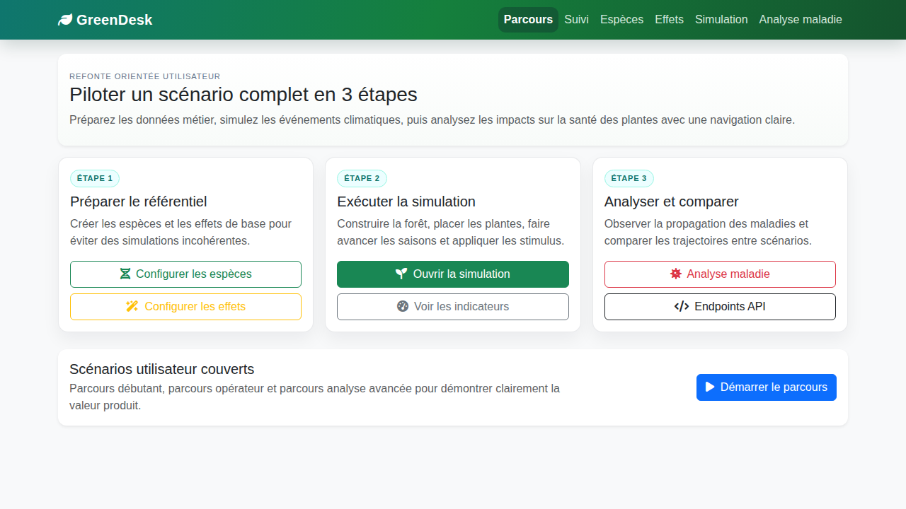
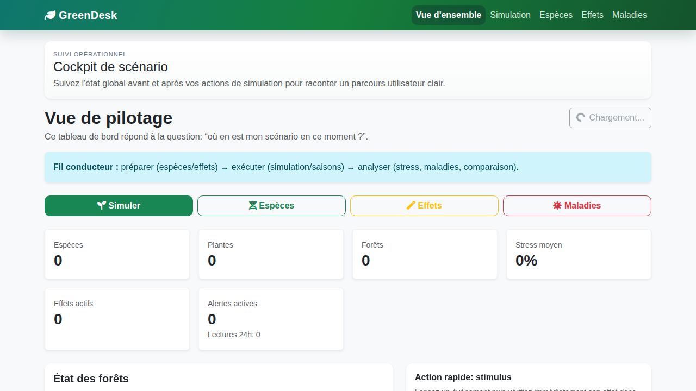
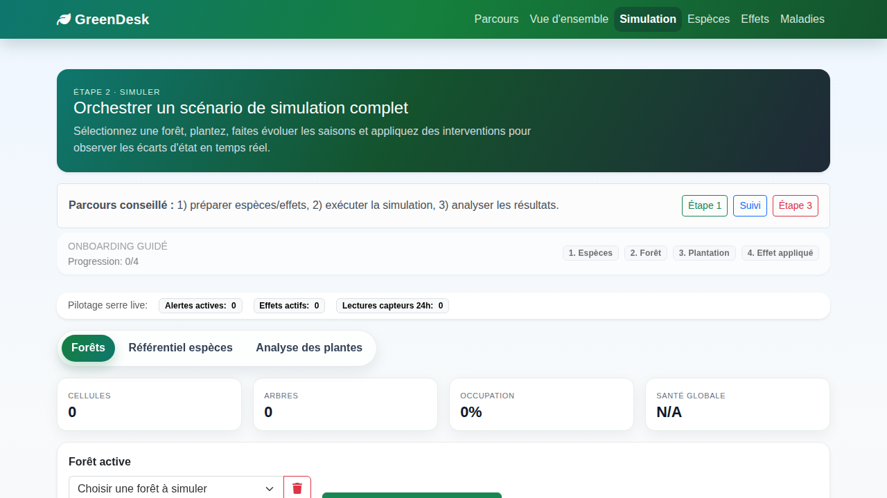
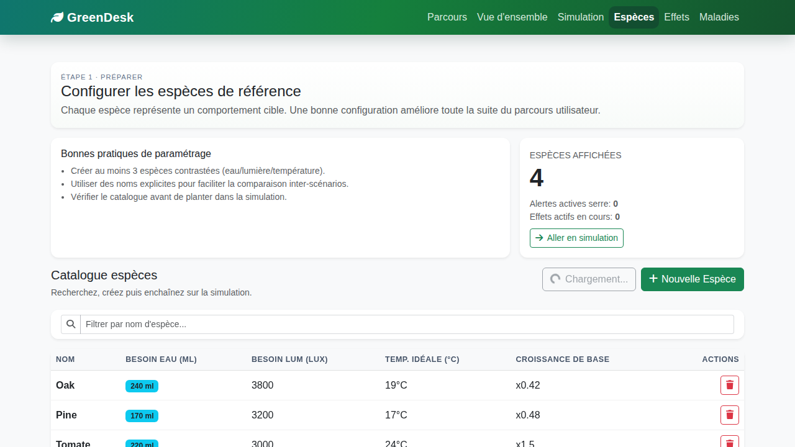
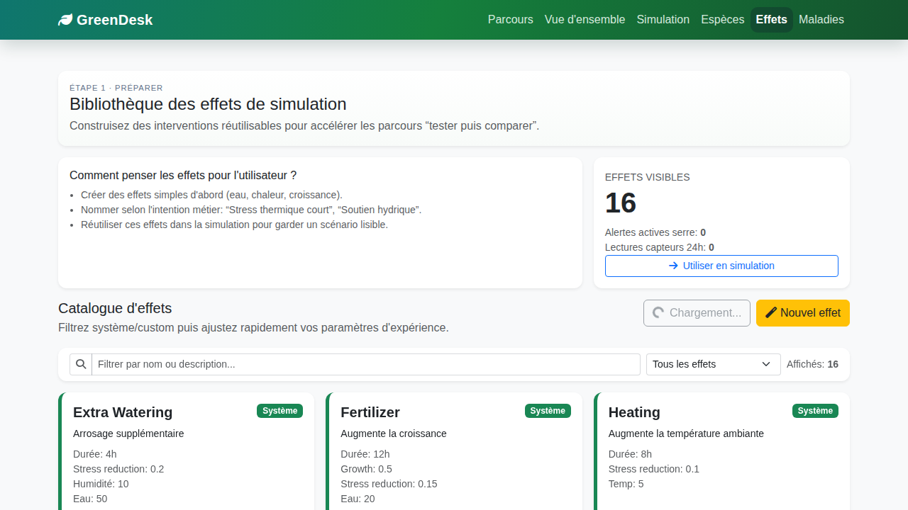
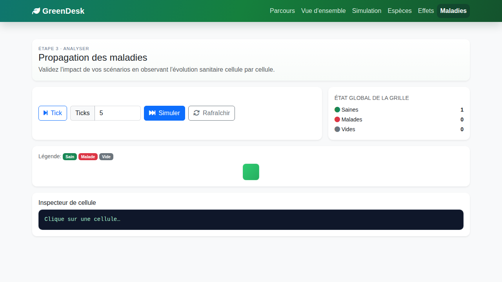
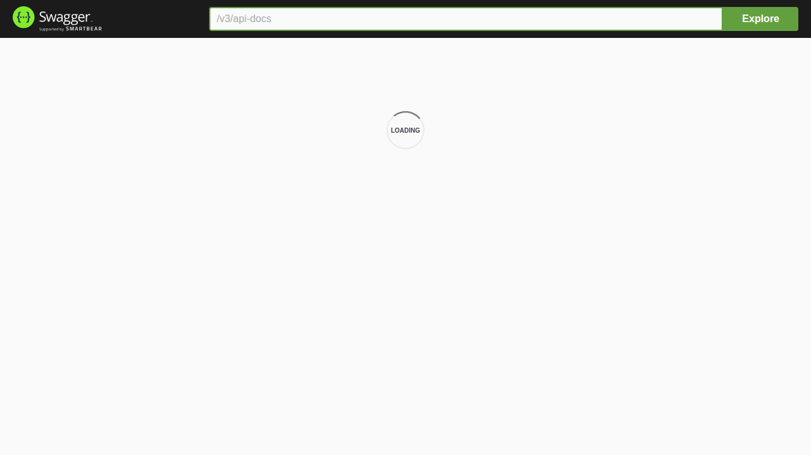
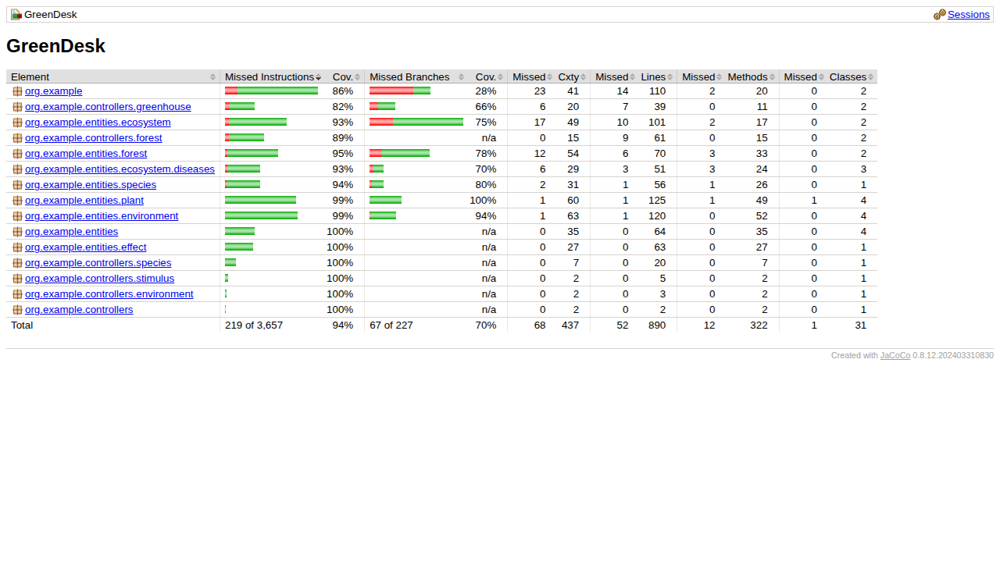

# Captures d'écran

Cette page regroupe des captures réelles de l'interface web GreenDesk (localhost:8080), sans captures API.

## Parcours express

1. [Étape 1 - Parcours](#/screenshots?id=step-1)
2. [Étape 2 - Tableau de bord](#/screenshots?id=step-2)
3. [Étape 3 - Simulation](#/screenshots?id=step-3)
4. [Étape 4 - Espèces](#/screenshots?id=step-4)
5. [Étape 5 - Effets](#/screenshots?id=step-5)
6. [Étape 6 - Maladies](#/screenshots?id=step-6)
7. [Étape 7 - Swagger API](#/screenshots?id=step-7)
8. [Étape 8 - Couverture JaCoCo](#/screenshots?id=step-8)

## Parcours utilisateur

### Parcours (`/home.html`)

**Étape 1 - Entrer dans le parcours**

- Point d'entrée de l'application.
- Permet d'accéder rapidement aux modules Espèces, Effets, Simulation et Suivi.

### Tableau de bord (`/dashboard.html`)

**Étape 2 - Suivre les indicateurs**

- Vue synthétique de l'état courant.
- Sert à contrôler rapidement la situation avant/après simulation.

### Simulation (`/index.html`)

**Étape 3 - Lancer la simulation**

- Zone principale pour exécuter les scénarios.
- Permet d'observer l'évolution des plantes selon les paramètres.

## Configuration

### Espèces (`/species.html`)

**Étape 4 - Configurer les espèces**

- Gestion des espèces disponibles.
- Prépare les données nécessaires aux créations de plantes.

### Effets (`/effects.html`)

**Étape 5 - Configurer les effets**

- Catalogue des effets agronomiques.
- Base de configuration pour enrichir les scénarios de simulation.

## Analyse

### Maladies (`/disease.html`)

**Étape 6 - Analyser les maladies**

- Module de diagnostic et d'aide à l'interprétation.
- Utilisé pour compléter le suivi opérationnel.

## API & Qualité

### Swagger API (`/swagger-ui/index.html`)

**Étape 7 - Vérifier l'API via Swagger**

- Interface interactive pour tester les endpoints REST.
- Permet de valider rapidement les payloads et réponses.

### Couverture de code JaCoCo (`/build/reports/jacoco/test/html/index.html`)

**Étape 8 - Contrôler la couverture de tests**

- Vue synthétique des métriques de couverture du projet.
- Utilisé pour le suivi qualité avant livraison.
