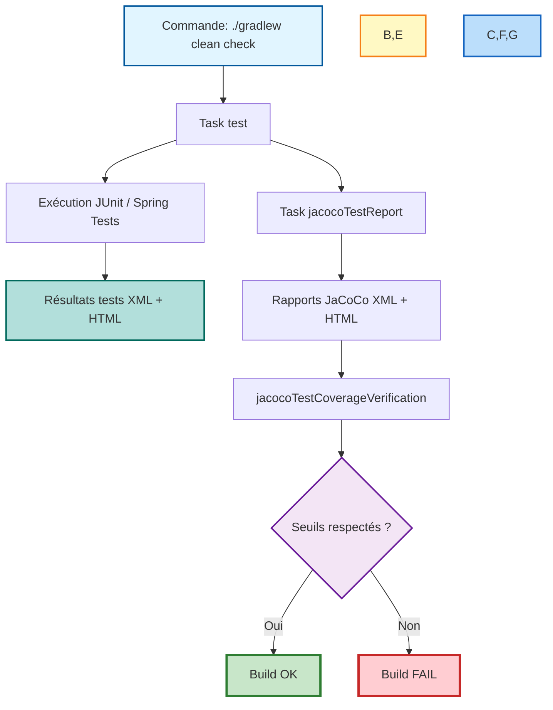
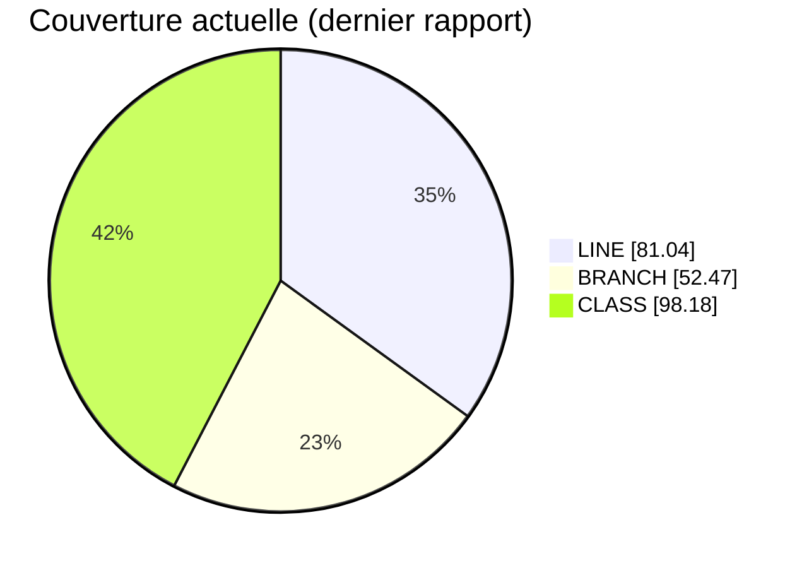

# Tests et qualité

## Objectifs qualité

GreenDesk impose des seuils de couverture via JaCoCo (`jacocoTestCoverageVerification`) :

- `LINE >= 70%`
- `BRANCH >= 45%`
- `CLASS >= 90%`

## Commandes principales

### Exécuter tous les tests

```bash
./gradlew test
```

### Vérifier build + qualité complète

```bash
./gradlew clean check
```

### Générer les rapports JaCoCo

```bash
./gradlew test jacocoTestReport
```

## Emplacements des rapports

- Tests: `build/reports/tests/test/index.html`
- Couverture HTML: `build/reports/jacoco/test/html/index.html`
- Couverture XML: `build/reports/jacoco/test/jacocoTestReport.xml`

## Couverture actuelle (dernier rapport généré)

Calculée depuis les compteurs globaux JaCoCo (`LINE: covered=1590, missed=372`, `BRANCH: covered=329, missed=298`, `CLASS: covered=54, missed=1`):

- LINE: `81.04%`
- BRANCH: `52.47%`
- CLASS: `98.18%`

## Diagramme du passage de tests + JaCoCo



## Diagramme couverture JaCoCo



## Stratégie de tests recommandée

1. Tests unitaires des services métiers critiques
2. Tests contrôleurs sur chemins succès et erreur
3. Tests ciblés sur branches sensibles (ROI, alertes, simulation)
4. Vérification coverage avant merge

## Bonnes pratiques

- Garder les tests déterministes
- Isoler les dépendances via mocks quand pertinent
- Couvrir les cas de validation et les erreurs métier
- Contrôler les régressions via `./gradlew check`

## Rapport de campagne ciblée

- Rapport Greenhouse Ops: [reports/greenhouse-ops-report.md](reports/greenhouse-ops-report.md)
- Résultat de la campagne WebMvc ciblée: `8 tests passés / 0 échec`
